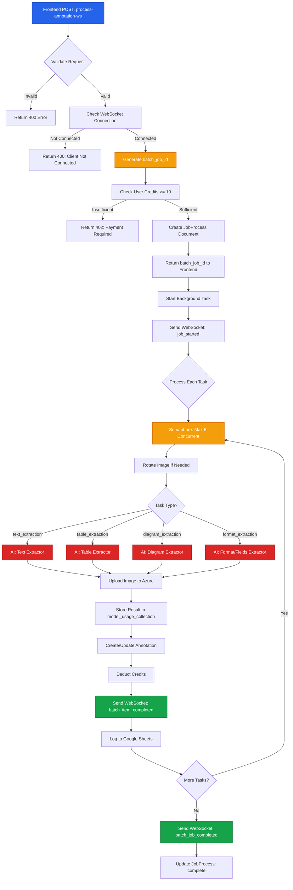

# Batch Processing & WebSocket

This document details the backend batch processing system, WebSocket communication, and AI-powered annotation extraction workflows.

## Process Overview

The batch processing system handles multiple annotation extraction requests concurrently, providing real-time progress updates via WebSocket, and persisting results to MongoDB.

## Complete Flow Diagram



## API Endpoint

### POST /api/process/process-annotation-ws

Processes multiple annotations in a batch with real-time WebSocket updates.

**Headers**:
```http
Authorization: Bearer {jwt_token}
Content-Type: application/json
```

**Query Parameters**:
- `client_id` (required): WebSocket client identifier from frontend

**Request Body**:
```json
{
  "tasks": [
    {
      "process_type": "text_extraction",
      "data": {
        "ann_id": "uuid-1234",
        "file_id": "507f1f77bcf86cd799439011",
        "bbox": [100, 200, 500, 400],
        "page_image": "data:image/png;base64,...",
        "bbox_image": "data:image/png;base64,...",
        "dpi": 275,
        "page_number": 1,
        "rotation": 0
      }
    }
  ],
  "batch_name": "Batch Annotation Processing - Page 1"
}
```

**Response** (Immediate):
```json
{
  "batch_job_id": "uuid-batch-5678",
  "message": "Batch field extraction started for 3 requests...",
  "client_id": "ws-client-abc",
  "total_requests": 3,
  "batch_name": "Batch Annotation Processing - Page 1"
}
```

## Implementation Flow

<Steps>

### Validate Request

Check authentication, client connection, and request structure.

```python
# Check JWT token
user = verify_token(auth_header)

# Check credits
credit_resp = get_credits(user['token'])
if float(credit_resp['credit_balance']) < 10:
    raise HTTPException(status_code=402, detail="Minimum 10 credits required")

# Validate client_id
if not client_id:
    raise HTTPException(status_code=400, detail="client_id required")

# Check WebSocket connection
if not websocket_manager.is_client_connected(client_id):
    raise HTTPException(
        status_code=400,
        detail="WebSocket client not connected"
    )

# Validate tasks
if not request.tasks or len(request.tasks) == 0:
    raise HTTPException(status_code=400, detail="At least one task required")
```

### Create Batch Job

Generate batch ID and create database record.

```python
import uuid

batch_job_id = str(uuid.uuid4())

job_doc = JobProcess(
    batchId=batch_job_id,
    clientId=client_id,
    status="started",
    jobs=[],
    annotations=[],
    completed_request=0,
    failed_request=0,
    total_request=len(request.tasks)
)
await jobprocess_collection.insert_one(job_doc.dict())
```

### Start Background Processing

Queue background task to avoid blocking the API response.

```python
from fastapi import BackgroundTasks

background_tasks.add_task(
    process_annotation_websocket_updates,
    request,
    client_id,
    batch_job_id,
    user['token'],
    services,
    executor
)

# Return immediately
return {
    "batch_job_id": batch_job_id,
    "client_id": client_id,
    "total_requests": len(request.tasks)
}
```

**Why Background?**
- API responds immediately (~50ms)
- Processing happens asynchronously
- WebSocket provides progress updates
- No HTTP timeout issues

### Send WebSocket: job_started

Notify frontend that processing has begun.

```python
await websocket_manager.start_job(
    client_id=client_id,
    job_id=batch_job_id,
    job_type="batch_process_annotation"
)

await websocket_manager.send_progress_update(
    client_id=client_id,
    job_id=batch_job_id,
    current_step=0,
    total_steps=total_requests,
    message="Starting"
)
```

### Process Tasks Concurrently

Use semaphore to limit concurrent processing.

```python
max_concurrent_requests = min(5, total_requests)
semaphore = asyncio.Semaphore(max_concurrent_requests)

async def process_single_request(request_index, process_request):
    async with semaphore:
        # Process annotation
        ...

# Create tasks for all requests
tasks = [
    asyncio.create_task(process_single_request(i, task))
    for i, task in enumerate(batch_request.tasks)
]

# Execute concurrently
await asyncio.gather(*tasks)
```

**Concurrency Control**:
- Max 5 simultaneous extractions
- Prevents server overload
- Balances speed and resources

### Process Individual Annotation

Extract content based on annotation type.

```python
individual_job_id = str(uuid.uuid4())

# Update annotation record
file_name, page_count, page_id = await update_annotation(process_request)

# Handle image rotation
image = handle_image_rotation(
    process_request.data.bbox_image,
    process_request.data.rotation
)

# Extract based on type
match process_request.process_type:
    case "text_extraction":
        result, word_len, usage = await services.text_extractor(img_base64)
    case "table_extraction":
        result, cells, usage = await services.table_extractor(img_base64)
    case "diagram_extraction":
        result, drawing_count, usage = await services.diagram_extractor(img_base64)
    case "format_extraction":
        result, field_count, usage = await services.format_extractor(fields_data)
```

### AI Extraction: Text

Extract text from image using GPT-4.1-nano.

```python
# Upload image to Azure for logging
img_base64, buffer_val = pil_to_base64(image)
text_img_url = await upload_to_azure(
    f"{process_request.data.ann_id}.jpg",
    "training-images",
    buffer_val
)

# Run extraction in thread pool
loop = asyncio.get_running_loop()
text_result, word_len, usage = await loop.run_in_executor(
    executor,
    services.text_extractor,
    img_base64
)

# text_result = "Extracted text content..."
# word_len = 42
# usage = {
#   'input_tokens': 1250,
#   'output_tokens': 85
# }
```

**Text Extractor Features**:
- OCR via GPT-4.1-nano vision
- Handles rotated text
- Preserves formatting
- Returns plain text

### Send WebSocket: batch_item_completed

Notify frontend of individual completion.

```python
await websocket_manager.send_to_client(client_id, {
    "type": "batch_item_completed",
    "batch_job_id": batch_job_id,
    "item_job_id": individual_job_id,
    "item_index": request_index,
    "annotation_type": process_request.process_type,
    "annotation_id": process_request.data.ann_id,
    "page_number": process_request.data.page_number,
    "file_id": process_request.data.file_id,
    "success": True,
    "result": text_result
})
```

**Frontend Handler**:
```typescript
// Frontend receives and updates annotation
const handleAnnotationUpdate = (update) => {
  const annotation = findAnnotation(update.annotation_id);
  annotation.processed = update.success;
  annotation.result = update.result;
  annotation.processingStatus = 'processed';
};
```

### Deduct Credits

Charge user for AI processing.

```python
credit_res = deduct_credits(
    {
        'metric_type': 'text_extraction',
        'units': 1
    },
    auth_token
)
if not credit_res['success']:
    raise HTTPException(
        status_code=402,
        detail=credit_res['message']
    )
```

**Credit Costs**:
- `text_extraction`: 1 credit
- `table_extraction`: 2 credits
- `diagram_extraction`: 3 credits
- `format_extraction`: 5 credits

### Log Model Usage

Store extraction details for analytics.

```python
bbox_area = compute_area(
    process_request.data.bbox,
    convert_base64_to_PIL_image(process_request.data.page_image).size
)

model_usage_id = await log_model_usage(
    model_type="gpt-4.1-nano",
    operation_type="text_extract",
    project_type=os.getenv("PROJECT_TYPE", "demo"),
    usage_data={
        "input_tokens": usage['input_tokens'],
        "output_tokens": usage['output_tokens'],
        "time_took": time.time() - start_time,
        "area_covered": bbox_area
    },
    model_parameters={},
    annotation_id=process_request.data.ann_id,
    input_payload={"image_url": text_img_url},
    output_payload={"text": text_result},
    num_data=word_len
)
```

### Update JobProcess

Track batch progress in MongoDB.

```python
await jobprocess_collection.update_one(
    {"batchId": batch_job_id},
    {
        "$set": {"status": "in_progress"},
        "$inc": {"completed_request": 1},
        "$push": {
            "jobs": {
                "individual_job_id": individual_job_id,
                "success": True,
                "annotation_id": process_request.data.ann_id,
                "model_usage_id": model_usage_id
            }
        }
    }
)
```

### Send WebSocket: batch_job_completed

Notify frontend when all tasks finish.

```python
await websocket_manager.send_batch_completion(
    client_id=client_id,
    batch_job_id=batch_job_id,
    total=total_requests,
    batch_name=request.batch_name,
    completed=completed_count,
    failed=failed_count,
    success=True,
    results=batch_results,
    error=None
)
```

**Message Format**:
```json
{
  "type": "batch_job_completed",
  "batch_job_id": "uuid-batch-5678",
  "total": 3,
  "completed": 3,
  "failed": 0,
  "success": true,
  "batch_name": "Batch Annotation Processing - Page 1",
  "results": [...]
}
```

</Steps>

## Annotation Types

### Text Extraction

**Input**: Cropped image of text region
**AI Model**: GPT-4.1-nano vision
**Output**: Plain text string
**Metrics**: Word count, tokens

**Example Result**:
```json
{
  "success": true,
  "result": "This is the extracted text content from the annotation region."
}
```

### Table Extraction

**Input**: Cropped image of table
**AI Model**: GPT-4.1-nano vision + Table parser
**Output**: HTML table string
**Metrics**: Cell count, tokens

**Example Result**:
```json
{
  "success": true,
  "result": {
    "html": "<table><tr><td>Header 1</td><td>Header 2</td></tr>...</table>"
  }
}
```

### Diagram Extraction

**Input**: Cropped image of technical diagram
**AI Model**: GPT-4.1-nano vision + Diagram analyzer
**Output**: Structured diagram data
**Metrics**: Drawing annotation count, tokens

**Example Result**:
```json
{
  "success": true,
  "result": {
    "DiagramTitle": "Assembly Drawing",
    "View": "Front View",
    "diag_description": "...",
    "Callouts": {...},
    "LinearDimensions": {...}
  }
}
```

### Format/Fields Extraction

**Input**: Page image + field definitions
**AI Model**: GPT-4.1-nano vision + Template processor
**Output**: HTML table with field values
**Metrics**: Field count, tokens

**Example Result**:
```json
{
  "success": true,
  "result": "<table><tr><th>Field</th><th>Value</th></tr>...</table>"
}
```

## WebSocket Messages

### Message Types

| Type | Direction | Purpose |
|------|-----------|---------|
| `job_started` | Backend → Frontend | Batch processing began |
| `progress_update` | Backend → Frontend | Progress: X of Y completed |
| `batch_item_completed` | Backend → Frontend | Individual annotation done |
| `batch_job_completed` | Backend → Frontend | All annotations done |

### Connection Management

**Frontend Initialization**:
```typescript
const { clientId, connect } = useWebSocket();

useEffect(() => {
  connect(); // Establish WebSocket
}, []);
```

**Backend Validation**:
```python
if not websocket_manager.is_client_connected(client_id):
    raise HTTPException(status_code=400, detail="Not connected")
```

## Error Handling

<Callout type="warning">
Robust error handling for production reliability.
</Callout>

### Extraction Failure

```python
try:
    result, metrics, usage = await services.text_extractor(img_base64)
    success = True
except Exception as e:
    result = f"Extraction failed: {str(e)}"
    success = False
    failed_count += 1

# Always send completion message
await websocket_manager.send_to_client(client_id, {
    "type": "batch_item_completed",
    "success": success,
    "result": result,
    "error": str(e) if not success else None
})
```

### Credit Deduction Failure

```python
try:
    credit_res = deduct_credits(...)
    if not credit_res['success']:
        raise HTTPException(status_code=402, detail=credit_res['message'])
except Exception as credit_error:
    # Mark annotation as error but continue batch
    print(f"Credit deduction failed: {credit_error}")
```

### WebSocket Disconnection

```python
# Backend detects disconnection
try:
    await websocket_manager.send_to_client(client_id, message)
except Exception as ws_error:
    print(f"WebSocket send failed: {ws_error}")
    # Continue processing, results stored in DB
```

## Performance Metrics

### Typical Processing Times

| Annotation Type | Size | Time (avg) |
|----------------|------|------------|
| Text (small) | 500x200px | 2-3s |
| Text (large) | 1500x800px | 4-6s |
| Table (simple) | 800x400px | 5-8s |
| Table (complex) | 1500x1000px | 10-15s |
| Diagram | 1200x800px | 15-25s |
| Fields | Full page | 20-30s |

**Factors**:
- Image resolution (DPI)
- Content complexity
- AI model latency
- Network speed

### Batch Processing Example

**Scenario**: 10 annotations on a page

| Metric | Value |
|--------|-------|
| Total annotations | 10 |
| Concurrent workers | 5 |
| Avg time per annotation | 5s |
| Total time (sequential) | 50s |
| Total time (concurrent) | ~12s |
| **Speedup** | **4.2x** |

## Code Reference

**API Endpoint**: `backend/api/routes/process/apis.py:35-102`
**Background Task**: `backend/api/routes/process/apis.py:105-615`
**WebSocket Manager**: `backend/api/routes/websocket_manager.py`
**Text Extractor**: `backend/api/routes/process/services/extractors/text_extract.py`
**Table Extractor**: `backend/api/routes/process/services/extractors/table_extract.py`
**Diagram Extractor**: `backend/api/routes/process/services/extractors/diagram_extract.py`

## Related Documentation

- [File Upload & Metadata](/backend-processing/file-upload) - Initial file processing
- [Page Image Generation](/backend-processing/page-images) - Image rendering
- [Frontend Processing](/existing-flow/file-processing) - How frontend triggers processing
- [WebSocket Architecture](/sprint-02/websocket-v2) - Real-time communication details