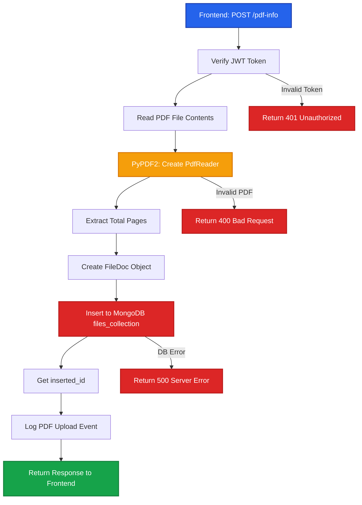

# File Upload & Metadata Processing

This document details the backend processing for PDF file uploads, metadata extraction, and database persistence.

## Process Overview

The file upload process extracts PDF metadata, creates database records, and returns essential information to the frontend for page selection.

## Flow Diagram



## API Endpoint

### POST /api/files/pdf-info

Extracts basic PDF information and creates a file record in the database.

**Headers**:
```http
Authorization: Bearer {jwt_token}
Content-Type: multipart/form-data
```

**Query Parameters**:
- `user_id` (required): User ID from authentication system

**Request Body**:
```http
Content-Type: multipart/form-data

file: <PDF Binary>
```

**Response**:
```json
{
  "fileId": "507f1f77bcf86cd799439011",
  "total_pages": 50,
  "file_name": "document.pdf"
}
```

## Implementation

<Steps>

### Authentication

Verify JWT token using FastAPI dependency injection.

```python
User_auth = Annotated[dict, Depends(verify_token)]

@router.post("/pdf-info")
async def get_pdf_info(
    user: User_auth,
    user_id: str = Query(...),
    file: UploadFile = File(...)
):
    # user contains decoded token data
    pass
```

### Read File Contents

Read the uploaded PDF file into memory.

```python
contents = await file.read()
```

**Memory Management**:
- File contents read asynchronously
- Stored in `bytes` format for processing
- No disk I/O required

### Extract PDF Metadata

Use PyPDF2 to extract page count without rendering.

```python
from PyPDF2 import PdfReader
import io

pdf = PdfReader(io.BytesIO(contents))
total_pages = len(pdf.pages)
```

**Features Extracted**:
- Total page count
- File size (`len(contents)`)
- MIME type (`file.content_type`)

<Callout type="info">
PyPDF2 extracts metadata without rendering pages, making this operation very fast even for large PDFs.
</Callout>

### Create File Document

Build a database document with file metadata.

```python
from database.db.db_models import FileDoc

file_doc = FileDoc(
    filename=file.filename,
    userId=user_id,
    totalPages=total_pages,
    selectedPages=[],  # Empty initially
    sizeBytes=len(contents),
    mimeType=file.content_type,
    fileUrl="",  # Not stored in blob yet
    status="uploaded"
)
```

**FileDoc Schema**:
```typescript
{
  filename: string;          // Original filename
  userId: string;            // User identifier
  totalPages: number;        // Total page count
  selectedPages: number[];   // User-selected pages (empty initially)
  sizeBytes: number;         // File size in bytes
  mimeType: string;          // application/pdf
  fileUrl: string;           // Azure Blob URL (empty for pdf-info)
  status: "uploaded" | "uploading";
  uploadedAt: DateTime;      // Auto-generated
}
```

### Insert to MongoDB

Persist the file document to MongoDB.

```python
from database.db.db import files_collection

res = await files_collection.insert_one(file_doc.dict())
file_id = str(res.inserted_id)
```

**MongoDB Operation**:
- `insert_one()`: Async insertion
- Returns `InsertOneResult` with `inserted_id`
- ObjectId converted to string for JSON serialization

### Log Upload Event

Track PDF uploads for analytics.

```python
from utils.db_logger import log_pdf_upload

await log_pdf_upload(
    filename=file.filename,
    file_size=len(contents),
    total_pages=total_pages,
    file_id=file_id
)
```

**Logging Purpose**:
- Usage analytics
- Audit trail
- Performance monitoring

### Return Response

Send file metadata back to frontend.

```python
return {
    "fileId": file_id,
    "total_pages": total_pages,
    "file_name": file.filename
}
```

</Steps>

## Database Schema

### files_collection

```javascript
{
  _id: ObjectId("507f1f77bcf86cd799439011"),
  filename: "engineering_drawing.pdf",
  userId: "user_12345",
  totalPages: 50,
  selectedPages: [],  // Updated later via /selected-pages
  sizeBytes: 2048576,  // ~2MB
  mimeType: "application/pdf",
  fileUrl: "",
  status: "uploaded",
  uploadedAt: ISODate("2025-09-30T10:30:00Z")
}
```

## Error Handling

<Callout type="warning">
Common error scenarios and handling strategies.
</Callout>

### Invalid PDF Format

```python
try:
    pdf = PdfReader(io.BytesIO(contents))
    total_pages = len(pdf.pages)
except Exception as e:
    # PyPDF2 raises various exceptions for corrupted PDFs
    raise HTTPException(
        status_code=400,
        detail=f"Invalid PDF file: {str(e)}"
    )
```

### Authentication Failure

```python
# Handled by verify_token dependency
# Returns 401 Unauthorized if token is invalid
```

### Database Connection Error

```python
try:
    res = await files_collection.insert_one(file_doc.dict())
except Exception as db_error:
    raise HTTPException(
        status_code=500,
        detail="Database error. Please try again."
    )
```

## Performance Considerations

### Memory Usage

```python
# For large PDFs (>50MB), consider streaming
# Current implementation loads entire file into memory
# Suitable for files up to 100MB
```

### Concurrent Uploads

```python
# No semaphore/rate limiting on pdf-info endpoint
# Each request handled independently
# MongoDB handles concurrent writes efficiently
```

### Response Time

| PDF Size | Pages | Typical Response Time |
|----------|-------|----------------------|
| 1 MB | 10 | 200-300ms |
| 10 MB | 100 | 500-800ms |
| 50 MB | 500 | 2-3s |

**Factors**:
- File size
- Page count
- Network latency
- MongoDB write speed

## Comparison: pdf-info vs upload

The backend has two file upload endpoints:

### /api/files/pdf-info (Used by Frontend)

**Purpose**: Quick metadata extraction
**Storage**: MongoDB only (no Azure Blob)
**Use Case**: File selection workflow
**Response**: `{fileId, total_pages, file_name}`

### /api/files/upload (Alternative)

**Purpose**: Full file upload with storage
**Storage**: MongoDB + Azure Blob Storage
**Use Case**: Persistent file storage
**Response**: WebSocket progress updates
**Features**:
- Batch upload support
- Azure Blob persistence
- Background processing
- WebSocket progress

<Callout type="info">
The frontend uses `/pdf-info` for the initial upload because it only needs metadata. The actual PDF is kept in browser memory for page rendering via `/get-page-image`.
</Callout>

## Related APIs

### Update Selected Pages

After page selection, the frontend calls:

```http
POST /api/utils/files/{fileId}/selected-pages
Content-Type: application/json

{
  "pages": [1, 2, 5, 10]
}
```

**Backend Implementation**:
```python
@router.post("/files/{file_id}/selected-pages")
async def update_selected_pages(file_id: str, sel: SelectedPages):
    res = await files_collection.update_one(
        {"_id": ObjectId(file_id)},
        {"$set": {"selectedPages": sel.pages}}
    )
    if res.matched_count == 0:
        raise HTTPException(status_code=404, detail="File not found")
    return {"fileId": file_id, "selectedPages": sel.pages}
```

### Retrieve File Data

To load a file with all pages and annotations:

```http
GET /api/files/file-info?user_id={userId}&file_id={fileId}
Authorization: Bearer {token}
```

Returns complete file structure with pages and annotations.

## Code Reference

**Implementation**: `backend/api/routes/files/apis.py:217-221`
**Service Function**: `backend/api/routes/files/services.py:133-161`
**Database Model**: `backend/database/db/db_models.py:FileDoc`

## Related Documentation

- [Page Image Generation](/backend-processing/page-images) - Converting pages to images
- [Frontend File Selection](/existing-flow/file-selection) - How frontend uses this API
- [Backend Overview](/backend-processing/) - Architecture and components