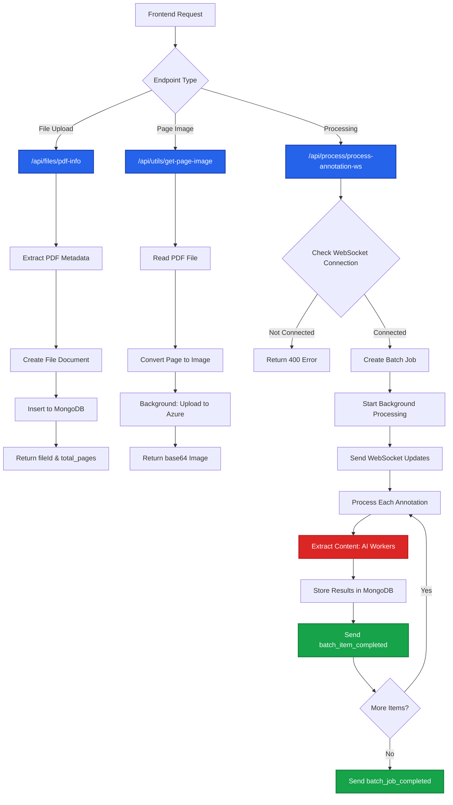

# Backend Processing Overview

This section documents the ADEOS FE backend architecture, API endpoints, and processing workflows. The backend is built with FastAPI and handles PDF processing, annotation extraction, and real-time WebSocket communication.

## Documentation

- **[File Upload & Metadata](/backend-processing/file-upload)** - PDF upload and metadata extraction
- **[Page Image Generation](/backend-processing/page-images)** - Converting PDF pages to images
- **[Batch Processing & WebSocket](/backend-processing/batch-processing)** - Real-time annotation processing

## Architecture Overview

### Technology Stack

- **Framework**: FastAPI (Python 3.11+)
- **Database**: MongoDB (files, pages, annotations collections)
- **Storage**: Azure Blob Storage (PDF files, page images)
- **Real-time Communication**: WebSocket (progress updates)
- **PDF Processing**: PyPDF2, pdf2image
- **AI Processing**: GPT-4.1-nano, Custom extractors
- **Authentication**: JWT Bearer tokens

### Key Components

| Component | Purpose | Location |
|-----------|---------|----------|
| **API Routes** | REST endpoints for file operations | `/api/routes/` |
| **WebSocket Manager** | Real-time communication | `/api/routes/websocket_manager.py` |
| **Database Layer** | MongoDB collections | `/database/db/` |
| **Extractors** | AI-powered content extraction | `/api/routes/process/services/extractors/` |
| **Azure Storage** | Blob storage interface | `/database/azure/` |
| **Utilities** | Logging, credits, config | `/utils/` |

### Database Collections

```typescript
// MongoDB Collections Structure
{
  files_collection: {
    _id: ObjectId,
    filename: string,
    userId: string,
    totalPages: number,
    selectedPages: number[],
    sizeBytes: number,
    mimeType: string,
    fileUrl: string,  // Azure Blob URL
    status: "uploaded" | "uploading",
    uploadedAt: DateTime
  },

  pages_collection: {
    _id: ObjectId,
    fileId: string,
    pageNumber: number,
    imagePath: string,  // Azure Blob URL
    dpi: number,
    processedAt: DateTime
  },

  annotations_collection: {
    _id: ObjectId,
    pageId: ObjectId,
    type: "text_extraction" | "table_extraction" | "diagram_extraction",
    initialBBox: [x1, y1, x2, y2],
    userBBox: [x1, y1, x2, y2],
    rotation: number,
    createdAt: DateTime,
    updatedAt: DateTime
  },

  model_usage_collection: {
    _id: ObjectId,
    annotationId: ObjectId,
    modelType: string,
    operationType: string,
    inputPayload: object,
    outputPayload: object,
    usageData: {
      input_tokens: number,
      output_tokens: number,
      time_took: number
    }
  },

  jobprocess_collection: {
    _id: ObjectId,
    batchId: string,
    clientId: string,
    status: "started" | "in_progress" | "complete",
    jobs: Array<{
      individual_job_id: string,
      success: boolean,
      annotation_id: string,
      model_usage_id: ObjectId
    }>,
    completed_request: number,
    failed_request: number,
    total_request: number
  }
}
```

## API Endpoint Overview

### File Operations

| Endpoint | Method | Purpose |
|----------|--------|---------|
| `/api/files/pdf-info` | POST | Extract PDF metadata, create file record |
| `/api/files/file-info` | GET | Retrieve file with all pages and annotations |
| `/api/files/file-id` | GET | List all files for a user |
| `/api/files/upload` | POST | Batch upload with WebSocket progress |

### Utility Operations

| Endpoint | Method | Purpose |
|----------|--------|---------|
| `/api/utils/get-page-image` | POST | Convert PDF page to base64 image |
| `/api/utils/files/{fileId}/selected-pages` | POST | Persist selected pages |
| `/api/utils/processing-status` | GET | Get global processing status |

### Processing Operations

| Endpoint | Method | Purpose |
|----------|--------|---------|
| `/api/process/process-annotation-ws` | POST | Batch process annotations with WebSocket |
| `/api/process/detect-tables` | POST | AI-powered table detection |

## Processing Flow



## Concurrency & Performance

### Semaphores

```python
# File upload workers
FILE_WORKERS = 5  # Concurrent file processing
sem = asyncio.Semaphore(FILE_WORKERS)

# Batch processing workers
max_concurrent_requests = min(5, total_requests)
semaphore = asyncio.Semaphore(max_concurrent_requests)
```

### Background Tasks

```python
# FastAPI Background Tasks for non-blocking operations
background_tasks.add_task(push_page_data, file_id, page, img_bytes, dpi)
background_tasks.add_task(process_annotation_websocket_updates, ...)
```

### Async/Await Pattern

All I/O operations (database, Azure storage, AI processing) use `async/await` for non-blocking execution.

## Authentication

All endpoints require JWT Bearer token authentication:

```python
User_auth = Annotated[dict, Depends(verify_token)]

@router.post("/pdf-info")
async def get_pdf_info(user: User_auth, ...):
    # user contains decoded token data
    # user['token'] for credit operations
    pass
```

## Error Handling

### HTTP Status Codes

| Code | Scenario |
|------|----------|
| 400 | Bad request (missing params, invalid WebSocket connection) |
| 401 | Unauthorized (invalid token) |
| 402 | Payment required (insufficient credits) |
| 404 | Resource not found (file, page, annotation) |
| 500 | Internal server error |

### Credit System

```python
# Check credits before processing
credit_resp = get_credits(user['token'])
if float(credit_resp['credit_balance']) < 10:
    raise HTTPException(status_code=402, detail="Minimum 10 credits required")

# Deduct credits after processing
credit_res = deduct_credits({
    'metric_type': 'text_extraction',
    'units': 1
}, auth_token)
```

## Logging & Monitoring

### Database Logging

```python
# Log PDF uploads
await log_pdf_upload(filename, file_size, total_pages, file_id)

# Log AI model usage
await log_model_usage(
    model_type="gpt-4.1-nano",
    operation_type="text_extract",
    usage_data={
        "input_tokens": usage['input_tokens'],
        "output_tokens": usage['output_tokens'],
        "time_took": time.time() - start_time
    },
    annotation_id=ann_id,
    input_payload=input_payload,
    output_payload=output_payload
)
```

### Google Sheets Logging

```python
# Log to Google Sheets for analytics
log_to_sheet(
    file_name, page_count, page_number,
    "gpt-4.1-nano", "text_extract",
    word_len, input_tokens, output_tokens,
    cost, time_took, bbox_area, dpi
)
```

## Environment Configuration

```python
# Required environment variables
AZURE_STORAGE_CONNECTION_STRING
MONGODB_URI
JWT_SECRET_KEY
WORKERS = {
    'FILE_WORKERS': 5,
    'EXTRACTION_WORKERS': 5
}
BATCH_JOB_PROCESS_START = "started"
BATCH_JOB_PROCESS_INPROGRESS = "in_progress"
BATCH_JOB_PROCESS_COMPLETE = "complete"
```

## Related Documentation

- [File Upload & Metadata](/backend-processing/file-upload) - Detailed upload flow
- [Page Image Generation](/backend-processing/page-images) - Image conversion process
- [Batch Processing & WebSocket](/backend-processing/batch-processing) - Real-time processing
- [Frontend Integration](/existing-flow/file-selection) - How frontend calls these APIs