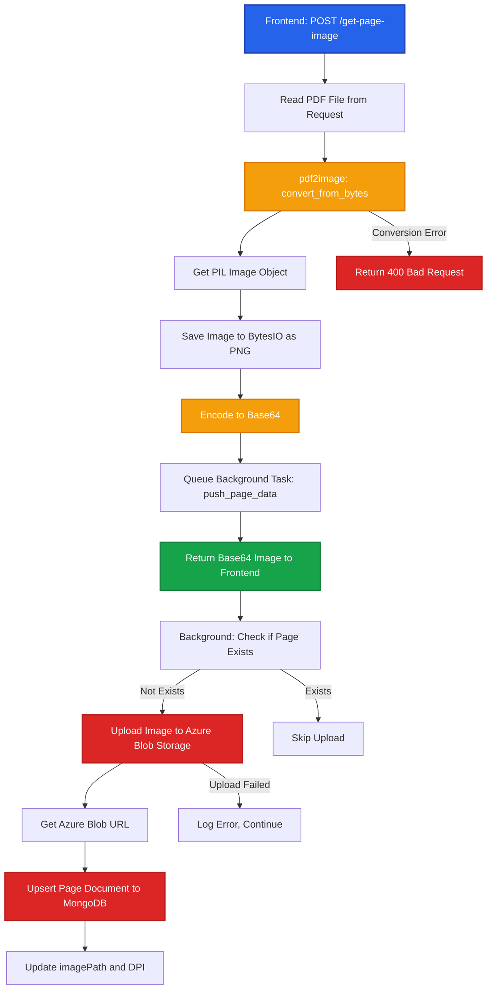

# Page Image Generation

This document details the backend process for converting PDF pages to images, including rendering, encoding, and Azure storage.

## Process Overview

The page image generation process converts a specific PDF page to a PNG image at a specified DPI, returns it as base64, and asynchronously uploads it to Azure Blob Storage.

## Flow Diagram



## API Endpoint

### POST /api/utils/get-page-image

Converts a specific PDF page to a base64-encoded PNG image.

**Headers**:
```http
Authorization: Bearer {jwt_token}
Content-Type: multipart/form-data
```

**Request Body**:
```http
Content-Type: multipart/form-data

file: <PDF Binary>
page: 1
file_id: "507f1f77bcf86cd799439011"
dpi: 275
```

**Response**:
```json
{
  "image": "data:image/png;base64,iVBORw0KGgoAAAANSUhEUgAA...",
  "upload_queued": true
}
```

**Response Time**: 500ms - 2s (depending on DPI and page complexity)

## Implementation

<Steps>

### Read PDF File

Read the uploaded PDF file from the request.

```python
from fastapi import UploadFile, File, Form

contents = await file.read()
```

### Convert Page to Image

Use `pdf2image` (powered by Poppler) to render the PDF page.

```python
from pdf2image import convert_from_bytes

images = convert_from_bytes(
    contents,
    first_page=page,      # Start page (1-indexed)
    last_page=page,       # End page (same as first for single page)
    dpi=dpi,              # Resolution (275 default)
    fmt='png',            # Output format
    thread_count=2,       # Poppler threads
    use_cropbox=True,     # Use PDF cropbox if available
    strict=False,         # Don't fail on warnings
    transparent=False     # Opaque background
)
```

**pdf2image Parameters**:
- `first_page/last_page`: Extract single page
- `dpi`: Higher DPI = better quality, larger file
- `thread_count`: Poppler parallelization
- `use_cropbox`: Respects PDF crop regions
- `strict=False`: Tolerates PDF issues

<Callout type="info">
`pdf2image` uses Poppler under the hood, a robust PDF rendering library. It produces high-quality raster images suitable for AI processing.
</Callout>

### Encode as PNG

Convert PIL Image to PNG bytes.

```python
import io
from PIL import Image

img_byte_arr = io.BytesIO()
images[0].save(img_byte_arr, format='PNG')
img_bytes = img_byte_arr.getvalue()
```

**PNG Format**:
- Lossless compression
- Supports transparency
- Ideal for diagrams and text

### Base64 Encoding

Encode PNG bytes for JSON transport.

```python
import base64

base64_encoded = base64.b64encode(img_bytes).decode('utf-8')
return {
    "image": f"data:image/png;base64,{base64_encoded}",
    "upload_queued": True
}
```

**Data URL Format**:
- `data:image/png;base64,{encoded_data}`
- Can be directly used in HTML `` src
- Supported by canvas APIs

### Background Azure Upload

Queue Azure upload as a background task to avoid blocking the response.

```python
from fastapi import BackgroundTasks

background_tasks.add_task(
    push_page_data,
    file_id,
    page,
    img_bytes,
    dpi
)
```

**Why Background?**
- Azure upload can take 1-3 seconds
- User gets immediate image response
- Improves perceived performance

</Steps>

## Background Task: push_page_data

Asynchronously uploads the page image to Azure and updates MongoDB.

```python
async def push_page_data(file_id, page_number, img_bytes, dpi):
    # Check if page already exists
    page_doc = await pages_collection.find_one({
        "fileId": file_id,
        "pageNumber": page_number
    })

    if not page_doc:
        # Upload to Azure Blob Storage
        img_url = await upload_page_to_azure(
            page_number,
            img_bytes,
            file_id
        )

        if img_url:
            # Update/Insert page document
            await pages_collection.update_one(
                {"fileId": file_id, "pageNumber": page_number},
                {"$set": {
                    "imagePath": img_url,
                    "dpi": dpi,
                    "processedAt": datetime.utcnow()
                }},
                upsert=True
            )
```

**Idempotency**:
- Only uploads if page doesn't exist in MongoDB
- Prevents duplicate Azure storage
- Upsert ensures document creation

## Azure Blob Storage

### upload_page_to_azure

Uploads page image to Azure with error handling.

```python
from database import upload_to_azure

async def upload_page_to_azure(page_number, img_bytes, file_id):
    try:
        img_url = await upload_to_azure(
            f"{file_id}_{page_number}.png",
            "page-images",  # Container name
            img_bytes
        )
        return img_url
    except Exception as e:
        print(f"Failed to upload page {page_number} to Azure: {str(e)}")
        return None
```

**Azure Blob URL Format**:
```
https://{storage_account}.blob.core.windows.net/page-images/{file_id}_{page_number}.png
```

**Storage Container**: `page-images`
**Naming Convention**: `{file_id}_{page_number}.png`

## Database Schema

### pages_collection

```javascript
{
  _id: ObjectId("507f1f77bcf86cd799439012"),
  fileId: "507f1f77bcf86cd799439011",
  pageNumber: 1,
  imagePath: "https://{account}.blob.core.windows.net/page-images/{file_id}_1.png",
  dpi: 275,
  processedAt: ISODate("2025-09-30T10:31:00Z")
}
```

## DPI Options & Image Quality

| DPI | Use Case | File Size | Quality |
|-----|----------|-----------|---------|
| 72 | Quick preview | ~500 KB | Low |
| 150 | Standard viewing | ~1 MB | Medium |
| 200 | Good quality | ~1.5 MB | Good |
| 275 | **Default** | ~2 MB | High |
| 300 | Print quality | ~2.5 MB | Very High |

**Frontend Selection**:
```typescript
const [selectedDpi, setSelectedDpi] = useState(275);
```

Users can adjust DPI based on needs:
- Lower DPI: Faster loading, less storage
- Higher DPI: Better OCR accuracy, clearer details

## Error Handling

<Callout type="warning">
Common errors and mitigation strategies.
</Callout>

### PDF Conversion Error

```python
try:
    images = convert_from_bytes(contents, ...)
except Exception as convert_error:
    print(f"PDF Conversion Error: {str(convert_error)}")
    raise HTTPException(
        status_code=400,
        detail=f"Error converting PDF to image: {str(convert_error)}"
    )
```

**Common Causes**:
- Corrupted PDF
- Unsupported PDF version
- Encrypted PDF
- Missing fonts

### Page Not Found

```python
if not images:
    raise HTTPException(
        status_code=404,
        detail="Page not found"
    )
```

### Azure Upload Failure

```python
# Handled gracefully - doesn't block response
if not img_url:
    print(f"Failed to upload page {page_number} to Azure")
    # Page image still returned to frontend
    # Can retry upload later
```

## Performance Optimization

### Concurrent Processing

Frontend loads multiple pages concurrently:

```typescript
// Max 3 concurrent requests
const MAX_CONCURRENT = 3;
```

Backend handles this naturally via FastAPI's async model.

### Caching Strategy

```python
# Check if page already processed
page_doc = await pages_collection.find_one({
    "fileId": file_id,
    "pageNumber": page_number
})

if page_doc and page_doc.get('imagePath'):
    # Page already in Azure, could return URL instead
    # Current implementation: always re-render
    pass
```

**Improvement Opportunity**:
- Return Azure URL if page already processed
- Skip pdf2image conversion
- Faster response for repeated requests

### Memory Management

```python
# Images converted in-memory
# No disk I/O required
# PIL Image automatically garbage collected
```

## Rendering Quality

### Poppler Configuration

```python
# pdf2image uses Poppler (via poppler-utils)
# Renders PDF to raster image with anti-aliasing
# Supports complex PDF features:
# - Embedded fonts
# - Vector graphics
# - Transparency
# - Color spaces (RGB, CMYK, etc.)
```

### Image Format Comparison

| Format | Pros | Cons | Used? |
|--------|------|------|-------|
| PNG | Lossless, transparency | Large files | ✅ Yes |
| JPEG | Small files | Lossy, no transparency | ❌ No |
| WebP | Small + lossless | Limited support | ❌ No |

**Why PNG?**
- Lossless quality for AI processing
- Transparency support
- Wide browser support

## Code Reference

**API Endpoint**: `backend/api/routes/utils/apis.py:74-119`
**Background Task**: `backend/api/routes/utils/apis.py:56-71`
**Azure Upload**: `backend/api/routes/utils/apis.py:42-53`
**Database Model**: `backend/database/db/db_models.py:PageDoc`

## Related Documentation

- [File Upload & Metadata](/backend-processing/file-upload) - Initial file processing
- [Frontend Page Loading](/existing-flow/file-selection) - How frontend requests images
- [Backend Overview](/backend-processing/) - Architecture details