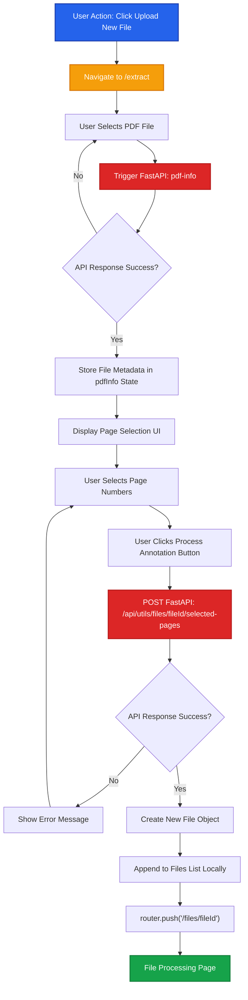

# File Selection Process

This document details the step-by-step process for file upload and page selection in the ADEOS FE extract page.

## Process Overview

The file selection process follows a linear workflow where users upload a file, receive metadata, select pages, and submit for processing.

## Flow Diagram



## Step-by-Step Flow

<Steps>

### Navigate to Extract Page

User clicks the **"Upload New File"** button, which navigates to `/extract` page.

**Route**: `/extract`
**Action**: User-initiated navigation

### Select File

User selects a PDF file using the file input component.

**Trigger**: `onFileSelect` event handler
**API Call**: FastAPI endpoint `pdf-info`

**Response Structure**:
```json
{
  "fileId": "string",
  "file_name": "string",
  "file_type": "string",
  "total_pages": "number",
  "file_blob": "Blob"
}
```

**State Updated**:
- `pdfInfo` object is populated with the response data
- File metadata is stored in component state

### Select Page Numbers

After receiving file metadata, the UI presents a page selection interface.

**UI Component**: Page number selector (multi-select or range input)
**User Action**: Select one or multiple pages for annotation processing

**State**:
- `selected_pages`: Array of page numbers selected by user

### Submit for Processing

User clicks the **"Process Annotation"** button.

**API Call**:
```
POST /api/utils/files/${pdfInfo.fileId}/selected-pages
```

**Payload**:
```json
{
  "pages": [1, 2, 3, ...]
}
```

**Headers**:
- `Content-Type: application/json`

### Append to Files List

On successful API response, instead of refetching all files, the system appends a new file object to the existing files list.

**Object Structure**:
```typescript
{
  file_id: pdfInfo.fileId,
  file_name: pdfInfo.file_name,
  format: pdfInfo.file_blob?.type || 'application/pdf',
  uploaded_at: new Date().toISOString(),
  total_pages: pdfInfo.total_pages,
  selected_pages: selected_pages,
  size: pdfInfo.file_blob?.size || 0
}
```

**Implementation**:
```typescript
setFiles(prevFiles => [...prevFiles, newFileObject]);
```

<Callout type="info">
This approach avoids an additional API call to fetch all files for a specific user ID, improving performance and reducing server load.
</Callout>

### Navigate to File Processing Page

After appending the file to the list, the user is automatically redirected to the file-specific processing page.

**Navigation**:
```typescript
router.push(`/files/${pdfInfo.fileId}`);
```

**Route**: `/files/[fileId]`
**Purpose**: Display file details and begin annotation extraction

</Steps>

## Key Components

### Extract Page (`/extract`)

| Component | Responsibility |
|-----------|----------------|
| File Input | Handles file selection and triggers `pdf-info` API |
| Page Selector | Allows user to select specific pages |
| Process Button | Submits selected pages to backend |
| State Management | Manages `pdfInfo` and `selected_pages` |

### API Endpoints

| Endpoint | Method | Purpose |
|----------|--------|---------|
| `pdf-info` (FastAPI) | POST | Extracts file metadata and returns fileId |
| `/api/utils/files/${fileId}/selected-pages` | POST | Submits selected pages for processing |

## Error Handling

<Callout type="warning">
Ensure proper error handling for:
- File upload failures
- Invalid file formats
- API timeout or network errors
- Empty page selection
</Callout>

**Common Error Scenarios**:

```typescript
// File upload error
if (!response.ok) {
  throw new Error('Failed to upload file');
}

// Empty page selection
if (selected_pages.length === 0) {
  alert('Please select at least one page');
  return;
}

// API submission error
try {
  await fetch(`/api/utils/files/${pdfInfo.fileId}/selected-pages`, {
    method: 'POST',
    body: JSON.stringify({ pages: selected_pages })
  });
} catch (error) {
  console.error('Failed to submit pages:', error);
}
```

## Performance Optimizations

1. **Local State Append**: Instead of refetching all files after upload, the new file is appended locally
2. **Immediate Navigation**: User is redirected immediately after successful submission
3. **Blob Handling**: File blob is stored temporarily for size calculation

## API Contract

### FastAPI: `pdf-info`

**Request**:
```http
POST /pdf-info
Content-Type: multipart/form-data

file: <PDF Blob>
```

**Response**:
```json
{
  "fileId": "string",
  "file_name": "string",
  "file_type": "string",
  "total_pages": 50,
  "file_blob": "Blob"
}
```

### FastAPI: `/api/utils/files/${fileId}/selected-pages`

**Request**:
```http
POST /api/utils/files/{fileId}/selected-pages
Content-Type: application/json

{
  "pages": [1, 2, 5, 10]
}
```

**Response**:
```json
{
  "success": true,
  "message": "Pages submitted for processing"
}
```

## Related Documentation

- [Sprint 02 WebSocket Architecture](/sprint-02/websocket-v2) - Real-time processing flow
- [API Integration](/sprint-02/python-backend) - Backend API details