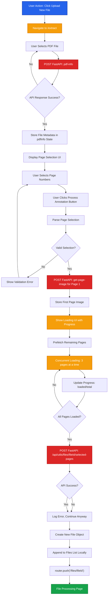

# File Selection Process

This document details the step-by-step process for file upload and page selection in the ADEOS FE extract page.

## Process Overview

The file selection process follows a linear workflow where users upload a file, receive metadata, select pages, and submit for processing.

## Flow Diagram



## Step-by-Step Flow

<Steps>

### Navigate to Extract Page

User clicks the **"Upload New File"** button, which navigates to `/extract` page.

**Route**: `/extract`
**Action**: User-initiated navigation

### Select File

User selects a PDF file using the file input component.

**Trigger**: `onFileSelect` event handler
**API Call**: FastAPI endpoint `pdf-info`

**Response Structure**:
```json
{
  "fileId": "string",
  "file_name": "string",
  "file_type": "string",
  "total_pages": "number",
  "file_blob": "Blob"
}
```

**State Updated**:
- `pdfInfo` object is populated with the response data
- File metadata is stored in component state

### Select Page Numbers

After receiving file metadata, the UI presents a page selection interface.

**UI Component**: Page number selector (multi-select or range input)
**User Action**: Select one or multiple pages for annotation processing

**State**:
- `selected_pages`: Array of page numbers selected by user

### Submit for Processing

User clicks the **"Process Annotation"** button to begin page processing.

**Page Selection Parsing**:
- Handles "all" keyword for all pages
- Parses ranges (e.g., "1-5")
- Parses individual pages (e.g., "1,3,5")
- Validates and deduplicates page numbers

**Parsed Output**:
```typescript
selected_pages = [1, 2, 5, 10]; // Sorted, unique page numbers
```

### Fetch First Page Image

Immediately fetch the first selected page to show content as quickly as possible.

**API Call**:
```
POST /api/utils/get-page-image
Content-Type: multipart/form-data

file: <PDF Blob>
page: 1
file_id: "fileId"
dpi: 275
```

**Response**:
```json
{
  "image": "data:image/png;base64,..."
}
```

**State Update**:
```typescript
setProcessingState(prev => ({
  ...prev,
  currentPage: firstPage,
  processedPages: selected_pages,
  pageImages: {
    [firstPage]: response.data.image
  },
  annotationMode: true
}));
```

<Callout type="info">
Fetching the first page immediately provides instant visual feedback while other pages load in the background.
</Callout>

### Show Loading Progress

Display loading UI with progress tracking.

**State**:
```typescript
setLoadingProgress({
  loaded: 1,  // First page already loaded
  total: selected_pages.length
});
setIsLoadingForRedirect(true);
```

**UI Components**:
- Animated spinner with percentage
- Progress bar showing loaded/total pages
- Status text: "Loading X of Y pages"

### Prefetch Remaining Page Images

Load remaining page images in the background with controlled concurrency.

**Concurrency Control**:
```typescript
const MAX_CONCURRENT = 3; // Maximum 3 simultaneous requests
```

**Process Flow**:
1. Sort pages in numerical order
2. Initialize loading status for each page (`pending`)
3. Process queue with max 3 concurrent requests
4. Update status for each page (`loading` → `loaded` or `error`)
5. Track progress: `setLoadingProgress({ loaded, total })`

**Implementation**:
```typescript
const prefetchPageImages = async (selectedPages: number[]) => {
  const sequentialPages = [...selectedPages].sort((a, b) => a - b);

  // Mark all pages as pending
  setProcessingState(prev => ({
    ...prev,
    pageLoadingStatus: {
      ...selectedPages.reduce((acc, page) => ({
        ...acc,
        [page]: 'pending'
      }), {})
    }
  }));

  // Process queue with controlled concurrency
  const requestQueue = [...pagesToLoad];

  while (requestQueue.length > 0) {
    const page = requestQueue.shift();

    // Update to loading
    updatePageStatus(page, 'loading');

    // Fetch page image
    await fetchPageImage(page);

    // Update to loaded
    updatePageStatus(page, 'loaded');

    // Update progress
    setLoadingProgress({ loaded: ++completedPages, total });
  }
};
```

**Page Loading Status**:
```typescript
pageLoadingStatus: {
  1: 'loaded',
  2: 'loading',
  3: 'pending',
  4: 'error'
}
```

### Persist Selected Pages

Save selected pages to backend for future retrieval.

**API Call**:
```
POST /api/utils/files/${pdfInfo.fileId}/selected-pages
Content-Type: application/json
Authorization: Bearer {token}

{
  "pages": [1, 2, 5, 10]
}
```

**Response**:
```json
{
  "success": true,
  "message": "Selected pages saved"
}
```

<Callout type="warning">
This persists page selection so that when navigating to `/files/[fileId]`, the backend knows which pages to retrieve.
</Callout>

### Append to Files List

On successful API response, instead of refetching all files, the system appends a new file object to the existing files list.

**Object Structure**:
```typescript
{
  file_id: pdfInfo.fileId,
  file_name: pdfInfo.file_name,
  format: pdfInfo.file_blob?.type || 'application/pdf',
  uploaded_at: new Date().toISOString(),
  total_pages: pdfInfo.total_pages,
  selected_pages: selected_pages,
  size: pdfInfo.file_blob?.size || 0
}
```

**Implementation**:
```typescript
setFiles(prevFiles => [...prevFiles, newFileObject]);
```

<Callout type="info">
This approach avoids an additional API call to fetch all files for a specific user ID, improving performance and reducing server load.
</Callout>

### Navigate to File Processing Page

After appending the file to the list, the user is automatically redirected to the file-specific processing page.

**Navigation**:
```typescript
router.push(`/files/${pdfInfo.fileId}`);
```

**Route**: `/files/[fileId]`
**Purpose**: Display file details and begin annotation extraction

</Steps>

## Key Components

### Extract Page (`/extract`)

| Component | Responsibility |
|-----------|----------------|
| File Input | Handles file selection and triggers `pdf-info` API |
| Page Selector | Allows user to select specific pages |
| Process Button | Submits selected pages to backend |
| State Management | Manages `pdfInfo` and `selected_pages` |

### API Endpoints

| Endpoint | Method | Purpose |
|----------|--------|---------|
| `pdf-info` (FastAPI) | POST | Extracts file metadata and returns fileId |
| `/api/utils/get-page-image` (FastAPI) | POST | Fetches rendered page image as base64 |
| `/api/utils/files/${fileId}/selected-pages` (FastAPI) | POST | Persists selected pages to backend |

## Error Handling

<Callout type="warning">
Ensure proper error handling for:
- File upload failures
- Invalid file formats
- API timeout or network errors
- Empty page selection
- Page validation errors (out of range, invalid format)
- Page image loading failures
</Callout>

**Common Error Scenarios**:

```typescript
// File upload error
if (!response.ok) {
  throw new Error('Failed to upload file');
}

// Page selection validation
const validationError = validatePageSelection(selection, totalPages);
if (validationError) {
  toast.error(validationError);
  return;
}

// Empty page selection
if (selected_pages.length === 0) {
  toast.error('Please select at least one page');
  return;
}

// Page image loading error
try {
  await fetchPageImage(page);
  updatePageStatus(page, 'loaded');
} catch (error) {
  updatePageStatus(page, 'error');
  console.error(`Failed to load page ${page}:`, error);
}

// API submission error
try {
  await axios.post(`/api/utils/files/${pdfInfo.fileId}/selected-pages`, {
    pages: selected_pages
  });
} catch (error) {
  console.error('Failed to persist pages:', error);
}
```

## Performance Optimizations

1. **First Page Priority**: Load the first page immediately for instant visual feedback
2. **Concurrent Prefetching**: Load remaining pages with max 3 concurrent requests to balance speed and server load
3. **Sequential Processing**: Pages loaded in numerical order for predictable behavior
4. **Progress Tracking**: Real-time progress updates with `loadingProgress` state
5. **Local State Append**: New file appended locally instead of refetching entire list
6. **Page Loading Status**: Track individual page status (`pending`, `loading`, `loaded`, `error`)
7. **Blob Caching**: File blob stored in memory for multiple page requests

## API Contract

### FastAPI: `pdf-info`

**Request**:
```http
POST /pdf-info
Content-Type: multipart/form-data

file: <PDF Blob>
```

**Response**:
```json
{
  "fileId": "string",
  "file_name": "string",
  "file_type": "string",
  "total_pages": 50,
  "file_blob": "Blob"
}
```

### FastAPI: `/api/utils/get-page-image`

**Request**:
```http
POST /api/utils/get-page-image
Content-Type: multipart/form-data
Authorization: Bearer {token}

file: <PDF Blob>
page: 1
file_id: "fileId"
dpi: 275
```

**Response**:
```json
{
  "image": "data:image/png;base64,iVBORw0KGgoAAAANSUhEUgAA..."
}
```

**Purpose**: Renders a specific PDF page as a base64-encoded PNG image at the specified DPI. Used during prefetching to load all selected pages before navigation.

### FastAPI: `/api/utils/files/${fileId}/selected-pages`

**Request**:
```http
POST /api/utils/files/{fileId}/selected-pages
Content-Type: application/json
Authorization: Bearer {token}

{
  "pages": [1, 2, 5, 10]
}
```

**Response**:
```json
{
  "success": true,
  "message": "Selected pages saved"
}
```

**Purpose**: Persists the selected page numbers for a file, enabling the backend to retrieve only the necessary pages when the user navigates to `/files/[fileId]`.

## Related Documentation

- [Sprint 02 WebSocket Architecture](/sprint-02/websocket-v2) - Real-time processing flow
- [API Integration](/sprint-02/python-backend) - Backend API details