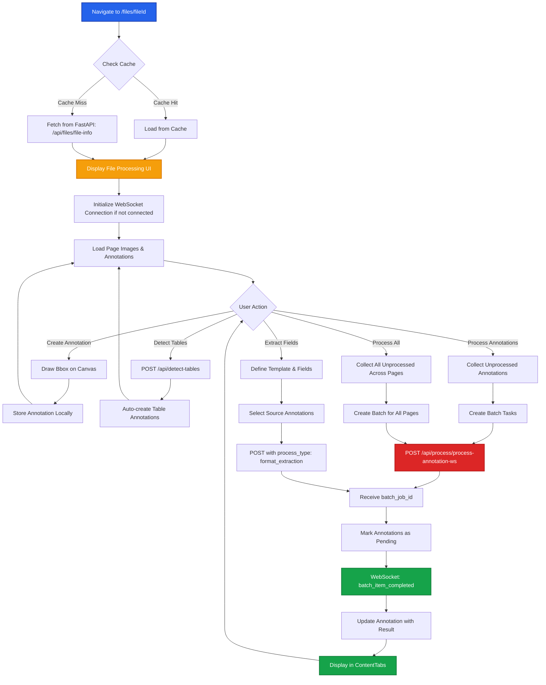

# File Processing Page

This document details the file processing workflow that occurs after navigation to `/files/[fileId]`, including annotation creation, processing, and real-time updates.

## Process Overview

The file processing page is the core workspace where users view PDF pages, create annotations, process them through AI workers, and view extracted content in real-time.

## Flow Diagram



## Step-by-Step Flow

<Steps>

### Page Load & Cache Check

When navigating to `/files/[fileId]`, the application first checks if file data exists in the WebSocket context cache.

**Cache Structure**:
```typescript
{
  fileId: string;
  fileName: string;
  totalPages: number;
  pageImages: Record<number, string>; // base64 images
  pageRotations: Record<number, number>;
  pageDpi: Record<number, number>;
  processedPages: number[];
  annotations: Record<number, Annotation[]>;
  currentPage: number;
  lastUpdated: number;
}
```

**Actions**:
- If cache exists: Restore state immediately
- If cache missing: Fetch from FastAPI

### Fetch File Data (Cache Miss)

**API Call**:
```
GET /api/files/file-info?user_id={userId}&file_id={fileId}
```

**Response Structure**:
```json
{
  "file_id": "string",
  "file_name": "string",
  "pages": [
    {
      "page_no": 1,
      "image": "base64_string",
      "dpi": 275,
      "page_data": [
        {
          "annotation_id": "string",
          "type": "text_extraction",
          "initialBBox": [x1, y1, x2, y2],
          "content": {},
          "rotation": 0
        }
      ]
    }
  ]
}
```

### Initialize UI Components

The page initializes three main sections:

1. **PageHeader**: Navigation, actions (Process All, Export, Refresh)
2. **ImageAnnotator**: Canvas for viewing images and creating annotations
3. **ContentTabs**: Display processed content (Text, Tables, Diagrams, Fields)

### WebSocket Connection

Establishes WebSocket connection for real-time processing updates.

**Connection Flow**:
```typescript
// Auto-connect on mount
useWebSocket().connect();

// Register file-specific handlers
registerAnnotationUpdateHandler(fileId, handleUpdate);

// Monitor connection status
useEffect(() => {
  if (!isConnected) {
    forceReconnect();
  }
}, [isConnected]);
```

### Create Annotations

Users create annotations by drawing bounding boxes on the canvas.

**Annotation Types**:
- **Text**: OCR text extraction
- **Table**: Table structure detection and extraction
- **Diagram**: Technical diagram analysis

**Create Flow**:
```typescript
// 1. User draws bbox on canvas (ImageAnnotator)
handleCreateAnnotation({
  type: currentAnnotationType,
  bbox: [x1, y1, x2, y2],
  processed: false,
  processingStatus: 'non-processed'
});

// 2. Annotation stored in local state
annotations[pageNumber] = [...existingAnnotations, newAnnotation];

// 3. Sync to WebSocket context
setFileAnnotations(fileId, annotations);
```

### Detect Tables (Optional)

Auto-detect table regions using AI detection API.

**API Call**:
```
POST /api/detect-tables
Content-Type: application/json

{
  "page_image": "base64_string",
  "file_id": "string",
  "page_number": 1,
  "dpi": 275
}
```

**Response**:
```json
{
  "tables": [
    {
      "bbox": [x1, y1, x2, y2],
      "confidence": 0.95
    }
  ]
}
```

**Processing**:
- Creates table annotations automatically
- User can adjust bboxes before processing

### Process Annotations (Single Page)

Process all unprocessed annotations on the current page.

**Batch Creation**:
```typescript
const tasks = annotations.map(annotation => ({
  process_type: annotation.type === 'table'
    ? 'table_extraction'
    : annotation.type === 'diagram'
      ? 'diagram_extraction'
      : 'text_extraction',
  data: {
    ann_id: annotation.id,
    file_id: fileId,
    bbox: annotation.bbox,
    page_image: pageImages[pageNumber],
    bbox_image: croppedImage, // Cropped from bbox
    dpi: selectedDpi,
    page_number: pageNumber,
    rotation: pageRotations[pageNumber] || 0
  }
}));
```

**API Call**:
```
POST /api/process/process-annotation-ws?client_id={clientId}
Content-Type: application/json
Authorization: Bearer {token}

{
  "tasks": [...],
  "batch_name": "Batch Annotation Processing (FilePage) - Page 1"
}
```

**Response**:
```json
{
  "batch_job_id": "uuid",
  "status": "queued",
  "message": "Batch job created"
}
```

### Mark Annotations as Pending

Immediately after batch submission, annotations are marked as pending.

```typescript
setProcessingState(prev => ({
  ...prev,
  processingPages: {
    ...prev.processingPages,
    [pageNumber]: true
  },
  annotations: {
    ...prev.annotations,
    [pageNumber]: annotations.map(a => ({
      ...a,
      processingStatus: 'pending'
    }))
  }
}));
```

<Callout type="info">
This provides instant UI feedback with loading spinners on annotations before WebSocket responses arrive.
</Callout>

### WebSocket: batch_item_completed

Workers send individual annotation results via WebSocket.

**Message Format**:
```json
{
  "type": "batch_item_completed",
  "batch_job_id": "uuid",
  "annotation_id": "string",
  "page_number": 1,
  "file_id": "string",
  "success": true,
  "result": {
    "extracted_content": "..." // for text
    // or
    "html": "<table>...</table>" // for tables
    // or
    "DiagramTitle": "..." // for diagrams
  }
}
```

**Handler**:
```typescript
const handleAnnotationUpdate = (update) => {
  setProcessingState(prev => {
    const pageAnnotations = [...prev.annotations[update.pageNumber]];
    const index = pageAnnotations.findIndex(a => a.id === update.annotationId);

    if (index !== -1) {
      pageAnnotations[index] = {
        ...pageAnnotations[index],
        processed: update.success,
        processingStatus: update.success ? 'processed' : 'error',
        result: update.result,
        hasError: !update.success
      };
    }

    return {
      ...prev,
      annotations: {
        ...prev.annotations,
        [update.pageNumber]: pageAnnotations
      }
    };
  });
};
```

### Display Results in ContentTabs

Processed annotations are displayed in the appropriate tab.

**Content Display Logic**:
- **Text Tab**: Shows extracted text content
- **Table Tab**: Renders HTML table with editable cells
- **Diagram Tab**: Displays structured diagram data
- **Fields Tab**: Shows template-based field extraction

**Export Options**:
- Export tables to Excel
- Export fields to formatted sheets
- Copy content to clipboard

### Process All (Multi-Page)

Process all unprocessed annotations across all pages in a single batch.

**Collection**:
```typescript
const allUnprocessed = Object.entries(annotations)
  .flatMap(([pageNum, pageAnnotations]) =>
    pageAnnotations
      .filter(a => !a.processed)
      .map(a => ({ annotation: a, pageNumber: parseInt(pageNum) }))
  );
```

**Batch Request**:
Same format as single-page processing, but with tasks from multiple pages.

**batch_job_id Tracking**:
```typescript
setFileProcessingAll(fileId, true, batchJobId);
registerBatch({
  id: batchJobId,
  fileId,
  type: 'all',
  timestamp: Date.now()
});
```

### Extract Fields (Template-Based)

Extract specific fields using custom templates.

**User Actions**:
1. Select "Fields" tab
2. Define template (name + field descriptions)
3. Select source annotations (optional)
4. Submit for extraction

**Task Structure**:
```typescript
{
  process_type: "format_extraction",
  data: {
    ann_id: `fields_${templateId}_${Date.now()}`,
    file_id: fileId,
    bbox: [0, 0, 100, 100], // Full page
    page_image: pageImages[currentPage],
    dpi: selectedDpi,
    page_number: currentPage,
    rotation: pageRotations[currentPage] || 0,
    fields: {
      templateId: "invoice_template",
      fields: [
        { name: "Invoice Number", description: "Unique invoice ID" },
        { name: "Total Amount", description: "Total payment due" }
      ],
      page_content: [
        {
          annotation_type: "text",
          annotation_content: { content: "extracted text..." }
        }
      ]
    }
  }
}
```

**Result Display**:
Fields are displayed in an HTML table format with extracted values.

</Steps>

## Key Components

### ImageAnnotator

| Feature | Description |
|---------|-------------|
| Canvas Rendering | Konva.js-based canvas for image display |
| Annotation Drawing | Interactive bbox creation with drag-and-drop |
| Annotation Controls | Type selection, table detection, process button |
| Rotation | 90° increments (0, 90, 180, 270) |
| DPI Selection | 72, 150, 200, 275, 300 |
| Transformer | Resize/move existing annotations |

### ContentTabs

| Tab | Content Type | Features |
|-----|-------------|----------|
| Text | Extracted text | View, copy, markdown rendering |
| Table | HTML tables | Editable cells, Excel export |
| Diagram | Structured data | Detailed breakdown, JSON view |
| Fields | Template results | Multi-template support, sheet export |

### WebSocket Context

| Feature | Purpose |
|---------|---------|
| Client ID | Unique identifier for WebSocket connection |
| Batch Tracking | Track batch_job_id for each processing request |
| Annotation Updates | Real-time updates from workers |
| File Data Cache | Persist state across navigations |
| Connection Management | Auto-reconnect, connection monitoring |

## State Management

### Local State (useState)

```typescript
const [processingState, setProcessingState] = useState({
  currentPage: number;
  processedPages: number[];
  pageImages: Record<number, string>;
  annotations: Record<number, Annotation[]>;
  pageRotations: Record<number, number>;
  processingPages: Record<number, boolean>;
  selectedAnnotationId?: string;
  annotationMode: boolean;
  currentAnnotationType: AnnotationType;
});
```

### WebSocket Context State

```typescript
{
  clientId: string;
  isConnected: boolean;
  fileBatchIds: Map<fileId, Map<pageNumber, batchId>>;
  fileAnnotations: Map<fileId, Record<pageNumber, Annotation[]>>;
  cachedFileData: Map<fileId, CachedFileData>;
  activeBatches: Set<batchId>;
}
```

### Synchronization

State is synced between local and WebSocket context:

```typescript
// Local → WebSocket Context
useEffect(() => {
  if (fileId && annotations) {
    setFileAnnotations(fileId, annotations);
    setCachedFileData(fileId, {
      ...cachedData,
      annotations,
      currentPage,
      lastUpdated: Date.now()
    });
  }
}, [annotations, currentPage]);

// WebSocket Context → Local (background updates)
useEffect(() => {
  const interval = setInterval(() => {
    const cachedData = getCachedFileData(fileId);
    if (cachedData && hasNoActiveProcessing) {
      setProcessingState(prev => ({
        ...prev,
        annotations: cachedData.annotations
      }));
    }
  }, 3000);

  return () => clearInterval(interval);
}, [fileId]);
```

## Error Handling

<Callout type="warning">
Common error scenarios and handling:
- **Network Errors**: Retry with exponential backoff (3 attempts)
- **Auth Errors**: Clear token, redirect to login
- **WebSocket Disconnection**: Auto-reconnect every 5 seconds
- **Processing Failures**: Mark annotation as error, display error message
- **Cache Corruption**: Force refresh from API
</Callout>

**Error Display**:
```typescript
// Annotation-level errors
annotation.processingStatus = 'error';
annotation.result = "Something went wrong, Contact support";
annotation.hasError = true;

// Page-level errors
toast.error(`Page ${pageNumber}: ${errorMessage}`);
```

## Performance Optimizations

1. **Image Caching**: Base64 images cached in WebSocket context
2. **Annotation Batching**: Process multiple annotations in single API call
3. **Lazy Loading**: Components loaded dynamically (ImageAnnotator)
4. **Debounced Updates**: State updates throttled to prevent excessive renders
5. **Canvas Optimization**: Konva.js layer caching for faster rendering

## API Endpoints

### File Info

**Endpoint**: `GET /api/files/file-info`

**Query Params**:
- `user_id`: User identifier
- `file_id`: File identifier

**Auth**: Bearer token required

### Process Annotations

**Endpoint**: `POST /api/process/process-annotation-ws`

**Query Params**:
- `client_id`: WebSocket client identifier

**Body**:
```json
{
  "tasks": [Task[]],
  "batch_name": "string"
}
```

**Auth**: Bearer token required

### Detect Tables

**Endpoint**: `POST /api/detect-tables`

**Body**:
```json
{
  "page_image": "base64_string",
  "file_id": "string",
  "page_number": number,
  "dpi": number
}
```

**Auth**: Bearer token required

## Related Documentation

- [File Selection Process](/existing-flow/file-selection) - Upload and page selection
- [WebSocket Architecture](/sprint-02/websocket-v2) - Real-time updates
- [Python Backend](/sprint-02/python-backend) - API implementation