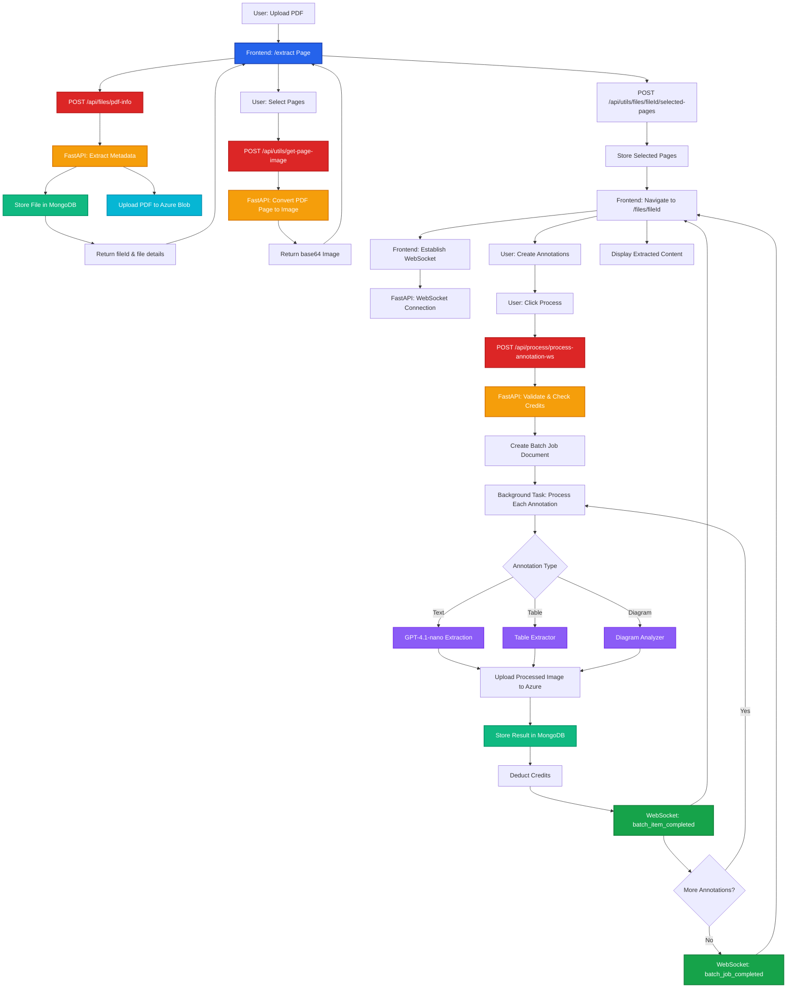

# ADEOS FE: Complete System Flow

This section documents the complete ADEOS FE (Annotation Detection and Extraction Optimization System) architecture, covering both frontend and backend processing flows. ADEOS FE is a real-time annotation processing system built with Next.js 15 and FastAPI, utilizing WebSocket for live updates.

## System Overview

ADEOS FE consists of two main components that work together to provide a seamless file processing experience:

### [Frontend Flow](/existing-flow/frontend-flow)
Next.js 15 application handling file uploads, page selection, and real-time annotation visualization.

### [Backend Flow](/existing-flow/backend-flow)
FastAPI backend managing PDF processing, AI-powered extraction, and WebSocket communication.

## Architecture Diagram



## Technology Stack

### Frontend
- **Framework**: Next.js 15 with App Router
- **Language**: TypeScript
- **State Management**: React Context API
- **Real-time**: WebSocket client
- **UI**: Tailwind CSS, shadcn/ui

### Backend
- **Framework**: FastAPI (Python 3.11+) with WebSocket support
- **Database**: MongoDB
- **Storage**: Azure Blob Storage
- **AI Models**: GPT-4.1-nano, Custom extractors

## Complete User Flow

<Steps>

### File Upload
User uploads a PDF file via the `/extract` page. The frontend sends the file to the FastAPI backend.

### Metadata Extraction
Backend extracts PDF metadata (total pages, file size) and stores the file record in MongoDB with an Azure Blob Storage URL.

### Page Selection
User selects specific pages for annotation processing. Selected pages are submitted to the backend.

### Navigation to Processing
User is redirected to `/files/[fileId]` where the file-specific processing interface loads.

### WebSocket Connection
Frontend establishes a WebSocket connection with the FastAPI backend for real-time updates.

### Batch Processing
Frontend submits annotation requests via `/api/process/process-annotation-ws`. Backend creates a batch job and processes annotations using background tasks.

### Background Processing
Background tasks process annotations (text, table, diagram) concurrently using AI models.

### Real-time Updates
As each annotation completes, the backend sends WebSocket events (`batch_item_completed`) to the frontend, which updates the UI in real-time.

### Completion
When all annotations are processed, the backend sends a `batch_job_completed` event. Results are stored in MongoDB and displayed to the user.

</Steps>

## Key Features

### Performance Optimizations
- **Concurrent Processing**: Up to 5 simultaneous annotation extractions
- **Background Tasks**: Non-blocking Azure Blob uploads
- **Local State Management**: Reduced API calls by caching file metadata
- **Page-Level Processing**: Only selected pages are processed

### Real-time Communication
- **WebSocket Events**: Instant progress updates
- **Batch Status Tracking**: Monitor individual annotation progress
- **Error Handling**: Graceful fallbacks when WebSocket is unavailable

### Scalability
- **Background Tasks**: Concurrent annotation processing
- **Semaphores**: Rate limiting for external AI APIs

## Documentation Sections

### Frontend Flow
Covers the Next.js 15 application, including:
- File selection and page preview
- Local state management
- WebSocket context implementation
- Real-time UI updates

**[Explore Frontend Flow →](/existing-flow/frontend-flow)**

### Backend Flow
Covers the FastAPI backend, including:
- File upload and metadata extraction
- PDF page-to-image conversion
- Batch processing with WebSocket
- AI-powered extraction workers

**[Explore Backend Flow →](/existing-flow/backend-flow)**

## Quick Start

### Frontend Development
```bash
# Navigate to frontend directory
cd frontend/

# Install dependencies
npm install

# Start development server
npm run dev
```

### Backend Development
```bash
# Navigate to backend directory
cd backend/

# Create virtual environment
python -m venv venv
source venv/bin/activate

# Install dependencies
pip install -r requirements.txt

# Start FastAPI server (includes WebSocket support)
uvicorn main:app --reload
```

## Environment Variables

### Frontend
```bash
NEXT_PUBLIC_API_URL=http://localhost:8000
NEXT_PUBLIC_WS_URL=ws://localhost:8000
```

### Backend
```bash
MONGODB_URI=mongodb://localhost:27017/adeos
AZURE_STORAGE_CONNECTION_STRING=your_azure_connection_string
JWT_SECRET_KEY=your_secret_key
```

## Related Resources

- [Sprint 02 Documentation](/sprint-02) - Latest features and improvements
- [WebSocket Architecture](/sprint-02/websocket-v2) - Detailed WebSocket implementation