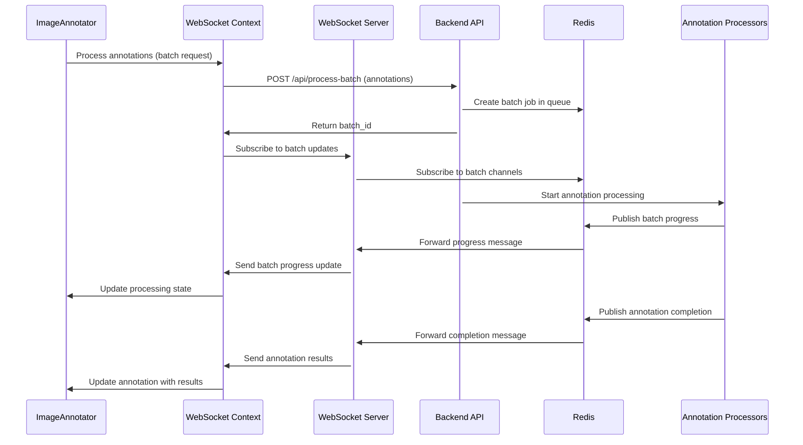

# ADEOS WebSocket Architecture for Annotation Processing

## Overview

This document outlines the WebSocket architecture for ADEOS (Annotation Detection and Extraction Optimization System) - a real-time annotation processing system with Next.js 15 frontend, Python backend API, and WebSocket server using Redis for queue management. The system handles document annotation processing with real-time progress updates for text extraction, table extraction, and diagram extraction.

## Architecture Components

### System Architecture Diagram

```
┌─────────────────┐                 ┌──────────────────┐
│  ADEOS Frontend │  Annotation     │  Python Backend  │
│   (Next.js 15) │  Processing     │      (API)       │
│                 │  Requests       │                  │
│ ┌─ImageAnnotator─┤ ──────────────→ │  ┌─Annotation────┤
│ ├─ContentTabs────┤                 │  │  Processing   │
│ ├─PageHeader─────┤                 │  │  Service      │
│ ├─PageTabs───────┤                 │  └───────────────┤
│ ├─AnnotationCtrl┤                 └─────────┬────────┘
│ │               │                           │
│ │ ┌─WebSocket───┤                           │ Redis Pub/Sub
│ │ │ Context     │                           ▼
│ │ │ - Processing┤                 ┌──────────────────┐
│ │ │   State     │                 │      Redis       │
│ │ │ - Connection│                 │  ┌─Batch Jobs────┤
│ │ │   Manager   │                 │  ├─Progress──────┤
│ │ └─────────────┤                 │  ├─Results───────┤
└─────────┬───────┘                 │  └─Pub/Sub───────┤
          │                         └──────────────────┘
          │ Real-time Updates                 ▲
          ▼                                   │
┌─────────────────┐                           │
│  WebSocket      │ ◄─────────────────────────┘
│    Server       │   Batch & Progress
│  (Node.js)      │   Message Routing
└─────────────────┘
```

### Component Responsibilities

1. **ADEOS Frontend Components**:
   - **ImageAnnotator**: Handles PDF/document annotation creation and manipulation
   - **ContentTabs**: Displays extracted content (text, tables, diagrams) with real-time updates
   - **PageHeader**: Shows processing status and batch operation controls
   - **PageTabs**: Navigation with per-page processing state indicators
   - **AnnotationControls**: Processing triggers and annotation mode controls
   - **WebSocketContext**: Manages batch processing state and real-time updates

2. **Python Backend API**: Handles annotation processing requests, manages Redis queues, publishes progress
3. **WebSocket Server**: Routes batch progress and completion messages to correct frontend instances
4. **Redis**: Stores batch jobs, processing state, and pub/sub messaging for real-time updates

## Implementation Details

### File and Folder Structure

```
adeos-fe/                        # ADEOS Frontend Repository
├── frontend/
│   ├── src/
│   │   ├── components/
│   │   │   ├── ImageAnnotator.tsx      # Main annotation interface
│   │   │   ├── ContentTabs.tsx         # Text/Table/Diagram display
│   │   │   ├── PageTabs.tsx            # Page navigation with status
│   │   │   ├── PageHeader.tsx          # Processing controls & status
│   │   │   ├── AnnotationControls.tsx  # Annotation tools & processing
│   │   │   ├── EditableTable.tsx       # Table editing interface
│   │   │   └── SmartWebSocketStatus.tsx # Connection status display
│   │   ├── context/
│   │   │   ├── WebSocketContext.tsx    # Batch processing state
│   │   │   └── AuthContext.tsx         # User authentication
│   │   ├── hooks/
│   │   │   ├── useProcessingState.ts   # Per-page/file processing state
│   │   │   ├── useSmartWebSocket.ts    # Smart connection management
│   │   │   └── useProcessingConnection.ts # Processing-aware connections
│   │   ├── types/
│   │   │   ├── pdf.ts                  # Annotation & processing types
│   │   │   └── websocket.ts            # WebSocket message types
│   │   ├── services/
│   │   │   └── api.ts                  # Backend API calls
│   │   └── utils/
│   │       └── layoutMapping.ts        # Layout classification utils
│   ├── package.json
│   ├── next.config.js
│   └── tailwind.config.js
│
├── backend/                     # Python Backend API
│   ├── app/
│   │   ├── __init__.py
│   │   ├── main.py
│   │   ├── models/
│   │   │   ├── __init__.py
│   │   │   └── schemas.py
│   │   ├── services/
│   │   │   ├── __init__.py
│   │   │   ├── extraction_service.py
│   │   │   ├── redis_service.py
│   │   │   └── queue_service.py
│   │   ├── workers/
│   │   │   ├── __init__.py
│   │   │   ├── text_extractor.py
│   │   │   ├── table_extractor.py
│   │   │   └── diagram_extractor.py
│   │   └── routes/
│   │       ├── __init__.py
│   │       └── api.py
│   ├── requirements.txt
│   ├── Dockerfile
│   └── docker-compose.yml
│
├── websocket-server/            # WebSocket Server (Node.js)
│   ├── src/
│   │   ├── index.js
│   │   ├── websocket.js
│   │   ├── redis-client.js
│   │   └── message-handler.js
│   ├── package.json
│   └── Dockerfile
│
├── infrastructure/              # Configuration & Deployment
│   ├── redis/
│   │   └── redis.conf
│   ├── nginx/
│   │   └── nginx.conf
│   └── docker-compose.yml
│
└── README.md
```

## Message Flow Sequence



## Data Flow Patterns

### Request/Response Flow
1. User creates annotations in ImageAnnotator component
2. AnnotationControls triggers batch processing via WebSocketContext
3. WebSocketContext sends batch processing request to Backend API
4. Backend creates batch job in Redis with unique batch_id
5. Backend returns batch_id to WebSocketContext for tracking
6. WebSocketContext maintains optimistic processing state

### Progress Update Flow
1. Annotation processors publish batch progress to Redis channels
2. WebSocket server receives updates via Redis subscription
3. WebSocket server routes updates to correct frontend instances
4. WebSocketContext updates batch processing state
5. Components (PageHeader, AnnotationControls) reflect real-time status

### Error Handling Flow
1. Processors publish error messages to Redis error channels
2. WebSocket server handles error message routing
3. WebSocketContext updates processing state with error information
4. **Fallback API Polling**: If WebSocket fails, initiate REST API calls using batch_id
5. **Batch Status API**: GET /api/batch/\{batch_id\}/status for current processing state
6. **Job Polling Service**: Poll pending batch_ids at configurable intervals
7. **Multiple Batch Management**: Handle concurrent batches with individual state tracking
8. UI components display appropriate error messages with retry options
9. Failed batch items are tracked for individual retry or batch reprocessing


## Queue Management Strategy

### Redis Queue Structure
- **Batch Queue**: `batches:pending` - Stores pending annotation batch jobs
- **Batch Progress**: `batch_progress:\{batch_id\}` - Real-time batch processing updates
- **Batch Results**: `batch_results:\{batch_id\}` - Individual annotation processing results
- **Batch Status**: `batch_status:\{batch_id\}` - Overall batch completion status
- **Client Sessions**: `client:\{client_id\}:batches` - Active batches per client session
- **Processing State**: `processing:\{file_id\}:\{page_num\}` - Per-page processing state

### Multi-Client Support
- Each WebSocket connection maintains unique client_id
- Batch jobs are associated with specific client sessions
- Redis pub/sub routes messages to correct client instances
- Optimistic processing state prevents UI flickering during reconnections
- Batch state persists across client disconnections for reliability

## Message Structure & API Specifications

### WebSocket Message Format

All WebSocket messages follow a standardized structure for consistency and easier handling:

```typescript
interface BaseWebSocketMessage {
  type: string;
  batch_id: string;
  timestamp: string;
  client_id: string;
  correlation_id?: string;
}

// Batch Processing Messages
interface BatchCreatedMessage extends BaseWebSocketMessage {
  type: 'batch_created';
  file_id: string;
  page_number: number;
  extraction_types: ExtractionType[];
  total_annotations: number;
  estimated_duration: number;
}

interface BatchProgressMessage extends BaseWebSocketMessage {
  type: 'batch_progress';
  progress: {
    completed_items: number;
    total_items: number;
    current_stage: string;
    percentage: number;
  };
  current_annotation: {
    annotation_id: string;
    extraction_type: ExtractionType;
    stage: string;
  };
}

interface BatchItemCompletedMessage extends BaseWebSocketMessage {
  type: 'batch_item_completed';
  annotation_id: string;
  extraction_type: ExtractionType;
  success: boolean;
  result?: {
    content: any;
    confidence: number;
    metadata: Record<string, any>;
  };
  error?: {
    code: string;
    message: string;
    details: Record<string, any>;
  };
  processing_time: number;
}

interface BatchCompletedMessage extends BaseWebSocketMessage {
  type: 'batch_completed';
  status: 'completed' | 'partial' | 'failed';
  summary: {
    total_items: number;
    completed_items: number;
    failed_items: number;
    total_processing_time: number;
  };
  results: Array<{
    annotation_id: string;
    extraction_type: ExtractionType;
    success: boolean;
    result?: any;
    error?: any;
  }>;
}

interface BatchErrorMessage extends BaseWebSocketMessage {
  type: 'batch_error';
  error: {
    code: string;
    message: string;
    recoverable: boolean;
    retry_after?: number;
  };
  failed_annotations?: string[];
}
```

### REST API Endpoints

#### Batch Status API

```typescript
// GET /api/batch/\{batch_id\}/status
interface BatchStatusResponse {
  batch_id: string;
  status: 'pending' | 'processing' | 'completed' | 'failed' | 'cancelled';
  created_at: string;
  updated_at: string;
  file_id: string;
  page_number: number;
  extraction_types: ExtractionType[];
  progress: {
    completed_items: number;
    total_items: number;
    percentage: number;
    current_stage?: string;
    estimated_remaining_time?: number;
  };
  items: Array<{
    annotation_id: string;
    extraction_type: ExtractionType;
    status: 'pending' | 'processing' | 'completed' | 'failed';
    result?: any;
    error?: {
      code: string;
      message: string;
      timestamp: string;
    };
  }>;
  queue_position?: number;
  error?: {
    code: string;
    message: string;
    timestamp: string;
    recoverable: boolean;
  };
}
```

#### Batch Management APIs

```typescript
// POST /api/batch/create
interface CreateBatchRequest {
  file_id: string;
  page_number: number;
  annotations: Array<{
    id: string;
    type: AnnotationType;
    bbox: [number, number, number, number];
    extraction_types: ExtractionType[];
  }>;
  options?: {
    priority?: 'low' | 'normal' | 'high';
    callback_url?: string;
    client_id?: string;
  };
}

interface CreateBatchResponse {
  batch_id: string;
  status: 'pending' | 'queued';
  estimated_duration: number;
  queue_position?: number;
  created_at: string;
}

// POST /api/batch/\{batch_id\}/retry
interface RetryBatchRequest {
  retry_failed_only?: boolean;
  annotation_ids?: string[]; // Specific annotations to retry
}

// DELETE /api/batch/\{batch_id\}/cancel
interface CancelBatchResponse {
  batch_id: string;
  status: 'cancelled';
  cancelled_at: string;
  refund_credits?: number;
}

// GET /api/batches/active
interface ActiveBatchesResponse {
  batches: Array<{
    batch_id: string;
    file_id: string;
    page_number: number;
    status: string;
    progress: number;
    created_at: string;
  }>;
  total_active: number;
}
```

## Annotation Processing Types

### 1. Text Annotation Processing
- Return structured text with confidence scores (optional) and layout information (optional)

### 2. Table Annotation Processing
- Return JSON formatted table data with headers and cell content (HTML table format)

### 3. Diagram/Image Annotation Processing
- Process diagram and image annotations for content extraction
- Return extracted diagram informations

## Performance Considerations

### Scalability Features
- Horizontal scaling of WebSocket servers
- Redis cluster support for high availability
- Background worker auto-scaling based on queue depth
- Connection pooling and rate limiting

### Optimization Strategies
- Message batching for high-frequency updates
- Compression for large result payloads
- Client-side reconnection with exponential backoff
- Graceful degradation for offline scenarios

## Security Implementation

### Authentication & Authorization
- Authentication token validation for API access
- WebSocket connection authentication via token

## Monitoring & Observability

### Metrics Collection
- Queue depth and processing time metrics
- WebSocket connection count and duration
- Extraction success/failure rates
- System resource utilization

### Logging Strategy
- Structured logging with correlation IDs
- Centralized log aggregation
- Real-time alerting for critical errors
- Performance monitoring dashboards

## Deployment Configuration

### Container Orchestration
- Docker containers for each service
- Kubernetes deployment manifests
- Auto-scaling based on queue metrics

### Environment Management
- Separate configurations for dev/staging/prod