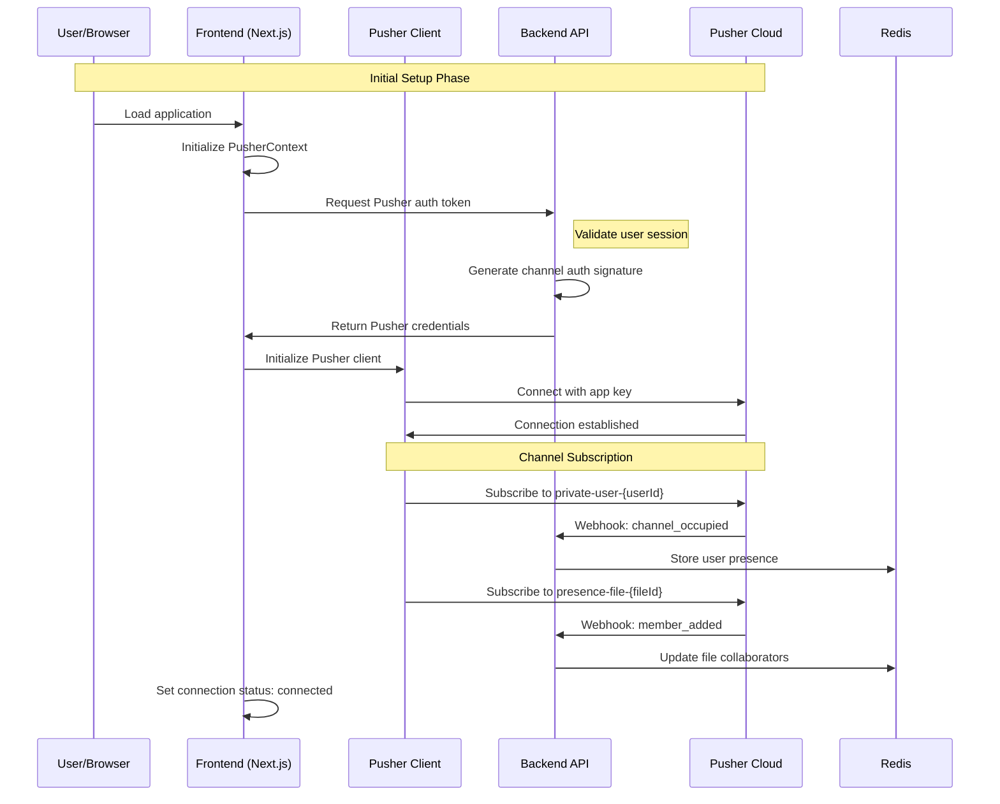
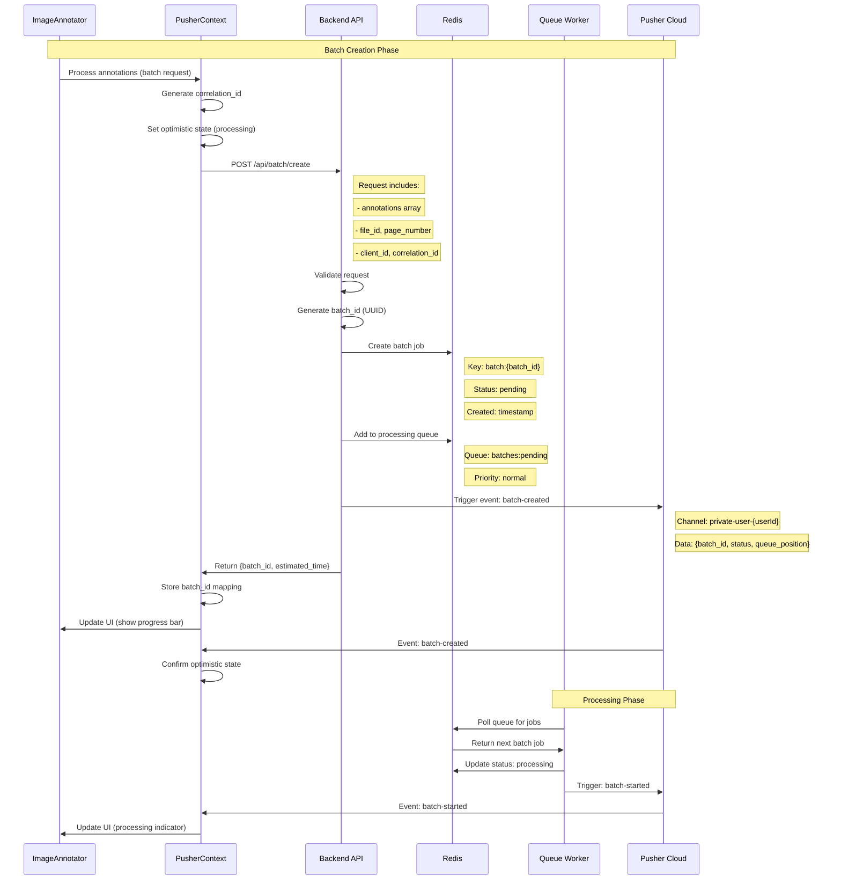
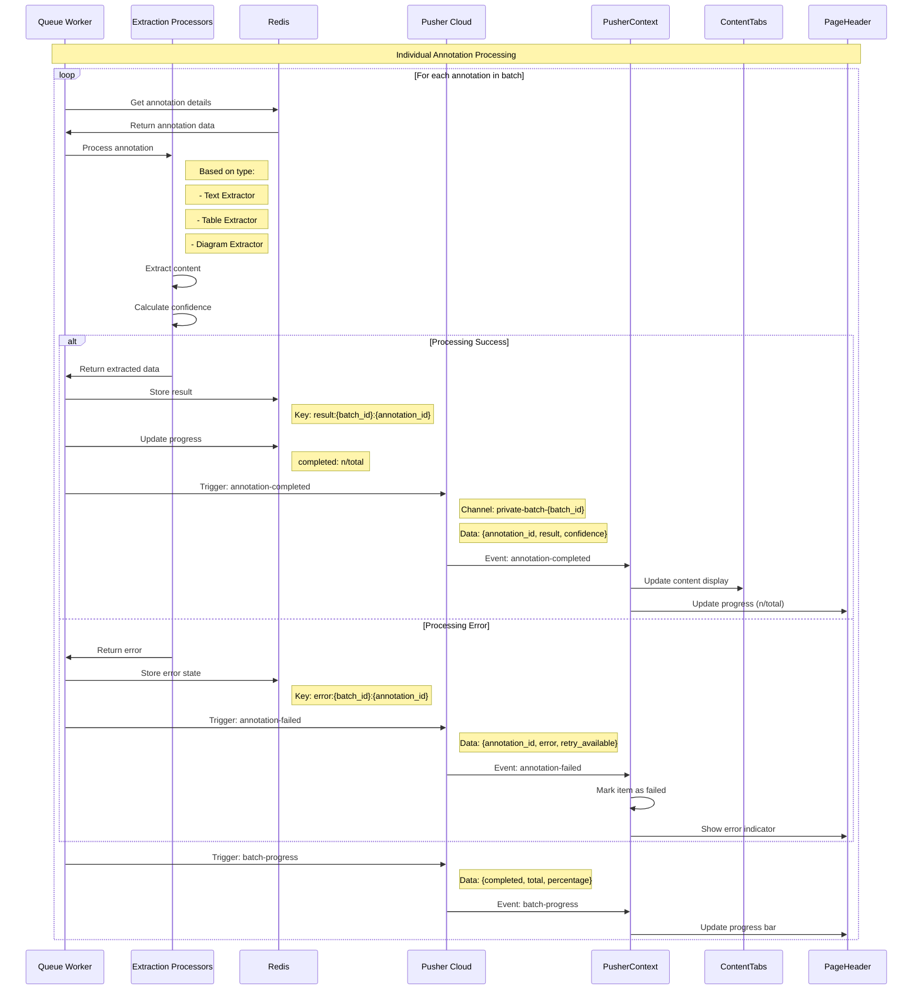
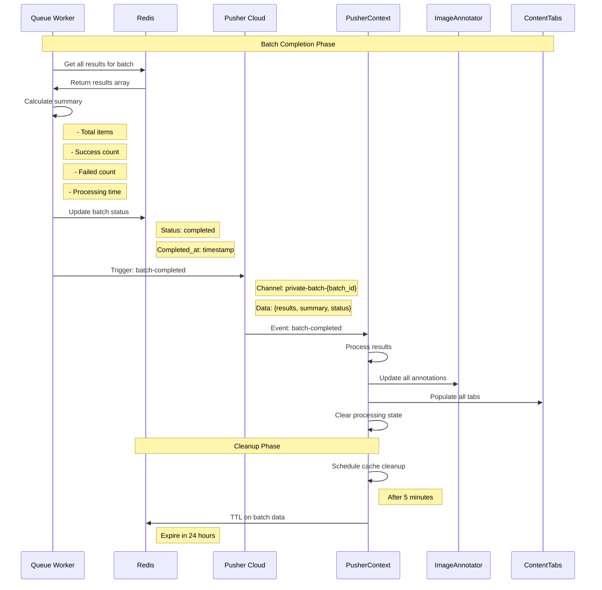
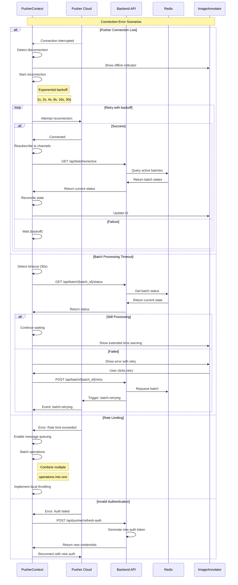
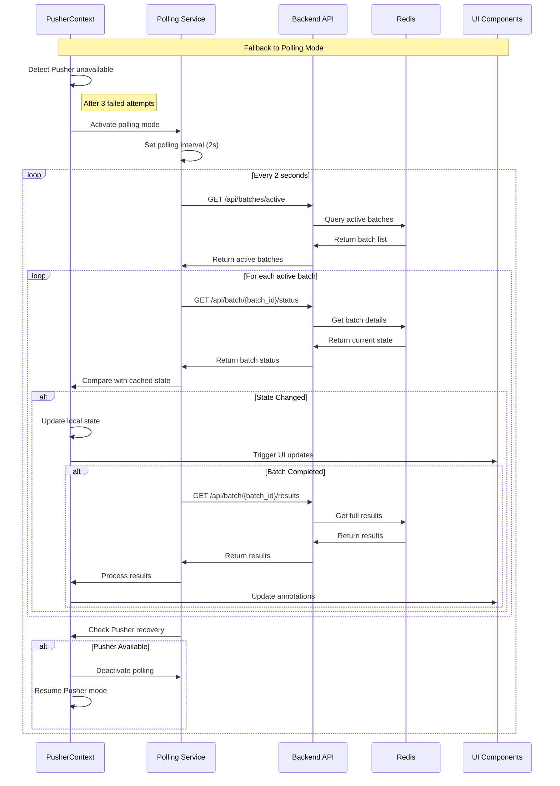

## Summary

This redesigned ADEOS architecture with Pusher provides:

### Key Benefits
1. **Simplified Infrastructure**: No custom WebSocket server to maintain
2. **Built-in Scalability**: Pusher handles millions of concurrent connections
3. **Global Distribution**: Low latency with Pusher's global infrastructure
4. **Reliability**: Automatic failover and redundancy
5. **Security**: Built-in authentication and encryption
6. **Monitoring**: Rich metrics and debugging tools

### Best Practices Implemented
1. **Graceful Degradation**: Automatic fallback to polling
2. **Error Recovery**: Exponential backoff and retry logic
3. **State Management**: Optimistic updates with reconciliation
4. **Performance**: Message batching and throttling
5. **Security**: Channel authorization and rate limiting
6. **Monitoring**: Comprehensive metrics and alerting

### Exception Handling
1. **Connection Failures**: Automatic reconnection with backoff
2. **Authentication Errors**: Token refresh mechanism
3. **Rate Limiting**: Client-side throttling and queue management
4. **Network Partitions**: State reconciliation on reconnection
5. **Processing Failures**: Individual retry with circuit breaker

This architecture ensures robust, scalable, and maintainable real-time annotation processing for ADEOS.# ADEOS Pusher Architecture for Annotation Processing

## Overview

This document outlines the redesigned architecture for ADEOS (Annotation Detection and Extraction Optimization System) using **Pusher** for real-time communication instead of a custom WebSocket server. The system handles document annotation processing with real-time progress updates for text extraction, table extraction, and diagram extraction using Pusher's managed infrastructure.

## Architecture Components

### System Architecture with Pusher

```
┌─────────────────┐                 ┌──────────────────┐
│  ADEOS Frontend │  Annotation     │  Python Backend  │
│   (Next.js 15)  │  Processing     │      (API)       │
│                 │  Requests       │                  │
│ ┌─ImageAnnotator─┤ ──────────────→ │  ┌─Annotation────┤
│ ├─ContentTabs────┤                 │  │  Processing   │
│ ├─PageHeader─────┤                 │  │  Service      │
│ ├─PageTabs───────┤                 │  └───────────────┤
│ ├─AnnotationCtrl┤                 │  ┌─Pusher────────┤
│ │               │                 │  │  Publisher    │
│ │ ┌─Pusher──────┤                 │  └───────────────┤
│ │ │ Context     │                 └─────────┬────────┘
│ │ │ - Processing│                           │
│ │ │   State     │                           │ Publish Events
│ │ │ - Channel   │                           ▼
│ │ │   Manager   │                 ┌──────────────────┐
│ │ └─────────────┤                 │     Pusher       │
└─────────┬───────┘                 │   Cloud Service  │
          │                         │  ┌─Channels──────┤
          │ Subscribe to            │  ├─Presence──────┤
          │ Real-time Events        │  ├─Private───────┤
          ▼                         │  └─Webhooks──────┤
┌─────────────────┐                 └──────────────────┘
│  Pusher Client  │                           ▲
│    (pusher-js)  │                           │
└─────────────────┘                           │
          ▲                                   │
          └───────────────────────────────────┘
                    Real-time Updates
                    
┌──────────────────┐
│      Redis       │
│  ┌─Batch Jobs────┤
│  ├─Progress──────┤
│  ├─Results───────┤
│  └─State Cache───┤
└──────────────────┘
```

## Detailed Flow Diagrams

### 1. Initial Connection and Authentication Flow



### 2. Batch Processing Request Flow



### 3. Annotation Processing and Progress Updates



### 4. Batch Completion and Result Handling



### 5. Error Handling and Recovery Flow



### 6. Fallback Polling Mechanism


