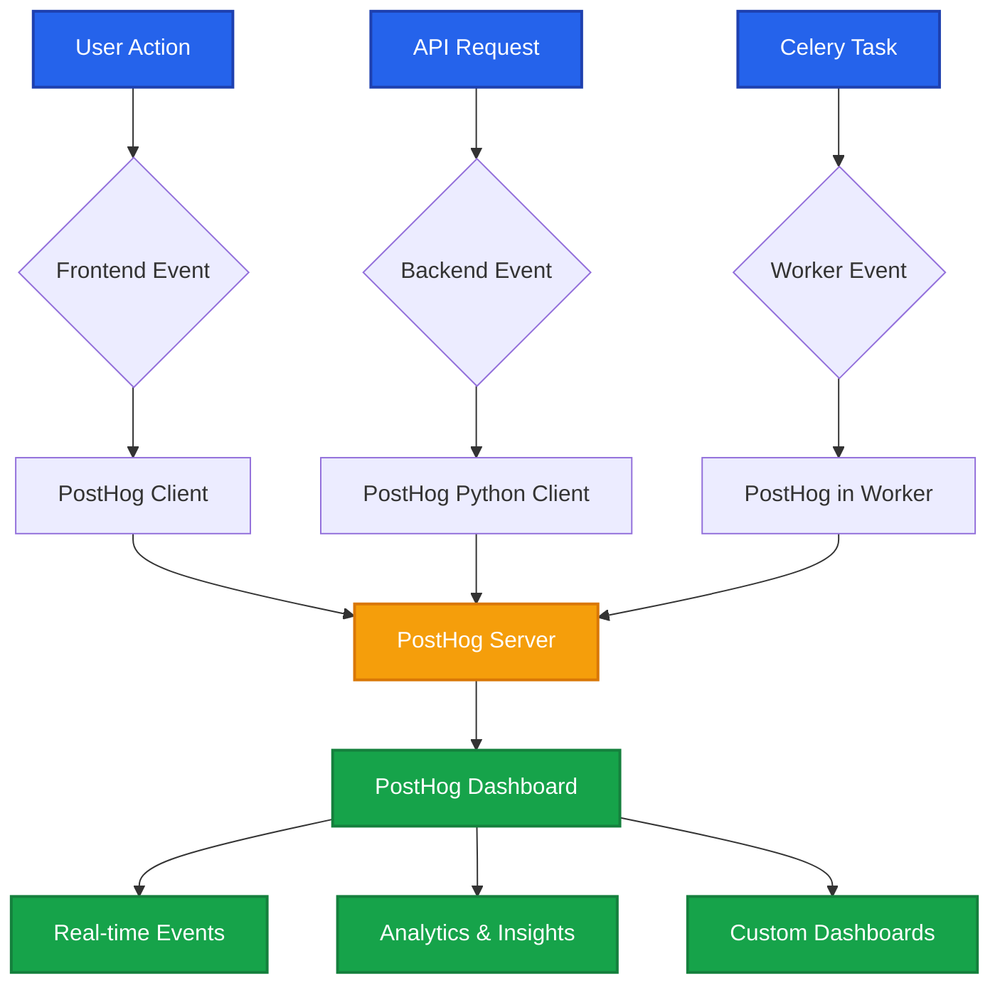

# PostHog Analytics

PostHog is a comprehensive product analytics platform that helps us understand how the OCR app is performing. It tracks user actions, processing times, errors, and provides actionable insights to improve the application/product.

## Overview

PostHog enables us to:
- Monitor daily image processing volumes
- Track upload success/failure rates
- Measure OCR processing speed and accuracy
- Track errors and debugging information
- Understand user behavior patterns

## Complete Flow



## What PostHog Tracks

### Frontend Events

| Event | Description | Properties |
|-------|-------------|------------|
| `file_upload_started` | File upload initiated | `batch_id`, `file_count` |
| `file_upload_completed` | Upload successful | `batch_id`, `file_count` |
| `file_upload_failed` | Upload failed | `batch_id`, `error_message` |
| `results_viewed` | User viewed results | `batch_id` |
| `image_opened` | User opened image | `image_id`, `batch_id` |
| `error_encountered` | Frontend error occurred | `error_type`, `error_message` |

### Backend Events

| Event | Description | Properties |
|-------|-------------|------------|
| `api_upload_received` | Upload received by API | `batch_id`, `file_count` |
| `task_queued` | Task added to queue | `batch_id`, `task_id` |
| `ocr_processing_started` | OCR processing began | `batch_id`, `task_id` |
| `ocr_processing_completed` | OCR completed successfully | `batch_id`, `processing_time_seconds`, `accuracy` |
| `ocr_processing_failed` | OCR processing failed | `batch_id`, `error_message` |
| `realtime_update_sent` | WebSocket update sent | `batch_id`, `update_type` |

## Setup Guide

import { Steps } from 'nextra/components'

<Steps>

### Get PostHog API Key

1. Go to [https://posthog.com/](https://posthog.com/) and sign up
2. Create a new project
3. Navigate to **Project Settings → Project API Key**
4. Copy the key (starts with `phc_` - this is the Project API Key, NOT the Personal API Key which starts with `phx_`)

### Add Environment Variables

Create or edit your `.env` file:

**Backend (.env)**
```bash
POSTHOG_API_KEY=phc_your_key_here
POSTHOG_HOST=https://app.posthog.com
```

**Frontend (.env.local)**
```bash
NEXT_PUBLIC_POSTHOG_KEY=phc_your_key_here
NEXT_PUBLIC_POSTHOG_HOST=https://app.posthog.com
```

import { Callout } from 'nextra/components'

<Callout type="info">
  Environment variables for Next.js must have the `NEXT_PUBLIC_` prefix to be accessible in the browser.
</Callout>

### Rebuild and Start

Rebuild the application to apply the new environment variables:

```bash
docker compose down
docker compose up --build
```

### Verify Installation

Check the logs to confirm PostHog is initialized:

```bash
docker compose logs | grep -i posthog
```

You should see: `"PostHog analytics initialized successfully"`

</Steps>

## Using PostHog Dashboard

### View Live Events

<Steps>

1. Go to [https://app.posthog.com/](https://app.posthog.com/)
2. Navigate to **Activity → Live events**
3. Upload an image in your app
4. Watch events appear in real-time (click refresh if needed)

</Steps>

### View All Events

Navigate to **Product Analytics → Events** to see all tracked events with filtering options.

### Create Custom Dashboards

Example: **Daily Operations Dashboard**

<Steps>

1. Go to **Dashboards → New Dashboard**
2. Name it "OCR Operations"
3. Add insights:
   - **Total Uploads**: Count of `api_upload_received` today
   - **Success Rate**: `ocr_processing_completed` / `ocr_processing_started` × 100
   - **Avg Processing Time**: Average of `processing_time_seconds`
   - **Error Count**: Count of `ocr_processing_failed`

</Steps>

<Callout type="info">
  Dashboards update in real-time and can be shared with team members via URL.
</Callout>

## Implementation Overview

### Backend Setup

**Files Involved:**
- `backend/app/analytics.py` - PostHog client and tracking functions
- `backend/main.py` - Tracks API events
- `backend/app/celery_app.py` - Initializes PostHog in workers
- `backend/app/tasks.py` - Tracks OCR processing events

**How It Works:**

<Steps>

1. PostHog initializes when FastAPI starts
2. PostHog also initializes in each Celery worker for task tracking
3. Events are tracked at key points (upload, processing, completion)
4. All events are sent to PostHog server asynchronously

</Steps>

**Example Implementation:**

```python
# backend/app/analytics.py
from posthog import Posthog
import os

posthog = Posthog(
    project_api_key=os.getenv("POSTHOG_API_KEY"),
    host=os.getenv("POSTHOG_HOST")
)

def track_event(event_name: str, distinct_id: str, properties: dict):
    """Track an event to PostHog"""
    try:
        posthog.capture(
            distinct_id=distinct_id,
            event=event_name,
            properties=properties
        )
    except Exception as e:
        logger.error(f"PostHog tracking failed: {e}")
```

### Frontend Setup

**Files Involved:**
- `frontend/utils/analytics.ts` - Tracking functions
- `frontend/providers/PostHogProvider.tsx` - Initializes PostHog
- `frontend/app/layout.tsx` - Wraps app with provider
- `frontend/app/page.tsx` - Tracks user actions

**How It Works:**

<Steps>

1. PostHog initializes when app loads
2. Page views tracked automatically
3. User actions tracked manually (upload, view results, etc.)
4. All events include user session context

</Steps>

**Example Implementation:**

```typescript
// frontend/utils/analytics.ts
import posthog from 'posthog-js'

export function trackEvent(eventName: string, properties?: Record<string, any>) {
  if (typeof window !== 'undefined' && posthog) {
    posthog.capture(eventName, properties)
  }
}

// Usage in components
import { trackEvent } from '@/utils/analytics'

const handleUpload = async () => {
  trackEvent('file_upload_started', {
    batch_id: batchId,
    file_count: files.length
  })
}
```

## Troubleshooting

### Events Not Showing Up

<Callout type="warning">
  **Check API Key**: Ensure you're using the Project API Key (starts with `phc_`), NOT the Personal API Key (starts with `phx_`)
</Callout>

**Check Logs:**

```bash
docker compose logs backend | grep -i posthog
docker compose logs worker | grep -i posthog
```

Should see: `"PostHog analytics initialized successfully"`

**Wait a Bit**: Events can take 1-2 minutes to appear in PostHog dashboard.

### Worker Events Missing

If you see backend events but not OCR processing events:

<Steps>

1. Check worker logs: `docker compose logs worker`
2. Verify PostHog initialized in workers
3. Restart workers: `docker compose restart worker`

</Steps>

### Frontend Events Not Working

<Steps>

1. Check browser console for errors
2. Verify environment variables have `NEXT_PUBLIC_` prefix
3. Rebuild frontend: `docker compose up --build frontend`

</Steps>

## Adding New Events

### Backend Example

Add a new tracking function in `backend/app/analytics.py`:

```python
def track_your_event(batch_id: str, custom_data: str):
    track_event(
        event_name="your_event_name",
        distinct_id=batch_id,
        properties={
            "custom_field": custom_data,
            "timestamp": datetime.now().isoformat()
        }
    )
```

Use it in your code:

```python
from app.analytics import track_your_event

track_your_event(batch_id, "some data")
```

### Frontend Example

Add a new tracking function in `frontend/utils/analytics.ts`:

```typescript
export function trackYourEvent(batchId: string, data: string) {
  trackEvent('your_event_name', {
    batch_id: batchId,
    custom_field: data,
    timestamp: new Date().toISOString()
  });
}
```

Use it in your components:

```typescript
import { trackYourEvent } from '@/utils/analytics';

trackYourEvent(batchId, 'some data');
```

## Best Practices

1. **Consistent Naming**: Use snake_case for event names (e.g., `ocr_processing_started`)
2. **Include Context**: Always include `batch_id` or `task_id` for correlation
3. **Error Tracking**: Track both success and failure events
4. **Performance**: Track timing metrics (`processing_time_seconds`)
5. **Privacy**: Don't track PII (personally identifiable information)

## Resources

- [PostHog Dashboard](https://app.posthog.com/)
- [PostHog Documentation](https://posthog.com/docs)
- [PostHog Tutorials](https://posthog.com/tutorials)
- [PostHog API Reference](https://posthog.com/docs/api)

## Related Documentation

- [Analytics & Telemetry](/tools/analytics-telemetry) - Overview of analytics solutions
