# Annotation Processing - Backend

This document details the V2 backend flow for processing annotation extraction jobs using Celery workers, Redis queues, and Pusher notifications.

## Process Overview

The backend receives annotation processing requests, creates batch jobs in MongoDB, queues extraction tasks to Redis/Celery, processes annotations using AI models, stores results in Azure Blob, and sends real-time updates via Pusher.

## Complete Flow Diagram

```mermaid
graph TD
    A[Frontend: POST /process-annotation] --> B[Receive Payload: pages, ann_id, ann_type]
    B --> C[Validate user_id and file_id]
    C --> D[Create Job Document in MongoDB]

    D --> E[Insert into jobprocess_collection]
    E --> F[Get batch_id from inserted_id]

    F --> G[Queue Task to Redis]
    G --> H[Redis: Store extraction_worker Task]
    H --> I[Return batch_id to Frontend]

    I --> J[Frontend: Subscribe to Pusher]

    H --> K[Celery Worker: Poll Redis Queue]
    K --> L[Pick extraction_worker Task]
    L --> M[Fetch Batch Job from MongoDB]

    M --> N[Loop: Process Each Annotation]
    N --> O[Fetch Page Image from Azure Blob]
    O --> P[Crop Image to BBox]

    P --> Q[Send Pusher: extraction_started]
    Q --> R[Run Layout Detection on Cropped Image]
    R --> S[Identify Chunks: text blocks, tables, diagrams]

    S --> T[Send Pusher: layout_detected with chunk count]
    T --> U[Loop: Process Each Chunk]

    U --> V{Chunk Type?}
    V -->|text| W[AI Model: Extract Text with GPT]
    V -->|table| X[AI Model: Extract Table Structure]
    V -->|diagram| Y[AI Model: Analyze Diagram]

    W --> Z[Store Chunk Extracted Data]
    X --> Z
    Y --> Z

    Z --> AA[Send Pusher: chunk_completed with progress]
    AA --> AB{More Chunks?}
    AB -->|Yes| U
    AB -->|No| AC[Combine All Chunk Data]

    AC --> AD[Save Final Extracted Data to MongoDB]
    AD --> AE[Upload Processed Image to Azure Blob]
    AE --> AF[Update MongoDB: Annotation Status = completed]
    AF --> AG[Update Redis: Progress Cache]
    AG --> AH[Send Pusher: batch_item_completed]

    AH --> AI{More Annotations?}
    AI -->|Yes| N
    AI -->|No| AJ[Update MongoDB: Batch Status = completed]

    AJ --> AK[Send Pusher: batch_job_completed]
    AK --> AL[Frontend: Fetch Final Data]

    style A fill:#2563eb,stroke:#1e40af,stroke-width:2px,color:#fff
    style D fill:#f59e0b,stroke:#d97706,stroke-width:2px,color:#fff
    style E fill:#dc2626,stroke:#b91c1c,stroke-width:2px,color:#fff
    style G fill:#8b5cf6,stroke:#7c3aed,stroke-width:2px,color:#fff
    style H fill:#dc2626,stroke:#b91c1c,stroke-width:2px,color:#fff
    style K fill:#f59e0b,stroke:#d97706,stroke-width:2px,color:#fff
    style O fill:#dc2626,stroke:#b91c1c,stroke-width:2px,color:#fff
    style Q fill:#8b5cf6,stroke:#7c3aed,stroke-width:2px,color:#fff
    style R fill:#f59e0b,stroke:#d97706,stroke-width:2px,color:#fff
    style T fill:#8b5cf6,stroke:#7c3aed,stroke-width:2px,color:#fff
    style W fill:#8b5cf6,stroke:#7c3aed,stroke-width:2px,color:#fff
    style X fill:#8b5cf6,stroke:#7c3aed,stroke-width:2px,color:#fff
    style Y fill:#8b5cf6,stroke:#7c3aed,stroke-width:2px,color:#fff
    style AA fill:#8b5cf6,stroke:#7c3aed,stroke-width:2px,color:#fff
    style AD fill:#dc2626,stroke:#b91c1c,stroke-width:2px,color:#fff
    style AE fill:#dc2626,stroke:#b91c1c,stroke-width:2px,color:#fff
    style AF fill:#dc2626,stroke:#b91c1c,stroke-width:2px,color:#fff
    style AG fill:#dc2626,stroke:#b91c1c,stroke-width:2px,color:#fff
    style AH fill:#8b5cf6,stroke:#7c3aed,stroke-width:2px,color:#fff
    style AK fill:#8b5cf6,stroke:#7c3aed,stroke-width:2px,color:#fff
    style AL fill:#16a34a,stroke:#15803d,stroke-width:2px,color:#fff
```



## API Endpoint

### POST /process-annotation

Initiates annotation extraction processing.

**Headers**:
```http
Authorization: Bearer {jwt_token}
Content-Type: application/json
```

**Request Body**:
```json
{
  "user_id": "user_12345",
  "file_id": "67890abc",
  "pages": [
    {
      "page_no": 1,
      "annotations": [
        {
          "ann_id": "ann_1",
          "ann_type": "text",
          "bbox": [100, 200, 300, 250]
        },
        {
          "ann_id": "ann_2",
          "ann_type": "table",
          "bbox": [50, 300, 500, 600]
        }
      ]
    },
    {
      "page_no": 2,
      "annotations": [
        {
          "ann_id": "ann_3",
          "ann_type": "diagram",
          "bbox": [150, 100, 450, 400]
        }
      ]
    }
  ]
}
```

**Response**:
```json
{
  "batch_id": "batch_123"
}
```

**Response Time**: Less than 100ms (async task initiation)

## Implementation Flow

<Steps>

### Receive and Validate Request

Parse request payload and validate data.

```python
from fastapi import APIRouter, Depends
from pydantic import BaseModel

router = APIRouter()

class AnnotationItem(BaseModel):
    ann_id: str
    ann_type: str  # "text" | "table" | "diagram" | "field"
    bbox: list[int]  # [x1, y1, x2, y2]

class PageAnnotations(BaseModel):
    page_no: int
    annotations: list[AnnotationItem]

class ProcessRequest(BaseModel):
    user_id: str
    file_id: str
    pages: list[PageAnnotations]

@router.post("/process-annotation")
async def initiate_processing(
    request: ProcessRequest,
    user: dict = Depends(verify_token)
):
    # Validate file exists
    file_doc = await files_collection.find_one({"_id": ObjectId(request.file_id)})
    if not file_doc:
        raise HTTPException(status_code=404, detail="File not found")

    # Create batch job
    batch_id = await create_batch_job(request)

    return {"batch_id": batch_id}
```

### Create Batch Job in MongoDB

Create a job document in jobprocess_collection.

```python
from datetime import datetime

async def create_batch_job(request: ProcessRequest) -> str:
    # Flatten annotations from all pages
    all_annotations = []
    for page in request.pages:
        for ann in page.annotations:
            all_annotations.append({
                "ann_id": ObjectId(ann.ann_id),
                "type": ann.ann_type,
                "page_no": page.page_no,
                "bbox": ann.bbox,
                "status": "queued",
                "data": None
            })

    # Create job document
    job_doc = {
        "file_id": ObjectId(request.file_id),
        "user_id": request.user_id,
        "status": "queued",
        "createdAt": datetime.utcnow(),
        "annotations": all_annotations
    }

    # Insert into MongoDB
    result = await jobprocess_collection.insert_one(job_doc)
    batch_id = str(result.inserted_id)

    # Queue Celery task
    extraction_worker.delay(batch_id)

    return batch_id
```

<Callout type="info">
**Redis Queue Flow**: `extraction_worker.delay()` serializes the task and pushes it to Redis using `LPUSH celery`. The task waits in the queue until a Celery worker picks it up with `BRPOP`.
</Callout>

### Background Extraction Worker

Celery task that processes each annotation.

```python
from celery import Celery
from pusher import Pusher
import redis
from azure.storage.blob import BlobServiceClient
import openai

celery_app = Celery('tasks', broker='redis://localhost:6379/0')
pusher_client = Pusher(...)
redis_client = redis.Redis(host='localhost', port=6379, db=0)
blob_service_client = BlobServiceClient(...)

@celery_app.task
def extraction_worker(batch_id: str):
    # Fetch batch job
    job_doc = jobprocess_collection.find_one({"_id": ObjectId(batch_id)})
    user_id = job_doc["user_id"]
    file_id = job_doc["file_id"]
    annotations = job_doc["annotations"]

    # Update status to processing
    jobprocess_collection.update_one(
        {"_id": ObjectId(batch_id)},
        {"$set": {"status": "processing"}}
    )

    # Initialize progress in Redis
    progress_key = f"batch:progress:{batch_id}"
    redis_client.hset(progress_key, mapping={
        "completed": 0,
        "total": len(annotations),
        "status": "processing"
    })
    redis_client.expire(progress_key, 7200)  # 2 hours

    # Process each annotation
    for idx, ann in enumerate(annotations):
        ann_id = str(ann["ann_id"])
        ann_type = ann["type"]
        page_no = ann["page_no"]
        bbox = ann["bbox"]

        try:
            # Update status to processing
            jobprocess_collection.update_one(
                {"_id": ObjectId(batch_id), "annotations.ann_id": ObjectId(ann_id)},
                {"$set": {"annotations.$.status": "processing"}}
            )

            # Fetch page image from Azure Blob
            page_doc = pages_collection.find_one({
                "file_id": ObjectId(file_id),
                "page_no": page_no
            })
            page_image_url = page_doc["url"]

            # Download image
            blob_client = blob_service_client.get_blob_client_from_url(page_image_url)
            image_bytes = blob_client.download_blob().readall()

            # Crop to bounding box
            cropped_image = crop_image(image_bytes, bbox)

            # Send extraction started notification
            pusher_client.trigger(user_id, 'extraction_started', {
                'batch_id': batch_id,
                'ann_id': ann_id
            })

            # Run layout detection
            layout_chunks = run_layout_detection(cropped_image)
            # Returns: [{"type": "text", "bbox": [...], "content": bytes}, ...]

            # Send layout detected notification
            pusher_client.trigger(user_id, 'layout_detected', {
                'batch_id': batch_id,
                'ann_id': ann_id,
                'chunk_count': len(layout_chunks)
            })

            # Process each chunk
            chunk_results = []
            for chunk_idx, chunk in enumerate(layout_chunks):
                chunk_type = chunk["type"]
                chunk_image = chunk["content"]

                # Extract based on chunk type
                if chunk_type == "text":
                    chunk_data = extract_text_with_gpt(chunk_image)
                elif chunk_type == "table":
                    chunk_data = extract_table(chunk_image)
                elif chunk_type == "diagram":
                    chunk_data = analyze_diagram(chunk_image)

                chunk_results.append({
                    "chunk_index": chunk_idx,
                    "type": chunk_type,
                    "data": chunk_data
                })

                # Send chunk completed notification
                pusher_client.trigger(user_id, 'chunk_completed', {
                    'batch_id': batch_id,
                    'ann_id': ann_id,
                    'chunk_index': chunk_idx,
                    'total_chunks': len(layout_chunks),
                    'progress': round(((chunk_idx + 1) / len(layout_chunks)) * 100)
                })

            # Combine all chunk data
            extracted_data = combine_chunk_data(chunk_results, ann_type)

            # Upload processed image to blob
            processed_blob_name = f"processed/{batch_id}/{ann_id}.png"
            processed_blob_client = blob_service_client.get_blob_client(
                container="annotations",
                blob=processed_blob_name
            )
            processed_blob_client.upload_blob(cropped_image, overwrite=True)
            processed_url = processed_blob_client.url

            # Add URL to extracted data
            extracted_data["processed_image_url"] = processed_url

            # Update MongoDB: jobprocess_collection
            jobprocess_collection.update_one(
                {"_id": ObjectId(batch_id), "annotations.ann_id": ObjectId(ann_id)},
                {"$set": {
                    "annotations.$.status": "completed",
                    "annotations.$.data": extracted_data
                }}
            )

            # Update MongoDB: annotations_collection
            annotations_collection.update_one(
                {"_id": ObjectId(ann_id)},
                {"$set": {
                    "status": "completed",
                    "data": extracted_data,
                    "updated_at": datetime.utcnow()
                }}
            )

            # Update Redis progress
            redis_client.hset(progress_key, "completed", idx + 1)

            # Send Pusher notification
            pusher_client.trigger(user_id, 'batch_item_completed', {
                'batch_id': batch_id,
                'ann_id': ann_id,
                'status': 'completed'
            })

        except Exception as e:
            # Mark as failed
            jobprocess_collection.update_one(
                {"_id": ObjectId(batch_id), "annotations.ann_id": ObjectId(ann_id)},
                {"$set": {
                    "annotations.$.status": "failed",
                    "annotations.$.error": str(e)
                }}
            )

            pusher_client.trigger(user_id, 'batch_item_failed', {
                'batch_id': batch_id,
                'ann_id': ann_id,
                'error': str(e)
            })

    # Mark batch as completed
    jobprocess_collection.update_one(
        {"_id": ObjectId(batch_id)},
        {"$set": {"status": "completed"}}
    )

    # Update Redis
    redis_client.hset(progress_key, "status", "completed")

    # Send batch completion notification
    pusher_client.trigger(user_id, 'batch_job_completed', {
        'batch_id': batch_id,
        'status': 'completed',
        'total_processed': len(annotations)
    })
```

### Layout Detection and Chunking

Detect layout elements within the cropped annotation region.

```python
from PIL import Image
import io
import numpy as np
from detectron2 import model_zoo
from detectron2.engine import DefaultPredictor
from detectron2.config import get_cfg

def run_layout_detection(image_bytes: bytes) -> list[dict]:
    """
    Detects layout elements (text blocks, tables, diagrams) in the image.
    Returns a list of chunks with their type and cropped content.
    """
    # Load image
    image = Image.open(io.BytesIO(image_bytes))
    img_array = np.array(image)

    # Initialize layout detection model (Detectron2 or LayoutLM)
    cfg = get_cfg()
    cfg.merge_from_file(model_zoo.get_config_file("COCO-Detection/faster_rcnn_R_50_FPN_3x.yaml"))
    cfg.MODEL.WEIGHTS = "path/to/layout_detection_weights.pth"
    cfg.MODEL.ROI_HEADS.SCORE_THRESH_TEST = 0.5
    predictor = DefaultPredictor(cfg)

    # Run detection
    outputs = predictor(img_array)

    # Extract detected regions
    chunks = []
    predictions = outputs["instances"].to("cpu")
    boxes = predictions.pred_boxes
    classes = predictions.pred_classes
    scores = predictions.scores

    # Class mapping: 0=text, 1=table, 2=diagram, 3=figure
    class_map = {0: "text", 1: "table", 2: "diagram", 3: "figure"}

    for idx, (box, cls, score) in enumerate(zip(boxes, classes, scores)):
        x1, y1, x2, y2 = box.tolist()

        # Crop chunk from image
        chunk_image = image.crop((x1, y1, x2, y2))
        chunk_bytes = io.BytesIO()
        chunk_image.save(chunk_bytes, format='PNG')
        chunk_bytes.seek(0)

        chunks.append({
            "type": class_map.get(int(cls), "text"),
            "bbox": [int(x1), int(y1), int(x2), int(y2)],
            "content": chunk_bytes.read(),
            "confidence": float(score)
        })

    # If no chunks detected, treat entire image as single text chunk
    if not chunks:
        img_bytes = io.BytesIO()
        image.save(img_bytes, format='PNG')
        img_bytes.seek(0)

        chunks = [{
            "type": "text",
            "bbox": [0, 0, image.width, image.height],
            "content": img_bytes.read(),
            "confidence": 1.0
        }]

    return chunks

def combine_chunk_data(chunk_results: list[dict], ann_type: str) -> dict:
    """
    Combines extracted data from all chunks into final result.
    """
    if ann_type == "text":
        # Concatenate all text chunks
        combined_text = " ".join([
            chunk["data"]["extracted_text"]
            for chunk in chunk_results
            if chunk["type"] == "text"
        ])

        return {
            "extracted_text": combined_text,
            "chunks": chunk_results,
            "chunk_count": len(chunk_results)
        }

    elif ann_type == "table":
        # Combine table data
        all_tables = [
            chunk["data"]
            for chunk in chunk_results
            if chunk["type"] == "table"
        ]

        return {
            "tables": all_tables,
            "table_count": len(all_tables),
            "chunks": chunk_results
        }

    elif ann_type == "diagram":
        # Combine diagram analysis
        descriptions = [
            chunk["data"]["description"]
            for chunk in chunk_results
            if chunk["type"] == "diagram"
        ]

        return {
            "description": " ".join(descriptions),
            "elements": [
                elem
                for chunk in chunk_results
                if chunk["type"] == "diagram"
                for elem in chunk["data"].get("elements", [])
            ],
            "chunks": chunk_results
        }

    # Default: return all chunks
    return {
        "chunks": chunk_results,
        "chunk_count": len(chunk_results)
    }
```

<Callout type="info">
**Layout Detection**: Using Detectron2 or LayoutLMv3, the system identifies different content types within a single annotation region. This allows for specialized processing of text blocks, tables, and diagrams even when they appear together in one annotation.
</Callout>

### Extraction Functions

AI-powered extraction based on chunk type.

```python
import openai
from PIL import Image
import io
import base64

def extract_text_with_gpt(image_bytes: bytes) -> dict:
    # Convert to base64
    image_b64 = base64.b64encode(image_bytes).decode()

    # Call GPT-4 Vision
    response = openai.ChatCompletion.create(
        model="gpt-4-vision-preview",
        messages=[
            {
                "role": "user",
                "content": [
                    {"type": "text", "text": "Extract all text from this image."},
                    {"type": "image_url", "image_url": f"data:image/png;base64,{image_b64}"}
                ]
            }
        ],
        max_tokens=1000
    )

    extracted_text = response.choices[0].message.content

    return {
        "extracted_text": extracted_text,
        "confidence": 0.95,
        "model": "gpt-4-vision"
    }

def extract_table(image_bytes: bytes) -> dict:
    # Use table extraction model
    # Return structured table data
    return {
        "table_data": [
            ["Header 1", "Header 2"],
            ["Cell 1", "Cell 2"]
        ],
        "rows": 2,
        "columns": 2,
        "confidence": 0.92
    }

def analyze_diagram(image_bytes: bytes) -> dict:
    # Use diagram analysis model
    return {
        "description": "Flowchart showing process steps...",
        "elements": ["start", "process", "decision", "end"],
        "confidence": 0.88
    }

def extract_field(image_bytes: bytes) -> dict:
    # Extract single field value
    return {
        "field_value": "John Doe",
        "field_type": "name",
        "confidence": 0.97
    }
```

</Steps>

## Database Schema

### jobprocess_collection

```javascript
{
  _id: ObjectId("batch_123..."),  // This is the batch_id
  file_id: ObjectId("67890abc..."),
  user_id: "user_12345",
  status: "processing",  // "queued" | "processing" | "completed" | "failed"
  createdAt: ISODate("2025-10-03T10:05:00Z"),
  annotations: [
    {
      ann_id: ObjectId("ann_1..."),
      type: "text",
      page_no: 1,
      bbox: [100, 200, 300, 250],
      status: "completed",  // "queued" | "processing" | "completed" | "failed"
      data: {
        extracted_text: "Sample text...",
        confidence: 0.98,
        processed_image_url: "https://..."
      },
      error: null
    },
    {
      ann_id: ObjectId("ann_2..."),
      type: "table",
      page_no: 1,
      bbox: [50, 300, 500, 600],
      status: "processing",
      data: null,
      error: null
    }
  ]
}
```

### annotations_collection

```javascript
{
  _id: ObjectId("ann_1..."),
  file_id: ObjectId("67890abc..."),
  page_no: 1,
  type: "text",
  bbox: [100, 200, 300, 250],
  status: "completed",
  data: {
    extracted_text: "Sample text...",
    confidence: 0.98,
    processed_image_url: "https://adeos.blob.core.windows.net/annotations/processed/batch_123/ann_1.png"
  },
  created_at: ISODate("2025-10-03T10:05:00Z"),
  updated_at: ISODate("2025-10-03T10:06:30Z")
}
```

## Redis Integration

### Task Queue

```python
# Push task to queue
extraction_worker.delay(batch_id)

# Redis structure
Key: celery
Type: LIST
Value: [
  {
    "task": "extraction_worker",
    "id": "task-uuid-789",
    "args": ["batch_123"],
    "kwargs": {}
  }
]
```

### Progress Tracking

```python
# Store progress
Key: batch:progress:batch_123
Type: HASH
Value: {
  "completed": "2",
  "total": "5",
  "status": "processing"
}
TTL: 7200 seconds
```

## Pusher Events

### extraction_started

Sent when annotation extraction begins.

```python
pusher_client.trigger(
    channel=user_id,
    event='extraction_started',
    data={
        'batch_id': 'batch_123',
        'ann_id': 'ann_1'
    }
)
```

### layout_detected

Sent after layout detection identifies chunks.

```python
pusher_client.trigger(
    channel=user_id,
    event='layout_detected',
    data={
        'batch_id': 'batch_123',
        'ann_id': 'ann_1',
        'chunk_count': 3
    }
)
```

### chunk_completed

Sent after each chunk is processed.

```python
pusher_client.trigger(
    channel=user_id,
    event='chunk_completed',
    data={
        'batch_id': 'batch_123',
        'ann_id': 'ann_1',
        'chunk_index': 0,
        'total_chunks': 3,
        'progress': 33  # Percentage
    }
)
```

### batch_item_completed

```python
pusher_client.trigger(
    channel=user_id,
    event='batch_item_completed',
    data={
        'batch_id': 'batch_123',
        'ann_id': 'ann_1',
        'status': 'completed'
    }
)
```

### batch_item_failed

```python
pusher_client.trigger(
    channel=user_id,
    event='batch_item_failed',
    data={
        'batch_id': 'batch_123',
        'ann_id': 'ann_2',
        'error': 'AI model timeout'
    }
)
```

### batch_job_completed

```python
pusher_client.trigger(
    channel=user_id,
    event='batch_job_completed',
    data={
        'batch_id': 'batch_123',
        'status': 'completed',
        'total_processed': 5
    }
)
```

## Error Handling

<Callout type="warning">
Handle AI model failures and blob storage errors gracefully.
</Callout>

### AI Model Timeout

```python
try:
    extracted_data = extract_text_with_gpt(cropped_image)
except openai.error.Timeout:
    # Retry with exponential backoff
    for attempt in range(3):
        time.sleep(2 ** attempt)
        try:
            extracted_data = extract_text_with_gpt(cropped_image)
            break
        except openai.error.Timeout:
            if attempt == 2:
                raise Exception("AI model timeout after 3 attempts")
```

### Blob Upload Failure

```python
try:
    processed_blob_client.upload_blob(cropped_image, overwrite=True)
except Exception as e:
    # Log error but continue processing
    logger.error(f"Blob upload failed for {ann_id}: {e}")
    extracted_data["processed_image_url"] = None
```

## Performance Metrics

| Metric | Value |
|--------|-------|
| POST /process-annotation | Less than 100ms |
| Text Extraction (GPT-4 Vision) | 2-4s per annotation |
| Table Extraction | 5-8s per annotation |
| Diagram Analysis | 6-10s per annotation |
| Blob Upload | 500-1000ms per image |
| Pusher Notification | Less than 100ms |
| Concurrent Workers | 5 (configurable) |

### Optimization Strategies

**Concurrent Processing**:
```python
import asyncio

async def process_annotations_concurrently(annotations):
    tasks = [process_single_annotation(ann) for ann in annotations]
    await asyncio.gather(*tasks)
```

**Batch Blob Uploads**:
```python
# Upload multiple images concurrently
async def upload_blobs_batch(images: list):
    tasks = [upload_to_blob(img) for img in images]
    await asyncio.gather(*tasks)
```

## Code References

**Process Annotation Endpoint**: `backend/api/routes/batch/process.py:100-140`
**Extraction Worker**: `backend/workers/extraction_worker.py:30-200`
**AI Extractors**: `backend/services/ai_extractors.py:10-150`
**Blob Service**: `backend/services/azure_blob.py:20-80`

## Related Documentation

- [Annotation Processing Frontend](/v2-iteration/annotation-processing-frontend) - Frontend implementation
- [Existing File Backend](/v2-iteration/existing-file-backend) - Loading existing batches
- [File Upload Backend](/v2-iteration/file-upload-backend) - File and page processing
