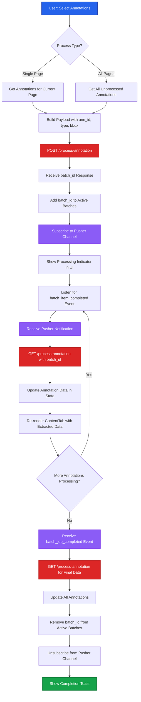

# Annotation Processing - Frontend

This document details the V2 frontend flow for initiating and monitoring annotation extraction processing.

## Process Overview

Users trigger annotation processing by selecting unprocessed annotations on a page or across the entire file. The frontend initiates a batch job, receives a batch_id, and listens to Pusher for real-time extraction updates.

## Complete Flow Diagram



## User Flow

<Steps>

### Select Annotations for Processing

User selects which annotations to process.

```tsx
const [selectedAnnotations, setSelectedAnnotations] = useState<string[]>([])
const [activePage, setActivePage] = useState<number>(1)

// Process single page
const handleProcessPage = () => {
  const pageAnnotations = annotations.filter(
    ann => ann.page_no === activePage && ann.status === 'pending'
  )
  processAnnotations(pageAnnotations)
}

// Process all unprocessed annotations
const handleProcessAll = () => {
  const unprocessedAnnotations = annotations.filter(
    ann => ann.status === 'pending'
  )
  processAnnotations(unprocessedAnnotations)
}
```

### Build Processing Payload

Construct the request payload with annotation details.

```tsx
const processAnnotations = async (annotationsToProcess: Annotation[]) => {
  const payload = {
    user_id: userId,
    file_id: fileId,
    pages: annotationsToProcess.map(ann => ({
      page_no: ann.page_no,
      annotations: [{
        ann_id: ann.ann_id,
        ann_type: ann.type,  // "text", "table", "diagram", "field"
        bbox: ann.bbox  // [x1, y1, x2, y2]
      }]
    }))
  }

  initiateProcessing(payload)
}
```

**Payload Example**:
```json
{
  "user_id": "user_12345",
  "file_id": "67890abc",
  "pages": [
    {
      "page_no": 1,
      "annotations": [
        {
          "ann_id": "ann_1",
          "ann_type": "text",
          "bbox": [100, 200, 300, 250]
        },
        {
          "ann_id": "ann_2",
          "ann_type": "table",
          "bbox": [50, 300, 500, 600]
        }
      ]
    },
    {
      "page_no": 2,
      "annotations": [
        {
          "ann_id": "ann_3",
          "ann_type": "diagram",
          "bbox": [150, 100, 450, 400]
        }
      ]
    }
  ]
}
```

### Initiate Batch Processing

Call POST `/process-annotation` to start extraction.

```tsx
const initiateProcessing = async (payload: ProcessingPayload) => {
  try {
    const response = await fetch('/api/process-annotation', {
      method: 'POST',
      headers: {
        'Content-Type': 'application/json',
        'Authorization': `Bearer ${token}`
      },
      body: JSON.stringify(payload)
    })

    const data = await response.json()
    /*
    Response format:
    {
      batch_id: "batch_123"
    }
    */

    handleBatchCreated(data.batch_id)
  } catch (error) {
    toast.error('Failed to start processing')
  }
}
```

### Handle Batch Creation

Add batch to state and subscribe to updates.

```tsx
const handleBatchCreated = (batchId: string) => {
  // Add to active batches
  setActiveBatches(prev => [...prev, batchId])

  // Update annotations status to processing
  setAnnotations(prev => prev.map(ann => {
    if (selectedAnnotations.includes(ann.ann_id)) {
      return { ...ann, status: 'processing' }
    }
    return ann
  }))

  // Subscribe to Pusher
  subscribeToBatch(batchId)

  // Show processing indicator
  toast.info(`Processing started (Batch: ${batchId})`)
}
```

### Subscribe to Pusher for Updates

Listen for real-time extraction updates.

```tsx
import Pusher from 'pusher-js'

const subscribeToBatch = (batchId: string) => {
  const pusher = new Pusher(process.env.NEXT_PUBLIC_PUSHER_KEY!, {
    cluster: process.env.NEXT_PUBLIC_PUSHER_CLUSTER!
  })

  const channel = pusher.subscribe(userId)

  // Listen for individual annotation completion
  channel.bind('batch_item_completed', async (data: {
    batch_id: string
    ann_id: string
    status: string
  }) => {
    if (data.batch_id === batchId) {
      await fetchBatchUpdate(batchId)
      toast.success(`Annotation ${data.ann_id} completed`)
    }
  })

  // Listen for batch completion
  channel.bind('batch_job_completed', async (data: {
    batch_id: string
    status: string
  }) => {
    if (data.batch_id === batchId) {
      await fetchFinalBatchData(batchId)
      cleanupBatch(batchId, channel)
      toast.success('All annotations processed!')
    }
  })

  // Store channel reference
  setBatchChannels(prev => ({
    ...prev,
    [batchId]: channel
  }))
}
```

### Fetch Batch Updates

When notified, fetch the latest batch data.

```tsx
const fetchBatchUpdate = async (batchId: string) => {
  const response = await fetch(
    `/api/process-annotation?batch_id=${batchId}`,
    {
      headers: {
        'Authorization': `Bearer ${token}`
      }
    }
  )

  const batchData = await response.json()

  // Update annotations with extracted data
  setAnnotations(prev => prev.map(ann => {
    const batchAnn = batchData.annotations.find(
      ba => ba.ann_id === ann.ann_id
    )

    if (batchAnn && batchAnn.status === 'completed') {
      return {
        ...ann,
        status: 'completed',
        data: batchAnn.data
      }
    }

    return ann
  }))

  // Update batch data state
  setBatchData(prev => ({
    ...prev,
    [batchId]: batchData
  }))
}
```

### Handle Batch Completion

Clean up and finalize when batch completes.

```tsx
const fetchFinalBatchData = async (batchId: string) => {
  // Final fetch to ensure all data is current
  await fetchBatchUpdate(batchId)
}

const cleanupBatch = (batchId: string, channel: any) => {
  // Remove from active batches
  setActiveBatches(prev => prev.filter(id => id !== batchId))

  // Unsubscribe from Pusher
  channel.unbind_all()
  channel.unsubscribe()

  // Remove channel reference
  setBatchChannels(prev => {
    const updated = { ...prev }
    delete updated[batchId]
    return updated
  })

  // Clear selection
  setSelectedAnnotations([])
}
```

### Display Extraction Results

Render extracted data in ContentTabs.

```tsx
const ContentTabs = ({ annotations }: { annotations: Annotation[] }) => {
  return (
    <div>
      {annotations.map(ann => (
        <div key={ann.ann_id} className="annotation-card">
          <div className="annotation-header">
            <span>Type: {ann.type}</span>
            <StatusBadge status={ann.status} />
          </div>

          {ann.status === 'processing' && (
            <div className="processing-indicator">
              <Spinner />
              <span>Processing...</span>
            </div>
          )}

          {ann.status === 'completed' && ann.data && (
            <div className="extraction-result">
              {ann.type === 'text' && (
                <p>{ann.data.extracted_text}</p>
              )}
              {ann.type === 'table' && (
                <Table data={ann.data.table_data} />
              )}
              {ann.type === 'diagram' && (
                <div>
                  
                  <p>{ann.data.description}</p>
                </div>
              )}
            </div>
          )}
        </div>
      ))}
    </div>
  )
}
```

</Steps>

## Key Components

| Component | Responsibility |
|-----------|---------------|
| `ProcessingControls` | Buttons for "Process Page" and "Process All" |
| `AnnotationSelector` | Allow users to select specific annotations |
| `ContentTabs` | Display annotations with processing status |
| `StatusBadge` | Visual indicator for annotation status |
| `ExtractionResult` | Render extracted data based on type |
| `BatchProgressIndicator` | Show overall batch progress |

## Error Handling

<Callout type="warning">
Handle processing errors and provide user feedback.
</Callout>

### Batch Creation Failure

```tsx
const initiateProcessing = async (payload: ProcessingPayload) => {
  try {
    const response = await fetch('/api/process-annotation', {
      method: 'POST',
      headers: { ... },
      body: JSON.stringify(payload)
    })

    if (!response.ok) {
      const error = await response.json()
      throw new Error(error.detail || 'Processing failed')
    }

    const data = await response.json()
    handleBatchCreated(data.batch_id)
  } catch (error) {
    toast.error(`Failed to start processing: ${error.message}`)
    // Reset annotation statuses
    setAnnotations(prev => prev.map(ann => {
      if (selectedAnnotations.includes(ann.ann_id)) {
        return { ...ann, status: 'pending' }
      }
      return ann
    }))
  }
}
```

### Pusher Event for Failed Annotation

```tsx
channel.bind('batch_item_failed', (data: {
  batch_id: string
  ann_id: string
  error: string
}) => {
  if (data.batch_id === batchId) {
    // Update annotation status to failed
    setAnnotations(prev => prev.map(ann => {
      if (ann.ann_id === data.ann_id) {
        return { ...ann, status: 'failed', error: data.error }
      }
      return ann
    }))

    toast.error(`Failed to process annotation: ${data.error}`)
  }
})
```

### Pusher Connection Failure

```tsx
const subscribeToBatch = (batchId: string) => {
  const pusher = new Pusher(...)

  pusher.connection.bind('error', (err: any) => {
    console.error('Pusher error:', err)

    // Fallback to polling
    toast.warning('Real-time updates unavailable. Polling for updates...')
    startPolling(batchId)
  })
}

const startPolling = (batchId: string) => {
  const pollInterval = setInterval(async () => {
    const response = await fetch(`/api/process-annotation?batch_id=${batchId}`)
    const data = await response.json()

    if (data.status === 'completed') {
      clearInterval(pollInterval)
      await fetchFinalBatchData(batchId)
      cleanupBatch(batchId, null)
    } else {
      await fetchBatchUpdate(batchId)
    }
  }, 3000) // Poll every 3 seconds

  // Store interval for cleanup
  setPollingIntervals(prev => ({
    ...prev,
    [batchId]: pollInterval
  }))
}
```

## Performance Optimizations

### Debounced Batch Updates

```tsx
import { debounce } from 'lodash'

const debouncedFetchBatch = useCallback(
  debounce((batchId: string) => {
    fetchBatchUpdate(batchId)
  }, 500),
  []
)

channel.bind('batch_item_completed', (data) => {
  debouncedFetchBatch(data.batch_id)
})
```

### Batch Progress Calculation

```tsx
const getBatchProgress = (batchId: string) => {
  const batch = batchData[batchId]
  if (!batch) return 0

  const completed = batch.annotations.filter(
    ann => ann.status === 'completed'
  ).length
  const total = batch.annotations.length

  return Math.round((completed / total) * 100)
}

// Display in UI
<ProgressBar value={getBatchProgress(batchId)} />
```

### Optimistic UI Updates

```tsx
const initiateProcessing = async (payload: ProcessingPayload) => {
  // Optimistically update UI
  setAnnotations(prev => prev.map(ann => {
    if (selectedAnnotations.includes(ann.ann_id)) {
      return { ...ann, status: 'queued' }
    }
    return ann
  }))

  try {
    const response = await fetch('/api/process-annotation', { ... })
    // ...
  } catch (error) {
    // Revert on failure
    setAnnotations(prev => prev.map(ann => {
      if (selectedAnnotations.includes(ann.ann_id)) {
        return { ...ann, status: 'pending' }
      }
      return ann
    }))
  }
}
```

## API Contracts

### POST /process-annotation

**Request**:
```json
{
  "user_id": "user_12345",
  "file_id": "67890abc",
  "pages": [
    {
      "page_no": 1,
      "annotations": [
        {
          "ann_id": "ann_1",
          "ann_type": "text",
          "bbox": [100, 200, 300, 250]
        }
      ]
    }
  ]
}
```

**Response**:
```json
{
  "batch_id": "batch_123"
}
```

### GET /process-annotation

**Request**:
```http
GET /api/process-annotation?batch_id=batch_123
Authorization: Bearer {token}
```

**Response**:
```json
{
  "batch_id": "batch_123",
  "createdAt": 1696329600,
  "file_id": "67890abc",
  "user_id": "user_12345",
  "status": "processing",
  "annotations": [
    {
      "ann_id": "ann_1",
      "type": "text",
      "page_no": 1,
      "status": "completed",
      "data": {
        "extracted_text": "Sample text...",
        "confidence": 0.98
      }
    }
  ]
}
```

## Related Documentation

- [Annotation Processing Backend](/v2-iteration/annotation-processing-backend) - Backend implementation
- [Existing File Frontend](/v2-iteration/existing-file-frontend) - Loading existing batches
