# Existing File Loading - Backend

This document details the V2 backend flow for serving existing files with pages, annotations, and ongoing batch processing status.

## Process Overview

The backend provides endpoints to retrieve file pages with annotations, list active batch jobs for a user, and fetch detailed batch processing data from MongoDB's jobprocess collection.

## Complete Flow Diagram

```mermaid
graph TD
    A[Frontend: GET /get-pages] --> B[Receive file_id Parameter]
    B --> C[Query pages_collection by file_id]
    C --> D[Fetch Page URLs from MongoDB]

    D --> E[Query annotations_collection by file_id]
    E --> F[Fetch Annotation Data]

    F --> G[Combine Pages and Annotations]
    G --> H[Return Response to Frontend]

    H --> I[Frontend: GET /get-batches]
    I --> J[Receive user_id Parameter]
    J --> K[Query jobprocess_collection by user_id]
    K --> L{Has Active Jobs?}

    L -->|No| M[Return Empty jobs Array]
    L -->|Yes| N[Filter Jobs with status != completed]

    N --> O[Extract batch_id List]
    O --> P[Return jobs Array]

    P --> Q[Frontend: Loop Through Batch IDs]
    Q --> R[GET /process-annotation with batch_id]
    R --> S[Query jobprocess_collection by batch_id]

    S --> T[Fetch Batch Job Document]
    T --> U[Return Batch Data with Annotations]

    U --> V[Celery Worker: Process Annotation]
    V --> W[Update MongoDB: Annotation Status]
    W --> X[Send Pusher: batch_item_completed]

    X --> Y{More Annotations?}
    Y -->|Yes| V
    Y -->|No| Z[Update MongoDB: Batch Status = completed]

    Z --> AA[Send Pusher: batch_job_completed]
    AA --> AB[Frontend: Fetch Final Batch Data]
    AB --> AC[Frontend: Remove Batch from State]

    style A fill:#2563eb,stroke:#1e40af,stroke-width:2px,color:#fff
    style C fill:#f59e0b,stroke:#d97706,stroke-width:2px,color:#fff
    style E fill:#f59e0b,stroke:#d97706,stroke-width:2px,color:#fff
    style K fill:#f59e0b,stroke:#d97706,stroke-width:2px,color:#fff
    style S fill:#f59e0b,stroke:#d97706,stroke-width:2px,color:#fff
    style V fill:#8b5cf6,stroke:#7c3aed,stroke-width:2px,color:#fff
    style W fill:#dc2626,stroke:#b91c1c,stroke-width:2px,color:#fff
    style X fill:#8b5cf6,stroke:#7c3aed,stroke-width:2px,color:#fff
    style Z fill:#dc2626,stroke:#b91c1c,stroke-width:2px,color:#fff
    style AA fill:#8b5cf6,stroke:#7c3aed,stroke-width:2px,color:#fff
    style AC fill:#16a34a,stroke:#15803d,stroke-width:2px,color:#fff
```



## API Endpoints

### GET /get-pages

Retrieves all pages and annotations for a specific file.

**Headers**:
```http
Authorization: Bearer {jwt_token}
```

**Query Parameters**:
- `file_id` (required): File identifier

**Response**:
```json
{
  "pages": [
    {
      "page_no": 1,
      "url": "https://adeos.blob.core.windows.net/pages/file-67890abc-page-1.png"
    },
    {
      "page_no": 2,
      "url": "https://adeos.blob.core.windows.net/pages/file-67890abc-page-2.png"
    }
  ],
  "annotations": [
    {
      "ann_id": "ann_123",
      "page_no": 1,
      "type": "text",
      "bbox": [100, 200, 300, 250],
      "data": {
        "extracted_text": "Sample extracted text",
        "confidence": 0.95
      },
      "status": "completed"
    }
  ]
}
```

**Response Time**: 100-200ms

### GET /get-batches

Retrieves all active batch jobs for a user.

**Headers**:
```http
Authorization: Bearer {jwt_token}
```

**Query Parameters**:
- `user_id` (required): User identifier

**Response**:
```json
{
  "jobs": [
    "batch_id_1",
    "batch_id_2",
    "batch_id_3"
  ]
}
```

**Response Time**: 50-100ms

### GET /process-annotation

Retrieves detailed batch processing data for a specific batch.

**Headers**:
```http
Authorization: Bearer {jwt_token}
```

**Query Parameters**:
- `batch_id` (required): Batch job identifier

**Response**:
```json
{
  "batch_id": "batch_123",
  "createdAt": 1696329600,
  "file_id": "67890abc",
  "user_id": "user_12345",
  "status": "processing",
  "annotations": [
    {
      "ann_id": "ann_1",
      "type": "text",
      "page_no": 1,
      "status": "completed",
      "data": {
        "extracted_text": "Sample text...",
        "confidence": 0.98
      }
    },
    {
      "ann_id": "ann_2",
      "type": "table",
      "page_no": 2,
      "status": "processing",
      "data": null
    }
  ]
}
```

**Response Time**: 80-150ms

## Implementation Flow

<Steps>

### Fetch Pages and Annotations

Retrieve all pages and annotations for a file from MongoDB.

```python
from fastapi import APIRouter, Query, Depends
from bson import ObjectId

router = APIRouter()

@router.get("/get-pages")
async def get_pages(
    file_id: str = Query(...),
    user: dict = Depends(verify_token)
):
    # Fetch all pages for file
    pages_cursor = pages_collection.find(
        {"file_id": ObjectId(file_id), "status": "completed"}
    ).sort("page_no", 1)

    pages = []
    async for page_doc in pages_cursor:
        pages.append({
            "page_no": page_doc["page_no"],
            "url": page_doc["url"]
        })

    # Fetch all annotations for file
    annotations_cursor = annotations_collection.find(
        {"file_id": ObjectId(file_id)}
    ).sort("page_no", 1)

    annotations = []
    async for ann_doc in annotations_cursor:
        annotations.append({
            "ann_id": str(ann_doc["_id"]),
            "page_no": ann_doc["page_no"],
            "type": ann_doc["type"],
            "bbox": ann_doc.get("bbox", []),
            "data": ann_doc.get("data", {}),
            "status": ann_doc.get("status", "pending")
        })

    return {
        "pages": pages,
        "annotations": annotations
    }
```

### Retrieve Active Batch Jobs

Query MongoDB for all active batch jobs for a user.

```python
@router.get("/get-batches")
async def get_batches(
    user_id: str = Query(...),
    user: dict = Depends(verify_token)
):
    # Find all jobs that are not completed
    jobs_cursor = jobprocess_collection.find({
        "user_id": user_id,
        "status": {"$ne": "completed"}
    })

    batch_ids = []
    async for job_doc in jobs_cursor:
        batch_ids.append(str(job_doc["_id"]))

    return {
        "jobs": batch_ids
    }
```

**MongoDB Query**:
- Filter: `user_id` matches and `status != "completed"`
- Returns array of `batch_id` strings

### Fetch Batch Processing Data

Retrieve detailed information for a specific batch job.

```python
@router.get("/process-annotation")
async def get_batch_data(
    batch_id: str = Query(...),
    user: dict = Depends(verify_token)
):
    # Fetch batch job document
    job_doc = await jobprocess_collection.find_one({
        "_id": ObjectId(batch_id)
    })

    if not job_doc:
        raise HTTPException(status_code=404, detail="Batch not found")

    # Format annotations from batch
    annotations = []
    for ann in job_doc.get("annotations", []):
        annotations.append({
            "ann_id": str(ann["ann_id"]),
            "type": ann["type"],
            "page_no": ann["page_no"],
            "status": ann.get("status", "pending"),
            "data": ann.get("data", None)
        })

    return {
        "batch_id": str(job_doc["_id"]),
        "createdAt": job_doc["createdAt"].timestamp(),
        "file_id": str(job_doc["file_id"]),
        "user_id": job_doc["user_id"],
        "status": job_doc["status"],
        "annotations": annotations
    }
```

### Background Annotation Processing

Celery worker processes annotations and updates MongoDB.

```python
from celery import Celery
import redis

celery_app = Celery('tasks', broker='redis://localhost:6379/0')
pusher_client = Pusher(...)
redis_client = redis.Redis(host='localhost', port=6379, db=0)

@celery_app.task
def process_annotation_worker(batch_id: str, annotations: list):
    job_doc = jobprocess_collection.find_one({"_id": ObjectId(batch_id)})
    user_id = job_doc["user_id"]
    file_id = job_doc["file_id"]

    for ann in annotations:
        ann_id = ann["ann_id"]
        ann_type = ann["type"]
        page_no = ann["page_no"]

        # Update status to processing
        jobprocess_collection.update_one(
            {"_id": ObjectId(batch_id), "annotations.ann_id": ann_id},
            {"$set": {"annotations.$.status": "processing"}}
        )

        # Process based on type
        if ann_type == "text":
            extracted_data = extract_text(file_id, page_no, ann["bbox"])
        elif ann_type == "table":
            extracted_data = extract_table(file_id, page_no, ann["bbox"])
        elif ann_type == "diagram":
            extracted_data = extract_diagram(file_id, page_no, ann["bbox"])

        # Update annotation with extracted data
        jobprocess_collection.update_one(
            {"_id": ObjectId(batch_id), "annotations.ann_id": ann_id},
            {"$set": {
                "annotations.$.status": "completed",
                "annotations.$.data": extracted_data
            }}
        )

        # Update annotations_collection
        annotations_collection.update_one(
            {"_id": ObjectId(ann_id)},
            {"$set": {
                "status": "completed",
                "data": extracted_data
            }}
        )

        # Send Pusher notification for item completion
        pusher_client.trigger(user_id, 'batch_item_completed', {
            'batch_id': batch_id,
            'ann_id': ann_id,
            'status': 'completed'
        })

    # Mark batch as completed
    jobprocess_collection.update_one(
        {"_id": ObjectId(batch_id)},
        {"$set": {"status": "completed"}}
    )

    # Send Pusher notification for batch completion
    pusher_client.trigger(user_id, 'batch_job_completed', {
        'batch_id': batch_id,
        'status': 'completed'
    })
```

<Callout type="info">
The worker updates both `jobprocess_collection` (for batch tracking) and `annotations_collection` (for permanent storage) to maintain data consistency.
</Callout>

</Steps>

## Database Schema

### pages_collection

```javascript
{
  _id: ObjectId("page123..."),
  file_id: ObjectId("67890abc..."),
  page_no: 1,
  url: "https://adeos.blob.core.windows.net/pages/file-67890abc-page-1.png",
  status: "completed",
  created_at: ISODate("2025-10-03T10:01:00Z")
}
```

### annotations_collection

```javascript
{
  _id: ObjectId("ann_123..."),
  file_id: ObjectId("67890abc..."),
  page_no: 1,
  type: "text",  // "text" | "table" | "diagram" | "field"
  bbox: [100, 200, 300, 250],  // [x1, y1, x2, y2]
  status: "completed",  // "pending" | "processing" | "completed" | "failed"
  data: {
    extracted_text: "Sample text...",
    confidence: 0.98
  },
  created_at: ISODate("2025-10-03T10:05:00Z"),
  updated_at: ISODate("2025-10-03T10:06:00Z")
}
```

### jobprocess_collection

```javascript
{
  _id: ObjectId("batch_123..."),  // This is the batch_id
  file_id: ObjectId("67890abc..."),
  user_id: "user_12345",
  status: "processing",  // "queued" | "processing" | "completed" | "failed"
  createdAt: ISODate("2025-10-03T10:05:00Z"),
  annotations: [
    {
      ann_id: ObjectId("ann_1..."),
      type: "text",
      page_no: 1,
      bbox: [100, 200, 300, 250],
      status: "completed",
      data: {
        extracted_text: "Sample text...",
        confidence: 0.98
      }
    },
    {
      ann_id: ObjectId("ann_2..."),
      type: "table",
      page_no: 2,
      bbox: [50, 100, 400, 500],
      status: "processing",
      data: null
    }
  ]
}
```

## Redis Integration

### Task Queue for Annotation Processing

```python
# When batch job is created
@router.post("/process-annotation")
async def create_batch_job(...):
    # Create job document
    job_doc = {...}
    result = jobprocess_collection.insert_one(job_doc)
    batch_id = str(result.inserted_id)

    # Queue worker task in Redis
    process_annotation_worker.delay(batch_id, annotations)

    return {"batch_id": batch_id}
```

**Redis Queue**:
```
Key: celery
Type: LIST
Value: [
  {
    "task": "process_annotation_worker",
    "args": ["batch_123", [...]],
    "id": "task-uuid-456"
  }
]
```

### Progress Tracking in Redis

```python
# Inside worker
progress_key = f"batch:progress:{batch_id}"
redis_client.hset(progress_key, mapping={
    "completed": 0,
    "total": len(annotations),
    "status": "processing"
})

for idx, ann in enumerate(annotations):
    # Process annotation
    # ...

    # Update progress
    redis_client.hset(progress_key, "completed", idx + 1)
```

## Pusher Events

### batch_item_completed

Sent when a single annotation completes processing.

```python
pusher_client.trigger(
    channel=user_id,
    event='batch_item_completed',
    data={
        'batch_id': 'batch_123',
        'ann_id': 'ann_1',
        'status': 'completed'
    }
)
```

### batch_job_completed

Sent when all annotations in a batch complete.

```python
pusher_client.trigger(
    channel=user_id,
    event='batch_job_completed',
    data={
        'batch_id': 'batch_123',
        'status': 'completed',
        'total_processed': 5
    }
)
```

## Error Handling

<Callout type="warning">
Handle errors gracefully and update job status accordingly.
</Callout>

### Annotation Processing Failure

```python
try:
    extracted_data = extract_text(file_id, page_no, bbox)
except Exception as e:
    # Mark annotation as failed
    jobprocess_collection.update_one(
        {"_id": ObjectId(batch_id), "annotations.ann_id": ann_id},
        {"$set": {
            "annotations.$.status": "failed",
            "annotations.$.error": str(e)
        }}
    )

    # Notify frontend
    pusher_client.trigger(user_id, 'batch_item_failed', {
        'batch_id': batch_id,
        'ann_id': ann_id,
        'error': str(e)
    })
```

### Batch Not Found

```python
@router.get("/process-annotation")
async def get_batch_data(batch_id: str):
    job_doc = await jobprocess_collection.find_one({"_id": ObjectId(batch_id)})

    if not job_doc:
        raise HTTPException(
            status_code=404,
            detail=f"Batch {batch_id} not found"
        )
```

## Performance Metrics

| Metric | Value |
|--------|-------|
| GET /get-pages (10 pages) | 100-200ms |
| GET /get-batches (100 jobs) | 50-100ms |
| GET /process-annotation | 80-150ms |
| Annotation Processing (text) | 2-3s per annotation |
| Annotation Processing (table) | 5-8s per annotation |
| Pusher Notification Latency | Less than 100ms |

## Code References

**Get Pages Endpoint**: `backend/api/routes/files/pages.py:10-40`
**Get Batches Endpoint**: `backend/api/routes/batch/batches.py:15-30`
**Process Annotation Endpoint**: `backend/api/routes/batch/process.py:50-80`
**Annotation Worker**: `backend/workers/annotation_processor.py:20-120`

## Related Documentation

- [Existing File Frontend](/v2-iteration/existing-file-frontend) - Frontend implementation
- [Annotation Processing Backend](/v2-iteration/annotation-processing-backend) - Creating new batch jobs
