# Existing File Loading - Frontend

This document details the V2 frontend flow for loading existing files with pages, annotations, and ongoing batch processing jobs.

## Process Overview

When a user navigates to a file's dynamic page, the frontend fetches all pages and annotations, checks for ongoing batch processing jobs, and listens to Pusher notifications for real-time updates on active batches.

## Complete Flow Diagram

```mermaid
graph TD
    A[User: Navigate to /files/file_id] --> B[GET /get-pages with file_id]
    B --> C[Receive Pages and Annotations Data]
    C --> D[Render Pages and ContentTabs]

    D --> E[GET /get-batches with user_id]
    E --> F{Has Active Batches?}

    F -->|No| G[Show Static Content Only]
    F -->|Yes| H[Store Batch IDs in State]

    H --> I[Loop Through Each Batch ID]
    I --> J[GET /process-annotation with batch_id]
    J --> K[Receive Batch Processing Data]
    K --> L[Update UI with Current Progress]

    L --> M[Subscribe to Pusher Channel for batch_id]
    M --> N[Listen for batch_item_completed Event]

    N --> O[Receive Pusher Notification]
    O --> P[GET /process-annotation with batch_id]
    P --> Q[Update Annotation Data in State]
    Q --> R[Re-render ContentTabs]

    R --> S{More Items in Batch?}
    S -->|Yes| N
    S -->|No| T[Receive batch_job_completed Event]

    T --> U[Remove batch_id from State]
    U --> V[Unsubscribe from Pusher Channel]
    V --> W[Final UI Update]

    W --> X{More Active Batches?}
    X -->|Yes| I
    X -->|No| Y[All Batches Complete]

    style A fill:#2563eb,stroke:#1e40af,stroke-width:2px,color:#fff
    style B fill:#dc2626,stroke:#b91c1c,stroke-width:2px,color:#fff
    style E fill:#dc2626,stroke:#b91c1c,stroke-width:2px,color:#fff
    style J fill:#dc2626,stroke:#b91c1c,stroke-width:2px,color:#fff
    style P fill:#dc2626,stroke:#b91c1c,stroke-width:2px,color:#fff
    style M fill:#8b5cf6,stroke:#7c3aed,stroke-width:2px,color:#fff
    style O fill:#8b5cf6,stroke:#7c3aed,stroke-width:2px,color:#fff
    style T fill:#8b5cf6,stroke:#7c3aed,stroke-width:2px,color:#fff
    style Y fill:#16a34a,stroke:#15803d,stroke-width:2px,color:#fff
```



## User Flow

<Steps>

### Navigate to File Page

User accesses the dynamic file page route.

```tsx
// Route: /files/[fileId]/page.tsx
export default function FilePage({ params }: { params: { fileId: string } }) {
  const { fileId } = params
  const [pages, setPages] = useState<PageData[]>([])
  const [annotations, setAnnotations] = useState<AnnotationData[]>([])
  const [activeBatches, setActiveBatches] = useState<string[]>([])
  const [batchData, setBatchData] = useState<Record<string, BatchJob>>({})

  useEffect(() => {
    loadFileData()
    checkActiveBatches()
  }, [fileId])

  return (
    <div>
      <PageTabs pages={pages} />
      <ContentTabs annotations={annotations} batchData={batchData} />
    </div>
  )
}
```

### Fetch Pages and Annotations

Call `/get-pages` to retrieve all pages and existing annotations.

```tsx
const loadFileData = async () => {
  const response = await fetch(`/api/get-pages?file_id=${fileId}`, {
    headers: {
      'Authorization': `Bearer ${token}`
    }
  })

  const data = await response.json()
  /*
  Response format:
  {
    pages: [
      { page_no: 1, url: "https://..." },
      { page_no: 2, url: "https://..." }
    ],
    annotations: [
      { ann_id: "123", page_no: 1, type: "text", data: {...} },
      { ann_id: "456", page_no: 2, type: "table", data: {...} }
    ]
  }
  */

  setPages(data.pages)
  setAnnotations(data.annotations)
}
```

### Check for Active Batches

Call `/get-batches` to retrieve ongoing batch processing jobs.

```tsx
const checkActiveBatches = async () => {
  const response = await fetch(`/api/get-batches?user_id=${userId}`, {
    headers: {
      'Authorization': `Bearer ${token}`
    }
  })

  const data = await response.json()
  /*
  Response format:
  {
    jobs: ["batch_id_1", "batch_id_2", "batch_id_3"]
  }
  */

  if (data.jobs && data.jobs.length > 0) {
    setActiveBatches(data.jobs)
    data.jobs.forEach(batchId => {
      fetchBatchData(batchId)
      subscribeToBatchUpdates(batchId)
    })
  }
}
```

### Fetch Batch Processing Data

For each active batch, call `/process-annotation` GET endpoint.

```tsx
const fetchBatchData = async (batchId: string) => {
  const response = await fetch(
    `/api/process-annotation?batch_id=${batchId}`,
    {
      headers: {
        'Authorization': `Bearer ${token}`
      }
    }
  )

  const data = await response.json()
  /*
  Response format:
  {
    batch_id: "batch_123",
    createdAt: 1696329600,
    file_id: "67890abc",
    user_id: "user_12345",
    status: "processing",
    annotations: [
      {
        ann_id: "ann_1",
        type: "text",
        status: "completed",
        data: { extracted_text: "..." }
      },
      {
        ann_id: "ann_2",
        type: "table",
        status: "processing",
        data: null
      }
    ]
  }
  */

  setBatchData(prev => ({
    ...prev,
    [batchId]: data
  }))

  // Update annotations with extracted data
  updateAnnotationsFromBatch(data)
}
```

### Subscribe to Pusher for Batch Updates

Listen for real-time notifications for each active batch.

```tsx
import Pusher from 'pusher-js'

const subscribeToBatchUpdates = (batchId: string) => {
  const pusher = new Pusher(process.env.NEXT_PUBLIC_PUSHER_KEY!, {
    cluster: process.env.NEXT_PUBLIC_PUSHER_CLUSTER!
  })

  const channel = pusher.subscribe(userId)

  // Listen for individual annotation completion
  channel.bind('batch_item_completed', (data: {
    batch_id: string
    ann_id: string
    status: string
  }) => {
    if (data.batch_id === batchId) {
      handleAnnotationCompleted(batchId, data.ann_id)
    }
  })

  // Listen for entire batch completion
  channel.bind('batch_job_completed', (data: {
    batch_id: string
    status: string
  }) => {
    if (data.batch_id === batchId) {
      handleBatchCompleted(batchId)
      channel.unbind_all()
      channel.unsubscribe()
    }
  })

  // Store channel reference for cleanup
  setBatchChannels(prev => ({
    ...prev,
    [batchId]: channel
  }))
}
```

### Handle Annotation Completion

When a single annotation completes, refetch batch data.

```tsx
const handleAnnotationCompleted = async (batchId: string, annId: string) => {
  // Refetch batch data to get updated extraction
  await fetchBatchData(batchId)

  // Show toast notification
  toast.success(`Annotation ${annId} processed successfully`)
}
```

### Handle Batch Completion

When an entire batch completes, clean up and remove from active batches.

```tsx
const handleBatchCompleted = async (batchId: string) => {
  // Final fetch to ensure all data is current
  await fetchBatchData(batchId)

  // Remove from active batches
  setActiveBatches(prev => prev.filter(id => id !== batchId))

  // Cleanup Pusher subscription
  const channel = batchChannels[batchId]
  if (channel) {
    channel.unbind_all()
    channel.unsubscribe()
  }

  // Remove from channel references
  setBatchChannels(prev => {
    const updated = { ...prev }
    delete updated[batchId]
    return updated
  })

  toast.success(`Batch ${batchId} completed`)
}
```

### Update UI with Batch Data

Merge batch extraction data with existing annotations.

```tsx
const updateAnnotationsFromBatch = (batchJob: BatchJob) => {
  setAnnotations(prev => {
    return prev.map(ann => {
      const batchAnn = batchJob.annotations.find(ba => ba.ann_id === ann.ann_id)
      if (batchAnn && batchAnn.status === 'completed') {
        return {
          ...ann,
          ...batchAnn.data,
          status: 'completed'
        }
      }
      return ann
    })
  })
}
```

</Steps>

## Key Components

| Component | Responsibility |
|-----------|---------------|
| `FilePage` | Main page component, manages state for pages, annotations, batches |
| `PageTabs` | Display page thumbnails and navigation |
| `ContentTabs` | Show annotations with extraction results |
| `BatchStatusIndicator` | Visual indicator for ongoing batch processing |
| `PusherProvider` | WebSocket connection for real-time batch updates |

## Error Handling

<Callout type="warning">
Handle API failures and batch errors gracefully.
</Callout>

### Failed Batch Fetch

```tsx
try {
  const response = await fetch(`/api/get-batches?user_id=${userId}`)
  if (!response.ok) {
    throw new Error('Failed to fetch batches')
  }
} catch (error) {
  console.error('Batch fetch error:', error)
  // Continue loading file without batch updates
  toast.error('Unable to load batch status')
}
```

### Pusher Connection Failure

```tsx
pusher.connection.bind('error', (err: any) => {
  console.error('Pusher connection error:', err)
  // Fallback to polling
  startBatchPolling(batchId)
})

const startBatchPolling = (batchId: string) => {
  const interval = setInterval(async () => {
    const data = await fetchBatchData(batchId)
    if (data.status === 'completed') {
      clearInterval(interval)
      handleBatchCompleted(batchId)
    }
  }, 5000) // Poll every 5 seconds
}
```

## Performance Optimizations

### Debounced Batch Data Updates

```tsx
import { debounce } from 'lodash'

const debouncedFetchBatch = debounce((batchId: string) => {
  fetchBatchData(batchId)
}, 500)

channel.bind('batch_item_completed', (data) => {
  debouncedFetchBatch(data.batch_id)
})
```

### Batch Data Caching

```tsx
const batchDataCache = useRef<Record<string, { data: BatchJob, timestamp: number }>>({})

const fetchBatchData = async (batchId: string) => {
  const cached = batchDataCache.current[batchId]
  const now = Date.now()

  // Use cache if less than 2 seconds old
  if (cached && now - cached.timestamp < 2000) {
    return cached.data
  }

  const data = await fetchBatchDataFromAPI(batchId)
  batchDataCache.current[batchId] = { data, timestamp: now }
  return data
}
```

## API Contracts

### GET /get-pages

**Request**:
```http
GET /api/get-pages?file_id=67890abc
Authorization: Bearer {token}
```

**Response**:
```json
{
  "pages": [
    { "page_no": 1, "url": "https://..." },
    { "page_no": 2, "url": "https://..." }
  ],
  "annotations": [
    {
      "ann_id": "ann_123",
      "page_no": 1,
      "type": "text",
      "data": { "extracted_text": "..." }
    }
  ]
}
```

### GET /get-batches

**Request**:
```http
GET /api/get-batches?user_id=user_12345
Authorization: Bearer {token}
```

**Response**:
```json
{
  "jobs": ["batch_id_1", "batch_id_2", "batch_id_3"]
}
```

### GET /process-annotation

**Request**:
```http
GET /api/process-annotation?batch_id=batch_123
Authorization: Bearer {token}
```

**Response**:
```json
{
  "batch_id": "batch_123",
  "createdAt": 1696329600,
  "file_id": "67890abc",
  "user_id": "user_12345",
  "status": "processing",
  "annotations": [
    {
      "ann_id": "ann_1",
      "type": "text",
      "status": "completed",
      "data": { "extracted_text": "Sample text..." }
    },
    {
      "ann_id": "ann_2",
      "type": "table",
      "status": "processing",
      "data": null
    }
  ]
}
```

## Related Documentation

- [Existing File Backend](/v2-iteration/existing-file-backend) - Backend processing flow
- [Annotation Processing Frontend](/v2-iteration/annotation-processing-frontend) - Starting new annotation jobs
