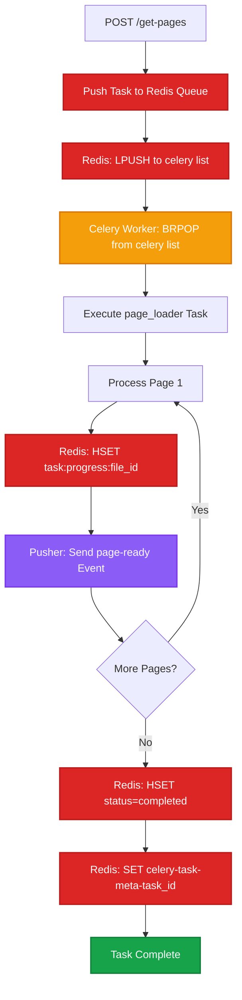

# File Upload Flow - Backend

This document details the V2 backend file upload flow with progressive page loading using Celery workers and Pusher notifications.

## Process Overview

The backend handles file uploads with blob storage deduplication, queues page processing tasks to Redis, executes background workers via Celery consuming from Redis, tracks progress in Redis cache, and sends real-time updates through Pusher as each page completes.

## Complete Flow Diagram

```mermaid
graph TD
    A[Frontend: POST /upload] --> B[Receive File in Request Body]
    B --> C[Check Blob Storage]
    C --> D{File Already Exists?}

    D -->|Yes| E[Fetch Existing File Metadata]
    D -->|No| F[Upload File to Azure Blob]

    E --> G[Get Processed Pages from DB]
    F --> H[Create File Record in DB]

    G --> I[Return Response with is_file_exist=true]
    H --> J[Return Response with is_file_exist=false]

    I --> K[Frontend Receives Response]
    J --> K

    K --> L[Frontend: POST /get-pages]
    L --> M[Backend: Receive Channel Name and File ID]
    M --> N[Validate Selected Pages]
    N --> O[Push Task to Redis Queue]

    O --> P[Redis: Store Task in Celery Queue]
    P --> Q[Return success: true Immediately]

    Q --> R[Frontend: Navigate to Dynamic Page]
    R --> S[Frontend: Show Loading State]
    S --> T[Frontend: Listen for Pusher Events]

    P --> U[Celery Worker: Poll Redis Queue]
    U --> V[Celery Worker: Pick page_loader Task]
    V --> W[Pull File from Blob Storage]
    W --> X[Load PDF or Image]
    X --> Y[Split into Page Images]

    Y --> Z[Loop: Process Each Selected Page]
    Z --> AA[Create Page Document in DB]
    AA --> AB[Upload Page Image to Blob Concurrently]

    AB --> AC[Get Blob URL for Page]
    AC --> AD[Update Page Document with URL]
    AD --> AE[Store Progress in Redis Cache]
    AE --> AF[Send Pusher Notification to Channel]
    AF --> AG[Pusher Event: page-ready with page_no and URL]

    AG --> AH[Frontend: Receives Pusher Event]
    AH --> AI[Frontend: GET /get-pages with file_id]
    AI --> AJ[Return Page URLs from DB]
    AJ --> AK[Frontend: Render Page Tab]
    AK --> AL[Frontend: Clear Loading for Page]

    AL --> AM{More Pages to Process?}
    AM -->|Yes| Z
    AM -->|No| AN[All Pages Completed]

    AN --> AO[Update Redis: Mark Task Complete]
    AO --> AP[Frontend: All Tabs Ready]

    style A fill:#2563eb,stroke:#1e40af,stroke-width:2px,color:#fff
    style C fill:#f59e0b,stroke:#d97706,stroke-width:2px,color:#fff
    style F fill:#dc2626,stroke:#b91c1c,stroke-width:2px,color:#fff
    style O fill:#8b5cf6,stroke:#7c3aed,stroke-width:2px,color:#fff
    style P fill:#dc2626,stroke:#b91c1c,stroke-width:2px,color:#fff
    style U fill:#f59e0b,stroke:#d97706,stroke-width:2px,color:#fff
    style V fill:#f59e0b,stroke:#d97706,stroke-width:2px,color:#fff
    style AB fill:#dc2626,stroke:#b91c1c,stroke-width:2px,color:#fff
    style AE fill:#dc2626,stroke:#b91c1c,stroke-width:2px,color:#fff
    style AF fill:#8b5cf6,stroke:#7c3aed,stroke-width:2px,color:#fff
    style AI fill:#dc2626,stroke:#b91c1c,stroke-width:2px,color:#fff
    style AO fill:#dc2626,stroke:#b91c1c,stroke-width:2px,color:#fff
    style AN fill:#16a34a,stroke:#15803d,stroke-width:2px,color:#fff
    style AP fill:#16a34a,stroke:#15803d,stroke-width:2px,color:#fff
```



## API Endpoints

### POST /upload

Handles file upload with blob storage deduplication.

**Headers**:
```http
Authorization: Bearer {jwt_token}
Content-Type: multipart/form-data
```

**Request Body**:
```http
Content-Type: multipart/form-data

file: (binary data)
```

**Response**:
```json
{
  "file_id": "67890abc",
  "file_name": "document.pdf",
  "file_size": 2048576,
  "total_pages": 10,
  "is_file_exist": true,
  "processed_pages": [1, 2, 5]
}
```

**Response Time**: 200-500ms (with blob check)

### POST /get-pages

Initiates background page processing worker.

**Headers**:
```http
Authorization: Bearer {jwt_token}
Content-Type: application/json
```

**Request Body**:
```json
{
  "channel_name": "user_12345",
  "file_id": "67890abc",
  "selected_pages": [1, 2, 3]
}
```

**Response**:
```json
{
  "success": true
}
```

**Response Time**: Less than 100ms (async task initiation)

### GET /get-pages

Retrieves processed page URLs from blob storage.

**Headers**:
```http
Authorization: Bearer {jwt_token}
```

**Query Parameters**:
- `file_id` (required): File identifier

**Response**:
```json
{
  "pages": [
    {
      "page_no": 1,
      "url": "https://adeos.blob.core.windows.net/pages/file-67890abc-page-1.png"
    },
    {
      "page_no": 2,
      "url": "https://adeos.blob.core.windows.net/pages/file-67890abc-page-2.png"
    }
  ]
}
```

**Response Time**: 50-150ms (database query)

## Implementation Flow

<Steps>

### File Upload Handler

Receive file and check blob storage for duplicates.

```python
from fastapi import APIRouter, UploadFile, File, Depends
from azure.storage.blob import BlobServiceClient

router = APIRouter()

@router.post("/upload")
async def upload_file(
    file: UploadFile = File(...),
    user: dict = Depends(verify_token)
):
    contents = await file.read()
    file_size = len(contents)

    # Check if file exists in blob storage
    blob_name = f"{file.filename}-{file_size}"
    is_file_exist = await check_blob_exists(blob_name)

    if is_file_exist:
        # Fetch existing file metadata
        file_doc = await files_collection.find_one({"blob_name": blob_name})
        processed_pages = await get_processed_pages(file_doc["_id"])

        return {
            "file_id": str(file_doc["_id"]),
            "file_name": file.filename,
            "file_size": file_size,
            "total_pages": file_doc["total_pages"],
            "is_file_exist": True,
            "processed_pages": processed_pages
        }

    # Upload to blob storage
    blob_url = await upload_to_blob(blob_name, contents)

    # Create file record
    file_doc = {
        "file_name": file.filename,
        "blob_name": blob_name,
        "blob_url": blob_url,
        "file_size": file_size,
        "total_pages": await get_page_count(contents),
        "user_id": user["user_id"],
        "created_at": datetime.utcnow()
    }

    result = await files_collection.insert_one(file_doc)

    return {
        "file_id": str(result.inserted_id),
        "file_name": file.filename,
        "file_size": file_size,
        "total_pages": file_doc["total_pages"],
        "is_file_exist": False,
        "processed_pages": []
    }
```

**Blob Storage Check**:
- Uses filename + file size as unique identifier
- Prevents duplicate uploads
- Returns existing processed pages if found

### Check Blob Existence

```python
async def check_blob_exists(blob_name: str) -> bool:
    blob_client = blob_service_client.get_blob_client(
        container="files",
        blob=blob_name
    )
    return await blob_client.exists()
```

### Initiate Page Loader Worker

Trigger Celery background task for page processing.

```python
from celery_app import page_loader

@router.post("/get-pages")
async def get_pages(
    request: GetPagesRequest,
    user: dict = Depends(verify_token)
):
    # Validate file_id
    file_doc = await files_collection.find_one({"_id": ObjectId(request.file_id)})
    if not file_doc:
        raise HTTPException(status_code=404, detail="File not found")

    # Initiate page_loader worker
    page_loader.delay(
        channel_name=request.channel_name,
        file_id=request.file_id,
        selected_pages=request.selected_pages
    )

    return {"success": True}
```

**Request Model**:
```python
from pydantic import BaseModel

class GetPagesRequest(BaseModel):
    channel_name: str
    file_id: str
    selected_pages: list[int]
```

<Callout type="info">
**Redis Queue Flow**: When `page_loader.delay()` is called, Celery serializes the task and pushes it to Redis using `LPUSH celery`. The task sits in the Redis queue until a Celery worker picks it up using `BRPOP`. This allows the API to return immediately without blocking, while the worker processes pages in the background.
</Callout>

### Background Page Loader Worker

Celery task that processes pages and sends Pusher notifications.

```python
from celery import Celery
from pusher import Pusher
import redis
import fitz  # PyMuPDF
from io import BytesIO
from PIL import Image

celery_app = Celery('tasks', broker='redis://localhost:6379/0')

pusher_client = Pusher(
    app_id=os.getenv('PUSHER_APP_ID'),
    key=os.getenv('PUSHER_KEY'),
    secret=os.getenv('PUSHER_SECRET'),
    cluster=os.getenv('PUSHER_CLUSTER')
)

redis_client = redis.Redis(host='localhost', port=6379, db=0)

@celery_app.task
def page_loader(channel_name: str, file_id: str, selected_pages: list[int]):
    total_pages = len(selected_pages)
    progress_key = f"task:progress:{file_id}"

    # Initialize progress in Redis
    redis_client.hset(progress_key, mapping={
        "current_page": 0,
        "completed": 0,
        "total": total_pages,
        "status": "started"
    })
    redis_client.expire(progress_key, 3600)  # Expire in 1 hour

    # Pull file from blob storage
    file_doc = files_collection.find_one({"_id": ObjectId(file_id)})
    blob_client = blob_service_client.get_blob_client(
        container="files",
        blob=file_doc["blob_name"]
    )

    file_contents = blob_client.download_blob().readall()

    # Load PDF or image
    if file_doc["file_name"].endswith('.pdf'):
        doc = fitz.open(stream=file_contents, filetype="pdf")
    else:
        # Handle image files
        img = Image.open(BytesIO(file_contents))
        pages = [img]

    # Process each selected page
    for idx, page_no in enumerate(selected_pages):
        # Convert page to image
        if file_doc["file_name"].endswith('.pdf'):
            page = doc.load_page(page_no - 1)  # 0-indexed
            pix = page.get_pixmap(dpi=150)
            img_bytes = pix.tobytes("png")
        else:
            img_bytes = file_contents

        # Create page document in DB
        page_doc = {
            "file_id": ObjectId(file_id),
            "page_no": page_no,
            "status": "processing",
            "created_at": datetime.utcnow()
        }
        page_result = pages_collection.insert_one(page_doc)
        page_id = str(page_result.inserted_id)

        # Upload page image to blob storage (concurrent)
        page_blob_name = f"file-{file_id}-page-{page_no}.png"
        page_blob_client = blob_service_client.get_blob_client(
            container="pages",
            blob=page_blob_name
        )
        page_blob_client.upload_blob(img_bytes, overwrite=True)
        page_url = page_blob_client.url

        # Update page document with URL
        pages_collection.update_one(
            {"_id": ObjectId(page_id)},
            {"$set": {"url": page_url, "status": "completed"}}
        )

        # Update progress in Redis
        redis_client.hset(progress_key, mapping={
            "current_page": page_no,
            "completed": idx + 1,
            "status": "processing"
        })

        # Send Pusher notification
        pusher_client.trigger(
            channel_name,
            'page-ready',
            {
                'file_id': file_id,
                'page_no': page_no,
                'url': page_url
            }
        )

    # Mark task as completed in Redis
    redis_client.hset(progress_key, "status", "completed")
```

**Worker Features**:
- Initializes progress tracking in Redis before starting
- Pulls file from blob storage (not from request)
- Splits PDF into individual page images
- Uploads each page image to blob concurrently
- Updates Redis cache with current progress after each page
- Sends Pusher event after each page completes
- Updates database with page URLs
- Marks task as complete in Redis when finished

<Callout type="info">
Using Celery with Redis allows for distributed task processing, progress tracking, and retry mechanisms if page processing fails. Redis acts as both the message broker (task queue) and cache (progress tracking).
</Callout>

### Retrieve Page URLs

Fetch all processed page URLs for a file.

```python
@router.get("/get-pages")
async def retrieve_pages(
    file_id: str,
    user: dict = Depends(verify_token)
):
    # Fetch all pages for file_id
    pages_cursor = pages_collection.find(
        {"file_id": ObjectId(file_id), "status": "completed"}
    ).sort("page_no", 1)

    pages = []
    async for page_doc in pages_cursor:
        pages.append({
            "page_no": page_doc["page_no"],
            "url": page_doc["url"]
        })

    return {"pages": pages}
```

</Steps>

## Database Schema

### files_collection

```javascript
{
  _id: ObjectId("67890abc..."),
  file_name: "document.pdf",
  blob_name: "document.pdf-2048576",  // filename + file size
  blob_url: "https://adeos.blob.core.windows.net/files/document.pdf-2048576",
  file_size: 2048576,
  total_pages: 10,
  user_id: "user_12345",
  created_at: ISODate("2025-10-03T10:00:00Z")
}
```

### pages_collection

```javascript
{
  _id: ObjectId("page123..."),
  file_id: ObjectId("67890abc..."),  // Reference to files_collection
  page_no: 1,
  url: "https://adeos.blob.core.windows.net/pages/file-67890abc-page-1.png",
  status: "completed",  // "processing" | "completed" | "failed"
  created_at: ISODate("2025-10-03T10:01:00Z")
}
```

## Redis Integration

Redis plays three critical roles in the V2 architecture:

### 1. Celery Task Queue (Message Broker)

Redis stores task messages that Celery workers consume.

```python
# When POST /get-pages is called
@router.post("/get-pages")
async def get_pages(request: GetPagesRequest):
    # This pushes a task message to Redis queue
    page_loader.delay(
        channel_name=request.channel_name,
        file_id=request.file_id,
        selected_pages=request.selected_pages
    )
    return {"success": True}
```

**Redis Queue Structure**:
```
Key: celery
Type: LIST
Value: [
  {
    "task": "page_loader",
    "id": "task-uuid-123",
    "args": ["user_12345", "67890abc", [1, 2, 3]],
    "kwargs": {},
    "retries": 0
  }
]
```

**How it works**:
1. FastAPI pushes task to Redis `celery` list using `LPUSH`
2. Celery worker polls Redis using `BRPOP` (blocking pop)
3. Worker picks task and removes it from queue
4. Worker executes `page_loader` function

### 2. Task Progress Tracking

Store real-time progress for each page processing task.

```python
import redis

redis_client = redis.Redis(host='localhost', port=6379, db=0)

# Inside page_loader worker
@celery_app.task
def page_loader(channel_name: str, file_id: str, selected_pages: list[int]):
    total_pages = len(selected_pages)

    for idx, page_no in enumerate(selected_pages):
        # ... process page ...

        # Store progress in Redis
        progress_key = f"task:progress:{file_id}"
        redis_client.hset(progress_key, mapping={
            "current_page": page_no,
            "completed": idx + 1,
            "total": total_pages,
            "status": "processing"
        })
        redis_client.expire(progress_key, 3600)  # Expire in 1 hour

        # Send Pusher notification
        pusher_client.trigger(channel_name, 'page-ready', {...})

    # Mark as complete
    redis_client.hset(progress_key, "status", "completed")
```

**Redis Progress Structure**:
```
Key: task:progress:67890abc
Type: HASH
Value: {
  "current_page": "3",
  "completed": "3",
  "total": "5",
  "status": "processing"
}
TTL: 3600 seconds
```

**Frontend can query progress** (optional):
```python
@router.get("/task-progress/{file_id}")
async def get_task_progress(file_id: str):
    progress = redis_client.hgetall(f"task:progress:{file_id}")
    return {
        "current_page": int(progress.get(b"current_page", 0)),
        "completed": int(progress.get(b"completed", 0)),
        "total": int(progress.get(b"total", 0)),
        "status": progress.get(b"status", b"unknown").decode()
    }
```

### 3. Result Backend (Task State)

Celery stores task results and states in Redis.

```python
# celery_app.py configuration
celery_app = Celery(
    'adeos_workers',
    broker='redis://localhost:6379/0',
    backend='redis://localhost:6379/1'  # Separate DB for results
)
```

**Redis Result Structure**:
```
Key: celery-task-meta-{task_id}
Type: STRING (JSON)
Value: {
  "status": "SUCCESS",
  "result": {"pages_processed": 5},
  "traceback": null,
  "children": [],
  "date_done": "2025-10-03T10:05:00"
}
TTL: 86400 seconds (24 hours)
```

**Query task status**:
```python
from celery.result import AsyncResult

@router.get("/task-status/{task_id}")
async def get_task_status(task_id: str):
    result = AsyncResult(task_id, app=celery_app)
    return {
        "task_id": task_id,
        "status": result.status,  # PENDING, SUCCESS, FAILURE
        "result": result.result if result.ready() else None
    }
```

### Redis Data Flow Summary



### Redis Commands Reference

**Check queue length**:
```bash
redis-cli LLEN celery
```

**View task in queue**:
```bash
redis-cli LRANGE celery 0 -1
```

**Check progress**:
```bash
redis-cli HGETALL task:progress:67890abc
```

**View task result**:
```bash
redis-cli GET celery-task-meta-{task_id}
```

**Clear stuck tasks**:
```bash
redis-cli DEL celery
```

## Background Task Management

### Celery Configuration

```python
# celery_app.py
from celery import Celery

celery_app = Celery(
    'adeos_workers',
    broker='redis://localhost:6379/0',
    backend='redis://localhost:6379/0'
)

celery_app.conf.update(
    task_serializer='json',
    accept_content=['json'],
    result_serializer='json',
    timezone='UTC',
    enable_utc=True,
    task_track_started=True,
    task_time_limit=600,  # 10 minutes max per task
)
```

### Running Workers

```bash
# Start Celery worker
celery -A celery_app worker --loglevel=info --concurrency=4
```

### Redis Queue Monitoring

```bash
# Monitor Redis queue
redis-cli
> LLEN celery  # Check queue length
> KEYS *       # View all keys
```

## Pusher Integration

### Setup

```python
import pusher

pusher_client = pusher.Pusher(
    app_id=os.getenv('PUSHER_APP_ID'),
    key=os.getenv('PUSHER_KEY'),
    secret=os.getenv('PUSHER_SECRET'),
    cluster=os.getenv('PUSHER_CLUSTER'),
    ssl=True
)
```

### Sending Notifications

```python
pusher_client.trigger(
    channel_name='user_12345',  # User-specific channel
    event_name='page-ready',
    data={
        'file_id': '67890abc',
        'page_no': 1,
        'url': 'https://...'
    }
)
```

## Error Handling

<Callout type="warning">
Handle errors gracefully to ensure task retries and user notifications.
</Callout>

### File Not Found in Blob

```python
try:
    blob_client = blob_service_client.get_blob_client(container="files", blob=blob_name)
    file_contents = blob_client.download_blob().readall()
except Exception as e:
    # Log error and notify user
    pusher_client.trigger(channel_name, 'error', {
        'file_id': file_id,
        'message': 'File not found in storage'
    })
    raise
```

### PDF Processing Error

```python
try:
    doc = fitz.open(stream=file_contents, filetype="pdf")
except Exception as e:
    # Mark page as failed
    pages_collection.update_one(
        {"_id": ObjectId(page_id)},
        {"$set": {"status": "failed", "error": str(e)}}
    )
```

### Pusher Notification Failure

```python
try:
    pusher_client.trigger(channel_name, 'page-ready', data)
except Exception as e:
    # Log error but don't fail task
    logger.error(f"Pusher notification failed: {e}")
    # Page is still processed and available via GET /get-pages
```

## Performance Metrics

| Metric | Value |
|--------|-------|
| File Upload (10MB) | 500-800ms |
| Blob Existence Check | 50-100ms |
| Page Processing (per page) | 1-2s |
| Pusher Notification Latency | Less than 100ms |
| Concurrent Workers | 4 (configurable) |

### Optimization Strategies

**Concurrent Page Uploads**:
```python
import asyncio

async def upload_pages_concurrently(pages):
    tasks = [upload_page_to_blob(page) for page in pages]
    await asyncio.gather(*tasks)
```

**Batch Pusher Notifications**:
```python
# Send batch notification every 5 pages
if len(completed_pages) % 5 == 0:
    pusher_client.trigger_batch([
        {'channel': channel_name, 'name': 'page-ready', 'data': page}
        for page in completed_pages
    ])
```

## Code References

**Upload Endpoint**: `backend/api/routes/files/upload.py:15-45`
**Page Loader Worker**: `backend/workers/page_loader.py:20-85`
**Pusher Integration**: `backend/services/pusher_service.py:10-30`
**Database Models**: `backend/database/models.py:FileDoc, PageDoc`

## Related Documentation

- [File Upload Frontend](/v2-iteration/file-upload-frontend) - Frontend implementation
- [Celery Workers Guide](/backend-processing/celery-setup) - Worker configuration
- [Pusher Real-time Guide](/sprint-02/websocket-v2) - WebSocket alternatives
