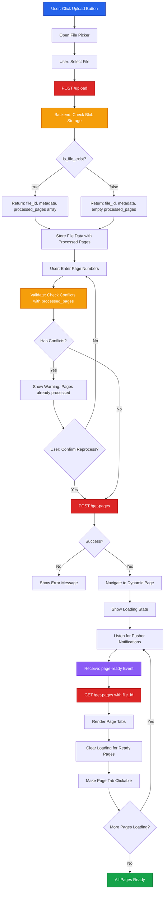

# File Upload Flow - Frontend

This document details the V2 frontend file upload flow using progressive page loading with Pusher real-time notifications.

## Process Overview

The V2 file upload flow introduces a streamlined approach: users upload files, select pages with conflict detection, and receive real-time page image updates via Pusher as the backend processes them progressively.

## Complete Flow Diagram



## User Flow

<Steps>

### File Upload Initiation

User clicks the "Upload New File" button, triggering the browser file picker.

```tsx
<Button onClick={() => fileInputRef.current?.click()}>
  Upload New File
</Button>
<input
  ref={fileInputRef}
  type="file"
  accept="application/pdf,image/*"
  onChange={handleFileSelect}
  hidden
/>
```

### File Selection and Upload

When a file is selected, call the backend `/upload` endpoint.

```tsx
const handleFileSelect = async (e: ChangeEvent<HTMLInputElement>) => {
  const file = e.target.files?.[0]
  if (!file) return

  const formData = new FormData()
  formData.append('file', file)

  const response = await fetch('/api/upload', {
    method: 'POST',
    body: formData,
    headers: {
      'Authorization': `Bearer ${token}`
    }
  })

  const data = await response.json()
  /*
  Response format:
  {
    file_id: "67890abc",
    file_name: "document.pdf",
    file_size: 2048576,
    total_pages: 10,
    is_file_exist: true,  // or false
    processed_pages: [1, 2, 5]  // array of page numbers, empty if new file
  }
  */

  setFileData(data)

  if (data.is_file_exist && data.processed_pages.length > 0) {
    toast.info(`File already exists. Pages ${data.processed_pages.join(', ')} are already processed.`)
  }
}
```

**Response Handling**:
- If `is_file_exist: true`, display processed pages info to user
- Store `processed_pages` array for conflict validation
- Store `file_id` for subsequent API calls
- Show file metadata (name, size, total pages)

### Page Number Input with Conflict Detection

User enters page numbers. Implement a validation helper to detect conflicts with already-processed pages.

```tsx
const validatePageNumbers = (selectedPages: number[], processedPages: number[]) => {
  const conflicts = selectedPages.filter(page => processedPages.includes(page))

  return {
    hasConflicts: conflicts.length > 0,
    conflictPages: conflicts,
    validPages: selectedPages.filter(page => !processedPages.includes(page))
  }
}

const handlePageNumbersSubmit = () => {
  const { hasConflicts, conflictPages } = validatePageNumbers(
    selectedPages,
    fileData.processed_pages
  )

  if (hasConflicts) {
    // Show confirmation dialog
    setConflictWarning({
      show: true,
      message: `Pages ${conflictPages.join(', ')} are already processed. Reprocess?`
    })
  } else {
    initiatePageProcessing()
  }
}
```

**Conflict Scenarios**:
- User selects pages [1, 2, 3]
- Pages [2, 3] already processed
- Show: "Pages 2, 3 already processed. Continue?"

<Callout type="warning">
Always validate page numbers before calling `/get-pages` to prevent unnecessary reprocessing and credit consumption.
</Callout>

### Initiate Page Processing

After confirmation, call `/get-pages` to start background processing.

```tsx
const initiatePageProcessing = async () => {
  const response = await fetch('/api/get-pages', {
    method: 'POST',
    headers: {
      'Content-Type': 'application/json',
      'Authorization': `Bearer ${token}`
    },
    body: JSON.stringify({
      channel_name: userId, // or unique channel identifier
      file_id: fileData.file_id,
      selected_pages: selectedPages
    })
  })

  const { success } = await response.json()

  if (success) {
    router.push(`/files/${fileData.file_id}`)
  }
}
```

### Navigate to Dynamic Page

Once `/get-pages` returns `success: true`, navigate to the dynamic file processing page.

```tsx
// Route: /files/[fileId]/page.tsx
export default function FileProcessingPage({ params }: { params: { fileId: string } }) {
  const [loadingPages, setLoadingPages] = useState<number[]>(selectedPages)
  const [readyPages, setReadyPages] = useState<PageData[]>([])

  return (
    <div>
      <LoadingSpinner visible={loadingPages.length > 0} />
      <PageTabs pages={readyPages} loading={loadingPages} />
    </div>
  )
}
```

### Listen for Pusher Notifications

Set up Pusher listener to receive real-time page-ready notifications.

```tsx
import Pusher from 'pusher-js'

useEffect(() => {
  const pusher = new Pusher(process.env.NEXT_PUBLIC_PUSHER_KEY!, {
    cluster: process.env.NEXT_PUBLIC_PUSHER_CLUSTER!
  })

  const channel = pusher.subscribe(userId) // Same channel_name sent to backend

  channel.bind('page-ready', (data: { page_no: number, file_id: string }) => {
    if (data.file_id === fileId) {
      handlePageReady(data.page_no)
    }
  })

  return () => {
    channel.unbind_all()
    channel.unsubscribe()
  }
}, [userId, fileId])
```

### Fetch Page URLs

When Pusher notifies a page is ready, call `/get-pages` GET endpoint to retrieve blob URLs.

```tsx
const handlePageReady = async (pageNo: number) => {
  const response = await fetch(`/api/get-pages?file_id=${fileId}`, {
    headers: {
      'Authorization': `Bearer ${token}`
    }
  })

  const { pages } = await response.json()
  // pages: [{ page_no: 1, url: 'https://...' }, ...]

  setReadyPages(pages)
  setLoadingPages(prev => prev.filter(p => p !== pageNo))
}
```

**Response Format**:
```json
{
  "pages": [
    {
      "page_no": 1,
      "url": "https://adeos.blob.core.windows.net/pages/page-1.png"
    },
    {
      "page_no": 2,
      "url": "https://adeos.blob.core.windows.net/pages/page-2.png"
    }
  ]
}
```

### Render Page Tabs Progressively

As pages become available, render clickable tabs and remove loading indicators.

```tsx
const PageTabs = ({ pages, loading }: { pages: PageData[], loading: number[] }) => {
  return (
    <div className="flex gap-2">
      {pages.map(page => (
        <Tab
          key={page.page_no}
          onClick={() => setActivePage(page.page_no)}
          disabled={false}
        >
          Page {page.page_no}
        </Tab>
      ))}
      {loading.map(pageNo => (
        <Tab key={pageNo} disabled>
          <Spinner /> Page {pageNo}
        </Tab>
      ))}
    </div>
  )
}
```

**Progressive Loading**:
- Backend sends Pusher events page-by-page
- Frontend fetches URLs incrementally
- Users can click and view pages as they become ready
- No need to wait for all pages to complete

</Steps>

## Key Components

| Component | Responsibility |
|-----------|---------------|
| `FileUploadButton` | Trigger file picker, handle file selection |
| `PageNumberInput` | User input for page selection, conflict validation |
| `ConflictDialog` | Warn users about reprocessing already-processed pages |
| `PusherProvider` | WebSocket connection for real-time updates |
| `PageTabs` | Dynamic tab rendering with loading states |
| `PageViewer` | Display page images from blob URLs |

## Error Handling

<Callout type="warning">
Handle API failures gracefully to ensure a smooth user experience.
</Callout>

### Upload Failure

```tsx
try {
  const response = await fetch('/api/upload', { ... })
  if (!response.ok) {
    throw new Error('Upload failed')
  }
} catch (error) {
  toast.error('Failed to upload file. Please try again.')
}
```

### Page Processing Timeout

```tsx
// If no Pusher event received within 30 seconds
const timeout = setTimeout(() => {
  toast.warning('Processing is taking longer than expected...')
}, 30000)

channel.bind('page-ready', (data) => {
  clearTimeout(timeout)
  handlePageReady(data.page_no)
})
```

### Missing Page URLs

```tsx
const handlePageReady = async (pageNo: number) => {
  const response = await fetch(`/api/get-pages?file_id=${fileId}`)
  const { pages } = await response.json()

  if (!pages || pages.length === 0) {
    // Retry after 2 seconds instead of redirecting
    toast.warning('Pages not ready yet. Retrying...')
    setTimeout(() => {
      handlePageReady(pageNo)
    }, 2000)
    return
  }

  setReadyPages(pages)
  setLoadingPages(prev => prev.filter(p => p !== pageNo))
}
```

## Performance Optimizations

### Debounced Page Number Validation

```tsx
import { debounce } from 'lodash'

const debouncedValidate = debounce((pages: number[]) => {
  const validation = validatePageNumbers(pages, processedPages)
  setValidationResult(validation)
}, 300)
```

### Preload Next Page Image

```tsx
useEffect(() => {
  if (activePage < readyPages.length) {
    const nextPage = readyPages[activePage + 1]
    if (nextPage) {
      const img = new Image()
      img.src = nextPage.url
    }
  }
}, [activePage, readyPages])
```

### Optimistic UI Updates

```tsx
const handlePageReady = (pageNo: number) => {
  // Immediately update UI
  setLoadingPages(prev => prev.filter(p => p !== pageNo))

  // Fetch data in background
  fetchPageUrls()
}
```

## API Contracts

### POST /upload

**Request**:
```http
POST /api/upload
Content-Type: multipart/form-data
Authorization: Bearer {token}

file: (binary data)
```

**Response (New File)**:
```json
{
  "file_id": "67890abc",
  "file_name": "document.pdf",
  "file_size": 2048576,
  "total_pages": 10,
  "is_file_exist": false,
  "processed_pages": []
}
```

**Response (Existing File)**:
```json
{
  "file_id": "67890abc",
  "file_name": "document.pdf",
  "file_size": 2048576,
  "total_pages": 10,
  "is_file_exist": true,
  "processed_pages": [1, 2, 5, 8]
}
```

### POST /get-pages

**Request**:
```json
{
  "channel_name": "user_12345",
  "file_id": "67890abc",
  "selected_pages": [1, 2, 3]
}
```

**Response**:
```json
{
  "success": true
}
```

### GET /get-pages

**Request**:
```http
GET /api/get-pages?file_id=67890abc
Authorization: Bearer {token}
```

**Response**:
```json
{
  "pages": [
    { "page_no": 1, "url": "https://..." },
    { "page_no": 2, "url": "https://..." }
  ]
}
```

## Related Documentation

- [File Upload Backend](/v2-iteration/file-upload-backend) - Backend processing flow
- [Pusher Integration](/sprint-02/websocket-v2) - Real-time communication setup
