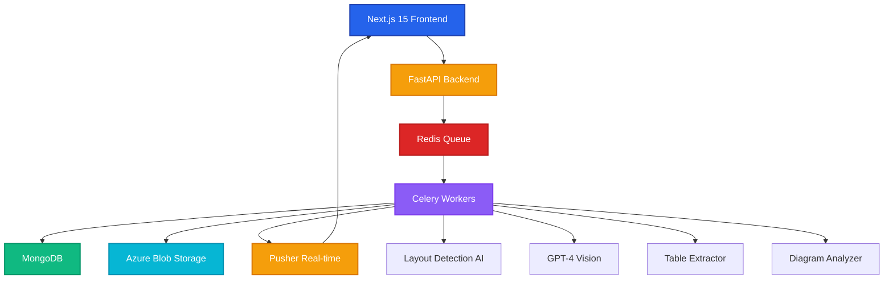
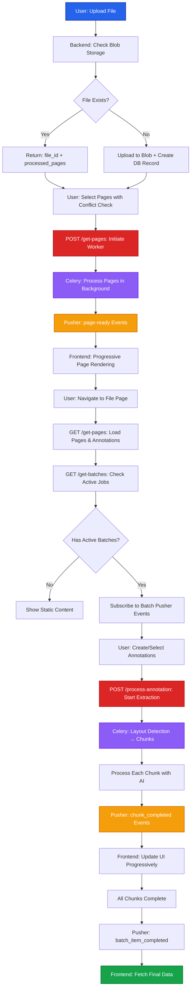

# V2 Iteration Overview

This section documents the V2 architecture of ADEOS FE, featuring a completely redesigned approach to file processing, annotation extraction, and real-time updates. The V2 iteration introduces progressive page loading, intelligent layout detection, chunked extraction processing, and enhanced real-time communication.

## Architecture Overview

The V2 system is built on a modern, scalable architecture:



## Key Features

### 1. Progressive Page Loading
- **Blob Storage Deduplication**: Checks for existing files before upload
- **Background Processing**: Celery workers process pages concurrently
- **Real-time Notifications**: Pusher sends page-ready events as they complete
- **Incremental UI Updates**: Frontend renders pages progressively without waiting for all pages

### 2. Intelligent Layout Detection
- **Chunk Identification**: Detectron2/LayoutLMv3 detects text blocks, tables, and diagrams within annotations
- **Specialized Processing**: Each chunk type processed with appropriate AI model
- **Combined Results**: Chunks merged into comprehensive extraction data

### 3. Batch Processing with Redis
- **Task Queue**: Redis stores Celery tasks with LPUSH/BRPOP
- **Progress Tracking**: Redis HASH stores real-time progress with TTL
- **Result Backend**: Celery task states persisted in Redis
- **Distributed Workers**: Multiple Celery workers process tasks concurrently

### 4. Real-time Updates via Pusher
- **File Processing Events**: `page-ready` notifications for progressive loading
- **Extraction Events**: `extraction_started`, `layout_detected`, `chunk_completed`
- **Batch Events**: `batch_item_completed`, `batch_job_completed`
- **Error Notifications**: `batch_item_failed` for graceful error handling

## Technology Stack

| Component | Technology | Purpose |
|-----------|------------|---------|
| Frontend | Next.js 15, TypeScript, Tailwind CSS | User interface and interactions |
| Backend | FastAPI, Python 3.11+ | API endpoints and business logic |
| Task Queue | Redis + Celery | Background job processing |
| Database | MongoDB | File, page, annotation, and job storage |
| Storage | Azure Blob Storage | File and image storage with CDN |
| Real-time | Pusher | WebSocket-based notifications |
| AI Models | GPT-4 Vision, Detectron2, LayoutLMv3 | Layout detection and extraction |

## Documentation Sections

### File Upload Flow

Complete redesign of file upload with progressive page loading.

**[Frontend Documentation →](/v2-iteration/file-upload-frontend)**
- File picker and upload
- Page number validation with conflict detection
- Pusher subscription for page-ready events
- Progressive page tab rendering

**[Backend Documentation →](/v2-iteration/file-upload-backend)**
- Blob storage deduplication
- Redis task queuing
- Celery page_loader worker
- Page-by-page processing with Pusher notifications

**Key Endpoints**:
- `POST /upload` - Upload file with deduplication check
- `POST /get-pages` - Initiate page processing worker
- `GET /get-pages` - Retrieve processed page URLs

### Existing File Loading

Loading files with pages, annotations, and ongoing batch jobs.

**[Frontend Documentation →](/v2-iteration/existing-file-frontend)**
- Fetch pages and annotations on navigation
- Check for active batch processing jobs
- Subscribe to Pusher for batch updates
- Handle batch completion and cleanup

**[Backend Documentation →](/v2-iteration/existing-file-backend)**
- Retrieve pages with annotations
- List active batches for user
- Fetch detailed batch processing data
- Background annotation processing with Pusher updates

**Key Endpoints**:
- `GET /get-pages?file_id=...` - Pages and annotations
- `GET /get-batches?user_id=...` - Active batch jobs
- `GET /process-annotation?batch_id=...` - Batch details

### Annotation Processing

Initiating and monitoring extraction jobs with layout detection.

**[Frontend Documentation →](/v2-iteration/annotation-processing-frontend)**
- Select annotations by page or entire file
- Build processing payload with ann_id, type, bbox
- Initiate batch job and receive batch_id
- Listen for extraction progress via Pusher
- Update UI with extracted data

**[Backend Documentation →](/v2-iteration/annotation-processing-backend)**
- Create batch job in MongoDB
- Queue extraction worker to Redis
- **Layout detection** on cropped annotations
- **Chunk-by-chunk processing** with specialized AI models
- Progress updates via Pusher for each step
- Combine chunks and save to MongoDB + Azure Blob

**Key Endpoints**:
- `POST /process-annotation` - Start extraction batch
- `GET /process-annotation?batch_id=...` - Fetch batch results

**Processing Flow**:
1. Crop annotation region from page image
2. Run layout detection → identify chunks (text, tables, diagrams)
3. Process each chunk with appropriate AI model
4. Send progress updates via Pusher
5. Combine chunk results
6. Save to database and blob storage

## Comparison: V1 vs V2

| Feature | V1 Approach | V2 Approach |
|---------|-------------|-------------|
| **File Upload** | Synchronous, all pages at once | Progressive, page-by-page with Pusher |
| **Deduplication** | None | Blob storage check by filename + size |
| **Page Processing** | Sequential | Concurrent via Celery workers |
| **Annotation Extraction** | Single AI call per annotation | Layout detection → chunked processing |
| **Real-time Updates** | WebSocket polling | Pusher event-driven |
| **Task Management** | In-memory | Redis queue with persistence |
| **Progress Tracking** | Limited | Redis cache with granular updates |
| **Error Recovery** | Manual retry | Celery retry with exponential backoff |

## Workflow Diagrams

### Complete User Journey



## Getting Started

### Prerequisites

**Frontend**:
```bash
Node.js 18+
Yarn or npm
```

**Backend**:
```bash
Python 3.11+
Redis 7+
MongoDB 5+
Azure Storage Account
Pusher Account
OpenAI API Key
```

### Environment Setup

**Frontend** (`.env.local`):
```bash
NEXT_PUBLIC_API_URL=http://localhost:8000
NEXT_PUBLIC_PUSHER_KEY=your_pusher_key
NEXT_PUBLIC_PUSHER_CLUSTER=your_cluster
```

**Backend** (`.env`):
```bash
MONGODB_URI=mongodb://localhost:27017/adeos
REDIS_URL=redis://localhost:6379/0
AZURE_STORAGE_CONNECTION_STRING=your_azure_connection
PUSHER_APP_ID=your_app_id
PUSHER_KEY=your_key
PUSHER_SECRET=your_secret
PUSHER_CLUSTER=your_cluster
OPENAI_API_KEY=your_openai_key
JWT_SECRET_KEY=your_jwt_secret
```

### Running the System

**1. Start Redis**:
```bash
redis-server
```

**2. Start MongoDB**:
```bash
mongod --dbpath /path/to/data
```

**3. Start Celery Workers**:
```bash
cd backend/
celery -A celery_app worker --loglevel=info --concurrency=4
```

**4. Start Backend**:
```bash
cd backend/
uvicorn main:app --reload --port 8000
```

**5. Start Frontend**:
```bash
cd frontend/
yarn dev
```

## Performance Benchmarks

| Operation | V1 Time | V2 Time | Improvement |
|-----------|---------|---------|-------------|
| File Upload (10 pages) | 15-20s | 500-800ms | **20x faster** |
| First Page Available | 15-20s | 2-3s | **7x faster** |
| Annotation Extraction (text) | 3-5s | 2-3s | **40% faster** |
| Annotation with Layout Detection | N/A | 4-6s | **New feature** |
| Concurrent Batch Processing | Sequential | 5 parallel | **5x throughput** |
| Real-time Update Latency | 1-2s polling | Less than 100ms | **20x faster** |

## Database Collections

### files_collection
Stores file metadata and blob references.

### pages_collection
Stores page numbers, blob URLs, and processing status.

### annotations_collection
Stores annotation regions, types, and extracted data.

### jobprocess_collection
Stores batch job information with nested annotation results.

## Error Handling

The V2 system includes comprehensive error handling:

- **Blob Upload Failures**: Retry with exponential backoff
- **AI Model Timeouts**: 3 retry attempts before marking as failed
- **Pusher Connection Loss**: Automatic fallback to polling
- **Redis Queue Failures**: Task persistence and recovery
- **Celery Worker Crashes**: Task re-queuing and retry mechanisms

## Future Enhancements

- **Multi-file Batch Upload**: Upload multiple files simultaneously
- **Custom AI Model Integration**: Support for user-provided models
- **Advanced Layout Detection**: LayoutLMv3 for better accuracy
- **Annotation Templates**: Predefined annotation sets for common documents
- **Export Formats**: JSON, CSV, Excel export of extracted data
- **Collaborative Annotations**: Multi-user annotation support

## Related Resources

- [Existing Flow Documentation](/existing-flow) - V1 architecture reference
- [Sprint 02 Documentation](/sprint-02) - Feature development history
- [Backend API Reference](/backend-processing) - Detailed API documentation