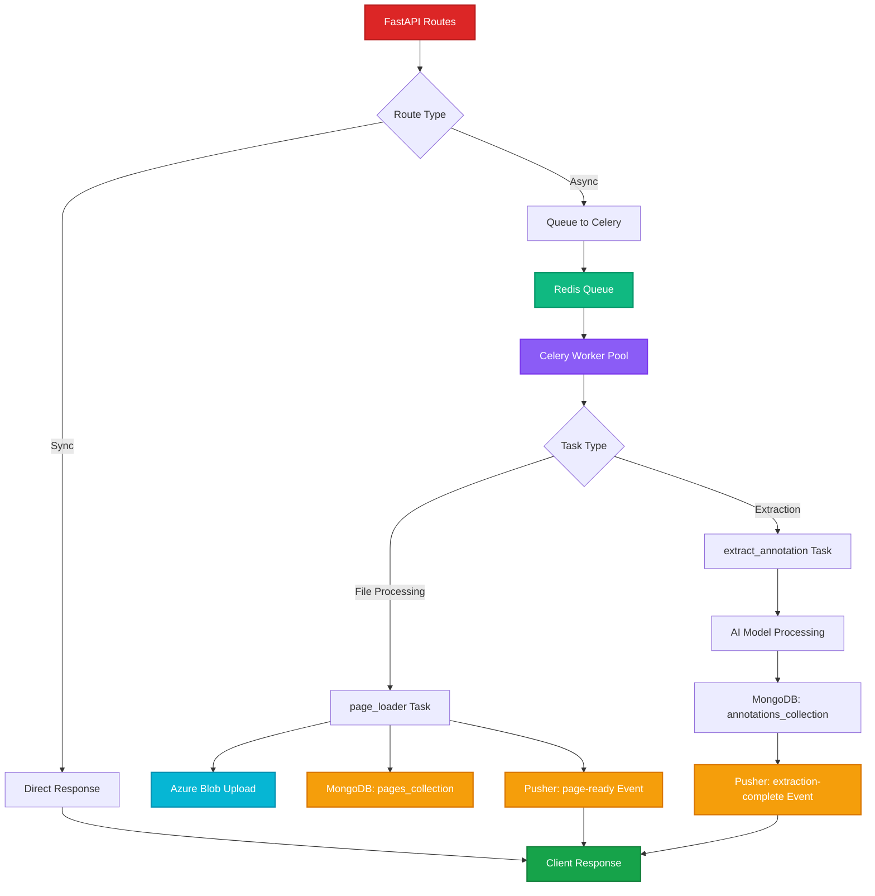
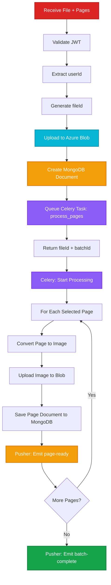
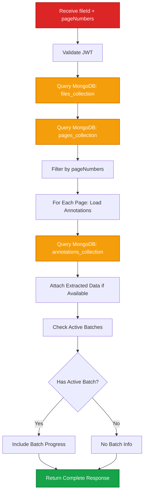

# API Architecture

Backend API design with FastAPI, Celery workers, Redis queues, and Pusher real-time events.

## Backend Architecture



## API Endpoints

### 1. POST /upload

Upload file and queue page processing.



**Request**:
```http
POST /api/upload
Content-Type: multipart/form-data
Authorization: Bearer {jwt_token}

file: (binary data)
pages: [1, 3, 5]
```

**Response**:
```json
{
  "success": true,
  "fileId": "file_abc123",
  "batchId": "batch_xyz789",
  "message": "File uploaded. Processing pages in background."
}
```

**Backend Implementation**:
```python
from fastapi import APIRouter, UploadFile, Depends
from celery_app import process_pages_task
import uuid

router = APIRouter()

@router.post("/upload")
async def upload_file(
    file: UploadFile,
    pages: list[int],
    user_id: str = Depends(get_current_user)
):
    file_id = str(uuid.uuid4())

    # Upload to Azure Blob
    blob_url = await azure_client.upload_blob(
        container="files",
        blob_name=f"{file_id}/{file.filename}",
        data=await file.read()
    )

    # Create MongoDB document
    await mongo_db.files.insert_one({
        "_id": file_id,
        "userId": user_id,
        "fileName": file.filename,
        "blobUrl": blob_url,
        "createdAt": datetime.utcnow()
    })

    # Queue Celery task
    batch_id = str(uuid.uuid4())
    process_pages_task.delay(file_id, pages, user_id, batch_id)

    return {
        "success": True,
        "fileId": file_id,
        "batchId": batch_id,
        "message": "File uploaded. Processing pages in background."
    }
```

### 2. GET /get-batchids

Retrieve active batch jobs for user.

**Request**:
```http
GET /api/get-batchids?userId=user_123
Authorization: Bearer {jwt_token}
```

**Response**:
```json
{
  "batches": [
    {
      "batchId": "batch_xyz789",
      "fileId": "file_abc123",
      "status": "processing",
      "progress": 45,
      "totalItems": 10,
      "completedItems": 4,
      "createdAt": "2025-10-08T10:30:00Z"
    }
  ]
}
```

**Backend Implementation**:
```python
@router.get("/get-batchids")
async def get_batch_ids(user_id: str = Depends(get_current_user)):
    batches = await mongo_db.batches.find({
        "userId": user_id,
        "status": {"$in": ["pending", "processing"]}
    }).sort("createdAt", -1).to_list(length=100)

    return {"batches": batches}
```

### 3. GET /get-file-data

Retrieve file pages, images, and annotations.



**Request**:
```http
GET /api/get-file-data?fileId=file_abc123&pageNumbers=1,3,5
Authorization: Bearer {jwt_token}
```

**Response**:
```json
{
  "fileId": "file_abc123",
  "fileName": "document.pdf",
  "pages": [
    {
      "pageNumber": 1,
      "imageUrl": "https://blob.azure.com/page-1.png",
      "annotations": [
        {
          "annId": "ann_001",
          "type": "text",
          "bbox": [100, 200, 400, 250],
          "extractedData": {
            "text": "Sample text",
            "confidence": 0.95
          }
        }
      ]
    }
  ],
  "activeBatch": {
    "batchId": "batch_xyz789",
    "progress": 45
  }
}
```

**Backend Implementation**:
```python
@router.get("/get-file-data")
async def get_file_data(
    file_id: str,
    page_numbers: str,  # Comma-separated: "1,3,5"
    user_id: str = Depends(get_current_user)
):
    page_nums = [int(p) for p in page_numbers.split(",")]

    # Get file metadata
    file_doc = await mongo_db.files.find_one({"_id": file_id, "userId": user_id})
    if not file_doc:
        raise HTTPException(404, "File not found")

    # Get pages
    pages = await mongo_db.pages.find({
        "fileId": file_id,
        "pageNumber": {"$in": page_nums}
    }).to_list(length=len(page_nums))

    # Load annotations for each page
    for page in pages:
        annotations = await mongo_db.annotations.find({
            "fileId": file_id,
            "pageNumber": page["pageNumber"]
        }).to_list(length=100)
        page["annotations"] = annotations

    # Check for active batch
    active_batch = await mongo_db.batches.find_one({
        "fileId": file_id,
        "status": "processing"
    })

    return {
        "fileId": file_id,
        "fileName": file_doc["fileName"],
        "pages": pages,
        "activeBatch": active_batch if active_batch else None
    }
```

### 4. POST /process-annotation

Start extraction batch for selected annotations.

**Request**:
```http
POST /api/process-annotation
Content-Type: application/json
Authorization: Bearer {jwt_token}

{
  "items": [
    {
      "annId": "ann_001",
      "type": "text",
      "bbox": [100, 200, 400, 250],
      "pageNumber": 1
    }
  ]
}
```

**Response**:
```json
{
  "success": true,
  "batchId": "batch_abc789",
  "totalItems": 1,
  "message": "Extraction started. Listen for Pusher events."
}
```

**Backend Implementation**:
```python
from celery_app import extract_annotation_task

@router.post("/process-annotation")
async def process_annotation(
    payload: dict,
    user_id: str = Depends(get_current_user)
):
    batch_id = str(uuid.uuid4())
    items = payload["items"]

    # Create batch document
    await mongo_db.batches.insert_one({
        "_id": batch_id,
        "userId": user_id,
        "fileId": items[0].get("fileId"),
        "status": "pending",
        "progress": 0,
        "totalItems": len(items),
        "completedItems": 0,
        "items": items,
        "createdAt": datetime.utcnow()
    })

    # Queue extraction task
    extract_annotation_task.delay(batch_id, items, user_id)

    return {
        "success": True,
        "batchId": batch_id,
        "totalItems": len(items),
        "message": "Extraction started. Listen for Pusher events."
    }
```

## Celery Tasks

### process_pages_task

```python
from celery import shared_task
from pdf2image import convert_from_bytes
import pusher_client

@shared_task(bind=True, max_retries=3)
def process_pages_task(self, file_id, page_numbers, user_id, batch_id):
    try:
        # Download file from Azure Blob
        file_data = azure_client.download_blob(f"files/{file_id}")

        # Convert pages to images
        images = convert_from_bytes(file_data, first_page=min(page_numbers), last_page=max(page_numbers))

        for idx, page_num in enumerate(page_numbers):
            # Upload page image to Blob
            img_bytes = images[idx].tobytes()
            img_url = azure_client.upload_blob(
                container="pages",
                blob_name=f"{file_id}/page-{page_num}.png",
                data=img_bytes
            )

            # Save to MongoDB
            await mongo_db.pages.insert_one({
                "fileId": file_id,
                "pageNumber": page_num,
                "imageUrl": img_url,
                "createdAt": datetime.utcnow()
            })

            # Emit Pusher event
            pusher_client.trigger(
                channel=f"user-{user_id}",
                event="page-ready",
                data={
                    "fileId": file_id,
                    "pageNumber": page_num,
                    "imageUrl": img_url
                }
            )

        # Emit batch complete
        pusher_client.trigger(
            channel=f"user-{user_id}",
            event="batch-complete",
            data={"batchId": batch_id, "fileId": file_id}
        )

    except Exception as exc:
        self.retry(exc=exc, countdown=2 ** self.request.retries)
```

### extract_annotation_task

```python
@shared_task(bind=True, max_retries=3)
def extract_annotation_task(self, batch_id, items, user_id):
    try:
        for item in items:
            # Update status
            await mongo_db.batches.update_one(
                {"_id": batch_id},
                {"$set": {"status": "processing"}}
            )

            # Download page image
            page_doc = await mongo_db.pages.find_one({
                "fileId": item["fileId"],
                "pageNumber": item["pageNumber"]
            })
            img_data = azure_client.download_blob(page_doc["imageUrl"])

            # Crop annotation region
            cropped = crop_image(img_data, item["bbox"])

            # Extract based on type
            if item["type"] == "text":
                extracted = await extract_text_ai(cropped)
            elif item["type"] == "table":
                extracted = await extract_table_ai(cropped)
            elif item["type"] == "diagram":
                extracted = await extract_diagram_ai(cropped)

            # Save to MongoDB
            await mongo_db.annotations.update_one(
                {"_id": item["annId"]},
                {"$set": {"extractedData": extracted}},
                upsert=True
            )

            # Emit progress
            pusher_client.trigger(
                channel=f"user-{user_id}",
                event="extraction-complete",
                data={
                    "batchId": batch_id,
                    "annId": item["annId"],
                    "extractedData": extracted
                }
            )

        # Mark batch complete
        await mongo_db.batches.update_one(
            {"_id": batch_id},
            {"$set": {"status": "completed", "progress": 100}}
        )

    except Exception as exc:
        self.retry(exc=exc, countdown=2 ** self.request.retries)
```

## Pusher Event Schema

### Event: page-ready

```json
{
  "event": "page-ready",
  "channel": "user-{userId}",
  "data": {
    "fileId": "file_abc123",
    "pageNumber": 3,
    "imageUrl": "https://blob.azure.com/page-3.png",
    "timestamp": "2025-10-08T10:32:15Z"
  }
}
```

### Event: extraction-complete

```json
{
  "event": "extraction-complete",
  "channel": "user-{userId}",
  "data": {
    "batchId": "batch_xyz789",
    "annId": "ann_001",
    "pageNumber": 1,
    "extractedData": {
      "text": "Extracted content",
      "confidence": 0.95
    },
    "timestamp": "2025-10-08T10:35:00Z"
  }
}
```

### Event: batch-complete

```json
{
  "event": "batch-complete",
  "channel": "user-{userId}",
  "data": {
    "batchId": "batch_xyz789",
    "fileId": "file_abc123",
    "totalItems": 10,
    "successfulItems": 9,
    "failedItems": 1,
    "completedAt": "2025-10-08T10:40:00Z"
  }
}
```

## Database Schema

### files_collection

```javascript
{
  _id: "file_abc123",
  userId: "user_123",
  fileName: "document.pdf",
  blobUrl: "https://blob.azure.com/files/...",
  createdAt: ISODate("2025-10-08T10:30:00Z")
}
```

### pages_collection

```javascript
{
  _id: ObjectId("..."),
  fileId: "file_abc123",
  pageNumber: 1,
  imageUrl: "https://blob.azure.com/pages/page-1.png",
  createdAt: ISODate("2025-10-08T10:31:00Z")
}
```

### annotations_collection

```javascript
{
  _id: "ann_001",
  fileId: "file_abc123",
  pageNumber: 1,
  type: "text",
  bbox: [100, 200, 400, 250],
  extractedData: {
    text: "Sample extracted text",
    confidence: 0.95
  },
  createdAt: ISODate("2025-10-08T10:32:00Z"),
  updatedAt: ISODate("2025-10-08T10:35:00Z")
}
```

### batches_collection

```javascript
{
  _id: "batch_xyz789",
  userId: "user_123",
  fileId: "file_abc123",
  status: "processing",  // pending | processing | completed | failed
  progress: 45,
  totalItems: 10,
  completedItems: 4,
  items: [
    {
      annId: "ann_001",
      status: "completed",
      progress: 100
    }
  ],
  createdAt: ISODate("2025-10-08T10:30:00Z"),
  completedAt: null
}
```

## Performance Optimizations

### 1. Celery Concurrency
```python
# Run 4 workers concurrently
celery -A celery_app worker --concurrency=4
```

### 2. Redis Connection Pool
```python
from redis import ConnectionPool

pool = ConnectionPool(
    host='localhost',
    port=6379,
    db=0,
    max_connections=50
)
```

### 3. MongoDB Indexing
```python
# Create indexes for faster queries
await mongo_db.files.create_index("userId")
await mongo_db.pages.create_index([("fileId", 1), ("pageNumber", 1)])
await mongo_db.annotations.create_index([("fileId", 1), ("pageNumber", 1)])
await mongo_db.batches.create_index([("userId", 1), ("status", 1)])
```

### 4. Pusher Batching
```python
# Batch multiple events into single Pusher call
pusher_client.trigger_batch([
    {"channel": f"user-{user_id}", "event": "page-ready", "data": page1_data},
    {"channel": f"user-{user_id}", "event": "page-ready", "data": page2_data},
])
```

## Related Documentation

- **[File Upload Flow →](/v3-iteration/file-upload-flow)** - Frontend upload implementation
- **[File Page Flow →](/v3-iteration/file-page-flow)** - Frontend data fetching
- **[State Management →](/v3-iteration/state-management)** - Frontend state handling
