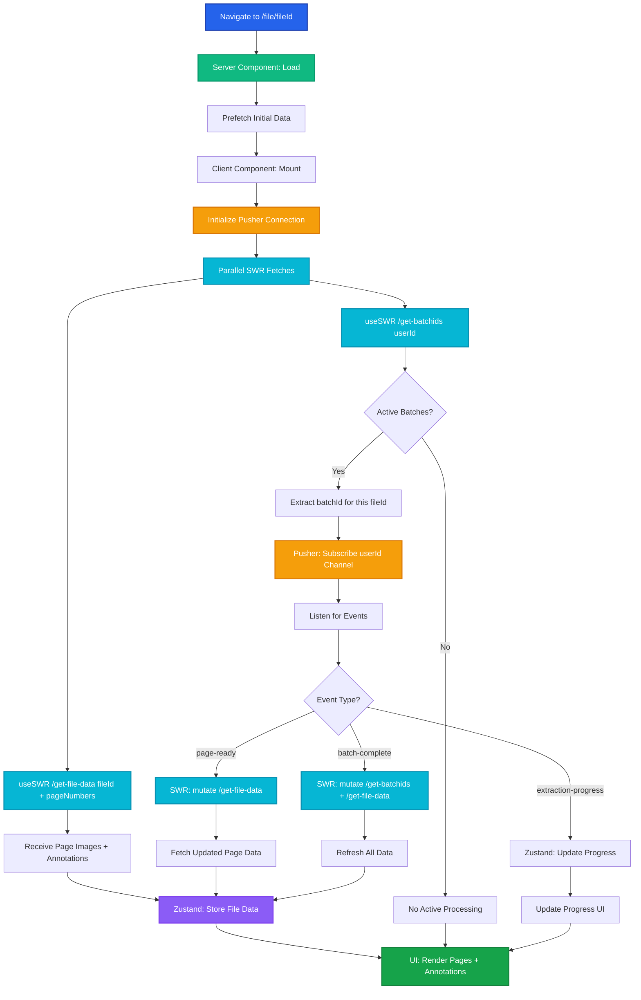
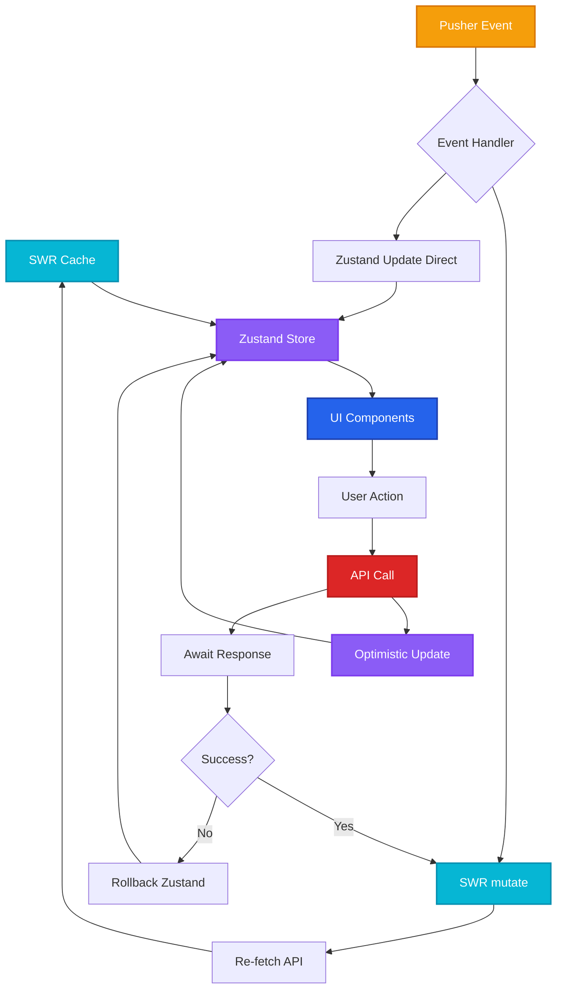

# File Page Flow

Dynamic file page with SWR data fetching, Pusher real-time updates, and optimized state management for ongoing batch processing.

## Complete Flow Diagram



## Implementation Pattern

### File Page Component

```tsx
// app/file/[fileId]/page.tsx
import { FilePageClient } from './client'

export default async function FilePage({ params }: { params: { fileId: string } }) {
  // Server-side prefetch
  const initialData = await fetch(`${process.env.API_URL}/get-file-data?fileId=${params.fileId}`)
    .then(res => res.json())

  return <FilePageClient fileId={params.fileId} initialData={initialData} />
}
```

### Client Component with SWR + Pusher

```tsx
// app/file/[fileId]/client.tsx
'use client'

import { useFileData } from '@/hooks/useFileData'
import { useBatchProgress } from '@/hooks/useBatchProgress'
import { usePusherSubscription } from '@/hooks/usePusherSubscription'

export function FilePageClient({ fileId, initialData }) {
  // SWR hooks
  const { data: fileData, mutate: mutateFileData } = useFileData(fileId, initialData)
  const { data: batches, mutate: mutateBatches } = useBatchProgress(userId)

  // Find active batch for this file
  const activeBatch = batches?.find(b => b.fileId === fileId && b.status === 'processing')

  // Pusher subscription
  usePusherSubscription({
    userId,
    onPageReady: (event) => {
      if (event.fileId === fileId) {
        mutateFileData() // Re-fetch file data
      }
    },
    onBatchProgress: (event) => {
      if (event.batchId === activeBatch?.batchId) {
        // Optimistic update
        mutateBatches((current) => {
          return current?.map(b =>
            b.batchId === event.batchId
              ? { ...b, progress: event.progress }
              : b
          )
        }, false) // Don't revalidate
      }
    },
    onBatchComplete: (event) => {
      if (event.batchId === activeBatch?.batchId) {
        mutateFileData() // Refresh file data
        mutateBatches() // Refresh batch list
      }
    },
  })

  return (
    <div>
      {activeBatch && <ProgressBar progress={activeBatch.progress} />}
      <PageGrid pages={fileData.pages} annotations={fileData.annotations} />
    </div>
  )
}
```

### useFileData Hook

```tsx
// hooks/useFileData.ts
import useSWR from 'swr'
import { useFileStore } from '@/store/fileStore'

const fetcher = (url: string) => fetch(url).then(r => r.json())

export function useFileData(fileId: string, initialData: any) {
  const setFileData = useFileStore(state => state.setFileData)

  const { data, error, mutate } = useSWR(
    `/api/get-file-data?fileId=${fileId}`,
    fetcher,
    {
      fallbackData: initialData,
      revalidateOnFocus: true,
      revalidateOnReconnect: true,
      dedupingInterval: 2000,
      onSuccess: (data) => {
        // Sync with Zustand store
        setFileData(fileId, data)
      },
    }
  )

  return { data, error, mutate, isLoading: !data && !error }
}
```

### useBatchProgress Hook

```tsx
// hooks/useBatchProgress.ts
import useSWR from 'swr'
import { useBatchStore } from '@/store/batchStore'

export function useBatchProgress(userId: string) {
  const setBatches = useBatchStore(state => state.setBatches)

  const { data, mutate } = useSWR(
    `/api/get-batchids?userId=${userId}`,
    fetcher,
    {
      refreshInterval: 0, // Only refresh on mutate or Pusher events
      onSuccess: (data) => {
        setBatches(data.batches)
      },
    }
  )

  return { data: data?.batches, mutate }
}
```

### usePusherSubscription Hook

```tsx
// hooks/usePusherSubscription.ts
import { useEffect } from 'react'
import Pusher from 'pusher-js'

type PusherCallbacks = {
  userId: string
  onPageReady?: (event: any) => void
  onBatchProgress?: (event: any) => void
  onBatchComplete?: (event: any) => void
}

export function usePusherSubscription({
  userId,
  onPageReady,
  onBatchProgress,
  onBatchComplete,
}: PusherCallbacks) {
  useEffect(() => {
    const pusher = new Pusher(process.env.NEXT_PUBLIC_PUSHER_KEY!, {
      cluster: process.env.NEXT_PUBLIC_PUSHER_CLUSTER!,
    })

    const channel = pusher.subscribe(`user-${userId}`)

    if (onPageReady) {
      channel.bind('page-ready', onPageReady)
    }

    if (onBatchProgress) {
      channel.bind('batch-progress', onBatchProgress)
    }

    if (onBatchComplete) {
      channel.bind('batch-complete', onBatchComplete)
    }

    return () => {
      channel.unbind_all()
      pusher.unsubscribe(`user-${userId}`)
      pusher.disconnect()
    }
  }, [userId, onPageReady, onBatchProgress, onBatchComplete])
}
```

## API Contracts

### GET /get-batchids

**Request**:
```http
GET /api/get-batchids?userId=user_123
Authorization: Bearer {jwt_token}
```

**Response**:
```json
{
  "batches": [
    {
      "batchId": "batch_xyz789",
      "fileId": "file_abc123",
      "status": "processing",
      "progress": 45,
      "totalItems": 10,
      "completedItems": 4,
      "createdAt": "2025-10-08T10:30:00Z"
    }
  ]
}
```

### GET /get-file-data

**Request**:
```http
GET /api/get-file-data?fileId=file_abc123&pageNumbers=1,3,5
Authorization: Bearer {jwt_token}
```

**Response**:
```json
{
  "fileId": "file_abc123",
  "fileName": "document.pdf",
  "pages": [
    {
      "pageNumber": 1,
      "imageUrl": "https://blob.azure.com/page-1.png",
      "annotations": [
        {
          "annId": "ann_001",
          "type": "text",
          "bbox": [100, 200, 400, 250],
          "extractedData": {
            "text": "Sample extracted text",
            "confidence": 0.95
          }
        }
      ]
    }
  ],
  "activeBatch": {
    "batchId": "batch_xyz789",
    "progress": 45
  }
}
```

## Pusher Event Schema

### page-ready Event

```json
{
  "event": "page-ready",
  "fileId": "file_abc123",
  "pageNumber": 3,
  "imageUrl": "https://blob.azure.com/page-3.png",
  "timestamp": "2025-10-08T10:32:15Z"
}
```

### batch-progress Event

```json
{
  "event": "batch-progress",
  "batchId": "batch_xyz789",
  "fileId": "file_abc123",
  "progress": 60,
  "completedItems": 6,
  "totalItems": 10,
  "currentItem": {
    "annId": "ann_006",
    "status": "extracting"
  }
}
```

### batch-complete Event

```json
{
  "event": "batch-complete",
  "batchId": "batch_xyz789",
  "fileId": "file_abc123",
  "totalItems": 10,
  "successfulItems": 9,
  "failedItems": 1,
  "completedAt": "2025-10-08T10:35:00Z"
}
```

## State Management Flow



## Performance Optimizations

### 1. Parallel Data Loading
```tsx
// Both requests fire simultaneously
const [fileData, batches] = await Promise.all([
  fetch(`/get-file-data?fileId=${fileId}`),
  fetch(`/get-batchids?userId=${userId}`)
])
```

### 2. SWR Deduplication
- Multiple components can call `useFileData(fileId)` - only one request fires
- Automatic request deduplication within 2-second window

### 3. Optimistic Updates
- Update Zustand store immediately on user action
- Rollback if API call fails
- Show loading state only for initial load

### 4. Selective Revalidation
- Don't revalidate on Pusher events (data already updated)
- Only revalidate on focus/reconnect for stale data

## Error Handling

### Network Errors
```tsx
const { data, error } = useSWR('/api/get-file-data', fetcher, {
  onErrorRetry: (error, key, config, revalidate, { retryCount }) => {
    if (retryCount >= 3) return
    setTimeout(() => revalidate({ retryCount }), 5000 * Math.pow(2, retryCount))
  }
})

if (error) {
  return <ErrorBoundary error={error} retry={() => mutate()} />
}
```

### Pusher Connection Loss
```tsx
pusher.connection.bind('error', (error) => {
  console.error('Pusher connection error:', error)
  // Fallback to polling
  const interval = setInterval(() => mutateFileData(), 5000)
  pusher.connection.bind('connected', () => clearInterval(interval))
})
```

## UX Flow

1. **Initial Load**: Server-side prefetch → instant page render
2. **Client Hydration**: SWR uses prefetched data → no loading state
3. **Pusher Connection**: Subscribe to userId channel → real-time ready
4. **Parallel Fetching**: Load batches + file data simultaneously
5. **Progressive Updates**: Pusher events → SWR mutate → UI updates
6. **Optimistic Actions**: User annotates → instant UI update → background sync

## Related Documentation

- **[File Upload Flow →](/v3-iteration/file-upload-flow)** - How users arrive at this page
- **[State Management →](/v3-iteration/state-management)** - Zustand store patterns
- **[API Architecture →](/v3-iteration/api-architecture)** - Backend implementation
