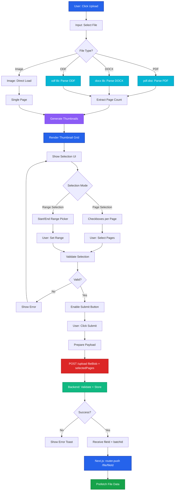
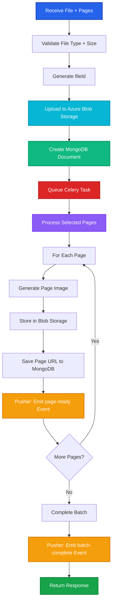

# File Upload Flow

Complete flow from file selection to navigation, featuring client-side parsing, thumbnail generation, and optimized page selection.

## Flow Diagram



## Frontend Implementation Pattern

### File Parsing Hook

```tsx
// hooks/useFileParsing.ts
import { useMemo, useState } from 'react'
import * as pdfjsLib from 'pdfjs-dist'
import { parseDocx } from '@/lib/docx-parser'
import { parseOdf } from '@/lib/odf-parser'

export function useFileParsing() {
  const [thumbnails, setThumbnails] = useState<string[]>([])
  const [pageCount, setPageCount] = useState(0)
  const [loading, setLoading] = useState(false)

  const parseFile = async (file: File) => {
    setLoading(true)

    if (file.type === 'application/pdf') {
      const pdf = await pdfjsLib.getDocument(URL.createObjectURL(file)).promise
      setPageCount(pdf.numPages)

      const thumbs = await Promise.all(
        Array.from({ length: pdf.numPages }, async (_, i) => {
          const page = await pdf.getPage(i + 1)
          const viewport = page.getViewport({ scale: 0.5 })
          const canvas = document.createElement('canvas')
          canvas.width = viewport.width
          canvas.height = viewport.height
          await page.render({ canvasContext: canvas.getContext('2d')!, viewport }).promise
          return canvas.toDataURL()
        })
      )
      setThumbnails(thumbs)
    }
    // Similar for DOCX, ODF, images...

    setLoading(false)
  }

  return { parseFile, thumbnails, pageCount, loading }
}
```

### Page Selection Component

```tsx
// components/PageSelector.tsx
'use client'

import { useState } from 'react'
import { useFileParsing } from '@/hooks/useFileParsing'

type SelectionMode = 'page' | 'range'

export function PageSelector({ file }: { file: File }) {
  const { thumbnails, pageCount } = useFileParsing()
  const [mode, setMode] = useState<SelectionMode>('page')
  const [selectedPages, setSelectedPages] = useState<number[]>([])
  const [range, setRange] = useState({ start: 1, end: pageCount })

  const handleSubmit = async () => {
    const pages = mode === 'page' ? selectedPages : Array.from(
      { length: range.end - range.start + 1 },
      (_, i) => range.start + i
    )

    const formData = new FormData()
    formData.append('file', file)
    formData.append('pages', JSON.stringify(pages))

    const response = await fetch('/api/upload', {
      method: 'POST',
      body: formData,
    })

    const data = await response.json()
    router.push('/file/' + data.fileId)
  }

  // Render mode toggle, thumbnail grid for page selection,
  // or range inputs for range selection
  // See full implementation in repository

  return <PageSelectorUI />
}
```

## Backend API Contract

### POST /upload

**Request**:
```http
POST /api/upload
Content-Type: multipart/form-data

file: (binary data)
pages: [1, 3, 5, 7]
userId: "user_123"
```

**Response**:
```json
{
  "success": true,
  "fileId": "file_abc123",
  "batchId": "batch_xyz789",
  "message": "File uploaded successfully. Processing pages in background."
}
```

**Backend Flow**:


## UX Optimizations

### 1. Progressive Thumbnail Loading
- Load thumbnails in chunks (4 at a time)
- Show skeleton loaders during generation
- Cache thumbnails in memory for re-selection

### 2. Smart Validation
- Disable submit if no pages selected
- Show warning for large selections (&gt;50 pages)
- Prevent duplicate page selections

### 3. Optimistic UI
- Show upload progress bar immediately
- Disable form during upload
- Show success animation before navigation

### 4. Error Handling
- File size validation (max 100MB)
- Supported file types: PDF, DOCX, ODT, images
- Network error retry with exponential backoff

## Performance Metrics

| Operation | Target Time | Notes |
|-----------|-------------|-------|
| PDF parsing (10 pages) | &lt;500ms | Using Web Workers |
| Thumbnail generation | &lt;100ms/page | Canvas rendering optimized |
| Page selection validation | &lt;50ms | Lodash memoization |
| Upload API call | &lt;2s | Streaming upload with progress |
| Navigation to file page | &lt;200ms | Next.js instant navigation |

## Related Flows

- **[File Page Flow →](/v3-iteration/file-page-flow)** - What happens after upload
- **[State Management →](/v3-iteration/state-management)** - How file data is stored
- **[API Architecture →](/v3-iteration/api-architecture)** - Backend implementation
