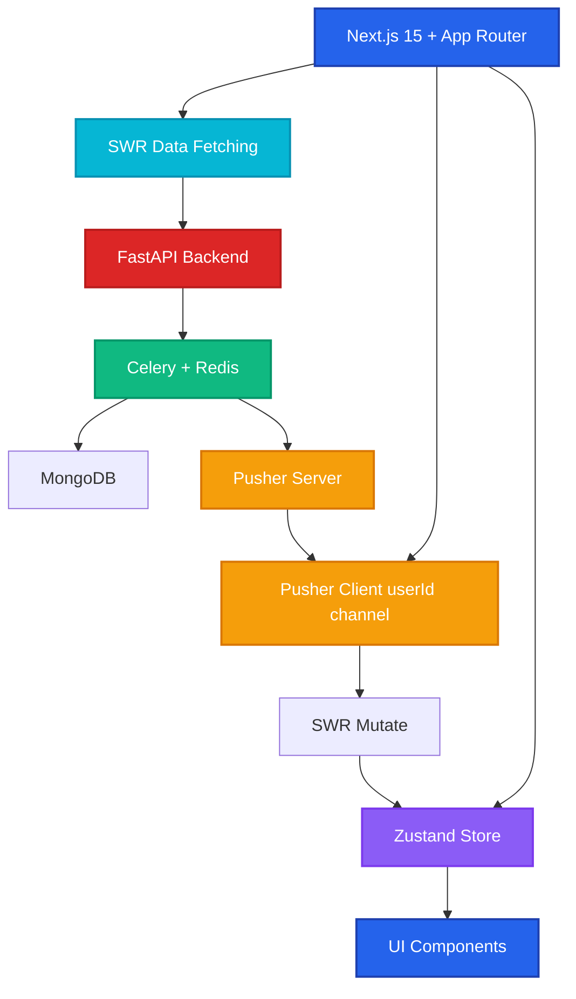
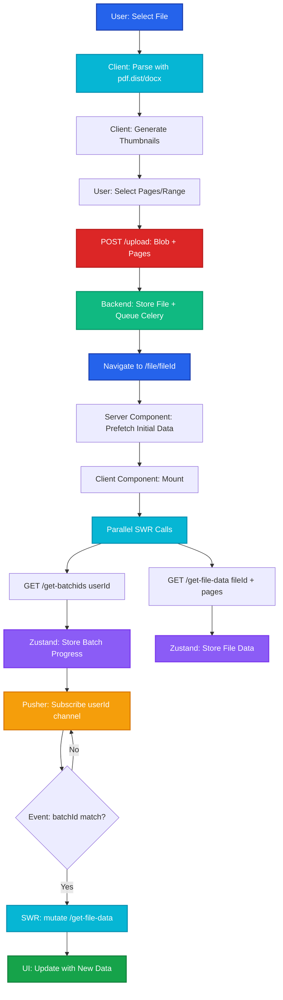

# V3 Iteration Overview

V3 iteration introduces a modern, performant architecture leveraging Next.js best practices with SWR, Pusher real-time subscriptions, Zustand state management, and optimized middleware patterns for superior UX.

## Architecture Stack

## Technology Stack

| Layer | Technology | Purpose |
|-------|------------|---------|
| **Frontend Framework** | Next.js 15 (App Router) | Server-side rendering, routing, API routes |
| **Data Fetching** | SWR | Client-side data fetching, caching, revalidation |
| **State Management** | Zustand + Lodash | Global state, file data handling, helpers |
| **Real-time** | Pusher (userId channel) | WebSocket subscriptions, live updates |
| **Backend API** | FastAPI + Python | REST endpoints, business logic |
| **Task Queue** | Celery + Redis | Background jobs, async processing |
| **Database** | MongoDB | Document storage |
| **File Processing** | pdf.dist, docx, odf parsers | Client-side file parsing, thumbnail generation |

## Key Architectural Decisions

### 1. **SWR with Pusher Integration**
- SWR handles all data fetching with automatic caching and revalidation
- Pusher subscriptions on `userId` channel for real-time updates
- Pusher events trigger SWR `mutate()` for instant UI updates
- Optimistic updates with automatic rollback on failure

### 2. **Client-side File Processing**
- Frontend uses `pdf.dist`, `docx`, and `odf` libraries to parse files
- Generate thumbnails client-side before upload
- Page/range selection UI with visual previews
- Only send file blob + selected pages to backend

### 3. **Middleware Hook Pattern**
- Custom hooks encapsulate SWR logic, Pusher subscriptions, and Zustand updates
- UI components directly connect to middleware hooks
- Separation of concerns: UI layer → Hook layer → API/State layer

### 4. **File Page Dynamic Routing**
- `/file/[fileId]` dynamic route
- Prefetch data on navigation
- Parallel API calls: `/get-batchids` (user-level) + `/get-file-data` (file-level)
- Real-time batch progress updates via Pusher → SWR mutate

## Core Flows

The V3 iteration focuses on four primary user flows:

### **[1. File Upload Flow →](/v3-iteration/file-upload-flow)**
- Client-side file parsing and thumbnail generation
- Page/range selection with visual preview
- API call with file blob + selected pages
- Navigation to `/file/[fileId]`

### **[2. File Page Flow →](/v3-iteration/file-page-flow)**
- Dynamic page with prefetch and parallel data loading
- SWR fetching: `/get-batchids` + `/get-file-data`
- Pusher subscription for batch progress
- Real-time UI updates via SWR mutate

### **[3. User Control Flow →](/v3-iteration/user-control-flow)**
- Auto-layout and auto-extraction toggle management
- Conflict resolution for manual annotations during auto-processing
- Progressive activation for mid-process setting changes
- Priority-based annotation merging strategies

### **[4. State Management →](/v3-iteration/state-management)**
- Zustand store for file data, annotations, batch progress
- Lodash helpers for data manipulation
- SWR cache synchronization
- Middleware hooks pattern

## Performance Optimizations

### SWR Configuration
- **Stale-while-revalidate**: Show cached data instantly, revalidate in background
- **Dedupe requests**: Prevent duplicate API calls
- **Focus revalidation**: Refresh data when user returns to tab
- **Error retry**: Exponential backoff for failed requests

### Pusher Optimization
- **Single channel per user**: Subscribe to `userId` channel only
- **Event filtering**: Filter events by `fileId` and `batchId` client-side
- **Automatic reconnection**: Handle connection drops gracefully
- **Unsubscribe on unmount**: Clean up subscriptions

### Next.js App Router
- **Server Components**: Fetch initial data server-side
- **Client Components**: Interactive UI with SWR hooks
- **Parallel Routes**: Load multiple data sources simultaneously
- **Streaming SSR**: Progressive rendering for faster perceived performance

## UX Improvements

| Feature | V2 Approach | V3 Approach |
|---------|-------------|-------------|
| **File Upload** | Server-side parsing | Client-side with live previews |
| **Page Selection** | Basic input | Visual thumbnails + range picker |
| **Navigation** | Redirect + full reload | Next.js navigation + prefetch |
| **Data Loading** | Sequential API calls | Parallel SWR requests |
| **Real-time Updates** | Poll or manual refresh | Pusher → SWR mutate (instant) |
| **State Management** | React Context | Zustand (optimized re-renders) |
| **Error Handling** | Manual retry | SWR auto-retry + error boundaries |

## Workflow Overview

## Documentation Structure

Each section includes:
- **Flow diagrams** with step-by-step visual representation
- **API contracts** with request/response examples
- **Code patterns** for hooks, components, and utilities
- **Best practices** for Next.js, SWR, and Pusher integration

Explore the detailed flows in the navigation menu.
