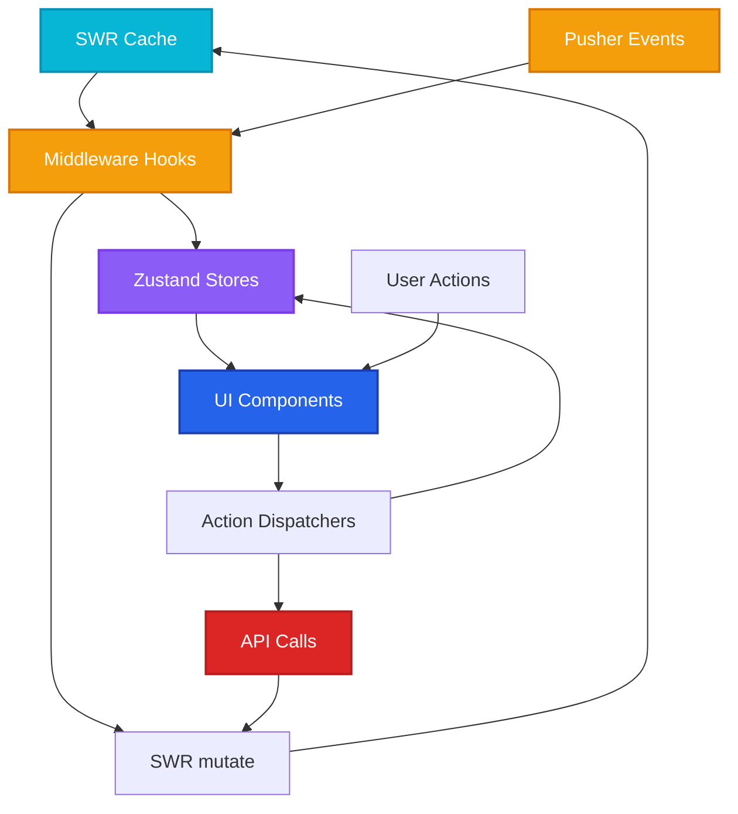
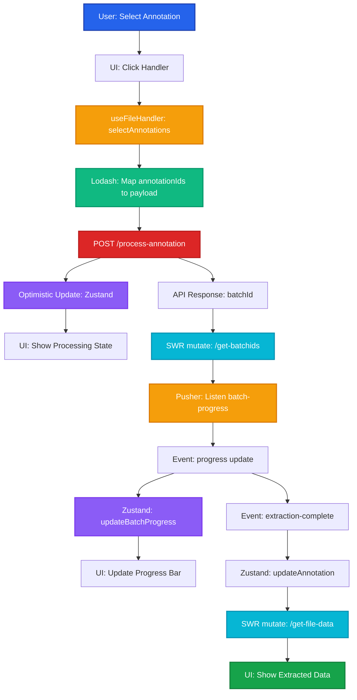

# State Management

Zustand-based state management with SWR cache synchronization, Lodash helpers, and middleware hook patterns for optimal performance.

## Architecture Overview



## Zustand Store Structure

### File Store

```tsx
// store/fileStore.ts
import { create } from 'zustand'
import { devtools, persist } from 'zustand/middleware'
import { produce } from 'immer'

interface Page {
  pageNumber: number
  imageUrl: string
  annotations: Annotation[]
}

interface Annotation {
  annId: string
  type: 'text' | 'table' | 'diagram'
  bbox: [number, number, number, number]
  extractedData?: any
}

interface FileState {
  files: Record<string, {
    fileId: string
    fileName: string
    pages: Page[]
    selectedPages: number[]
  }>
  currentFileId: string | null

  // Actions
  setFileData: (fileId: string, data: any) => void
  addPage: (fileId: string, page: Page) => void
  updateAnnotation: (fileId: string, pageNumber: number, annId: string, data: any) => void
  setSelectedPages: (fileId: string, pageNumbers: number[]) => void
  clearFile: (fileId: string) => void
}

export const useFileStore = create<FileState>()(
  devtools(
    persist(
      (set) => ({
        files: {},
        currentFileId: null,

        setFileData: (fileId, data) =>
          set(
            produce((state) => {
              state.files[fileId] = {
                fileId,
                fileName: data.fileName,
                pages: data.pages || [],
                selectedPages: [],
              }
              state.currentFileId = fileId
            }),
            false,
            'setFileData'
          ),

        addPage: (fileId, page) =>
          set(
            produce((state) => {
              if (!state.files[fileId]) return
              const existing = state.files[fileId].pages.findIndex(
                p => p.pageNumber === page.pageNumber
              )
              if (existing >= 0) {
                state.files[fileId].pages[existing] = page
              } else {
                state.files[fileId].pages.push(page)
                state.files[fileId].pages.sort((a, b) => a.pageNumber - b.pageNumber)
              }
            }),
            false,
            'addPage'
          ),

        updateAnnotation: (fileId, pageNumber, annId, data) =>
          set(
            produce((state) => {
              const page = state.files[fileId]?.pages.find(p => p.pageNumber === pageNumber)
              if (!page) return
              const ann = page.annotations.find(a => a.annId === annId)
              if (ann) {
                ann.extractedData = data
              }
            }),
            false,
            'updateAnnotation'
          ),

        setSelectedPages: (fileId, pageNumbers) =>
          set(
            produce((state) => {
              if (state.files[fileId]) {
                state.files[fileId].selectedPages = pageNumbers
              }
            }),
            false,
            'setSelectedPages'
          ),

        clearFile: (fileId) =>
          set(
            produce((state) => {
              delete state.files[fileId]
              if (state.currentFileId === fileId) {
                state.currentFileId = null
              }
            }),
            false,
            'clearFile'
          ),
      }),
      {
        name: 'file-storage',
        partialize: (state) => ({ files: state.files }), // Don't persist currentFileId
      }
    )
  )
)
```

### Batch Store

```tsx
// store/batchStore.ts
import { create } from 'zustand'
import { devtools } from 'zustand/middleware'
import { produce } from 'immer'

interface BatchItem {
  annId: string
  status: 'pending' | 'processing' | 'completed' | 'failed'
  progress: number
  error?: string
}

interface Batch {
  batchId: string
  fileId: string
  status: 'pending' | 'processing' | 'completed' | 'failed'
  progress: number
  totalItems: number
  completedItems: number
  items: BatchItem[]
  createdAt: string
}

interface BatchState {
  batches: Record<string, Batch>

  // Actions
  setBatches: (batches: Batch[]) => void
  updateBatchProgress: (batchId: string, progress: number) => void
  updateBatchItem: (batchId: string, annId: string, updates: Partial<BatchItem>) => void
  completeBatch: (batchId: string) => void
  removeBatch: (batchId: string) => void
}

export const useBatchStore = create<BatchState>()(
  devtools((set) => ({
    batches: {},

    setBatches: (batches) =>
      set(
        produce((state) => {
          batches.forEach((batch) => {
            state.batches[batch.batchId] = batch
          })
        }),
        false,
        'setBatches'
      ),

    updateBatchProgress: (batchId, progress) =>
      set(
        produce((state) => {
          if (state.batches[batchId]) {
            state.batches[batchId].progress = progress
          }
        }),
        false,
        'updateBatchProgress'
      ),

    updateBatchItem: (batchId, annId, updates) =>
      set(
        produce((state) => {
          const batch = state.batches[batchId]
          if (!batch) return
          const item = batch.items.find(i => i.annId === annId)
          if (item) {
            Object.assign(item, updates)
            // Recalculate batch progress
            batch.completedItems = batch.items.filter(
              i => i.status === 'completed' || i.status === 'failed'
            ).length
            batch.progress = (batch.completedItems / batch.totalItems) * 100
          }
        }),
        false,
        'updateBatchItem'
      ),

    completeBatch: (batchId) =>
      set(
        produce((state) => {
          if (state.batches[batchId]) {
            state.batches[batchId].status = 'completed'
            state.batches[batchId].progress = 100
          }
        }),
        false,
        'completeBatch'
      ),

    removeBatch: (batchId) =>
      set(
        produce((state) => {
          delete state.batches[batchId]
        }),
        false,
        'removeBatch'
      ),
  }))
)
```

## Middleware Hook Pattern

### useFileHandler Hook

```tsx
// hooks/useFileHandler.ts
import { useFileStore } from '@/store/fileStore'
import { useBatchStore } from '@/store/batchStore'
import useSWR from 'swr'
import { usePusherSubscription } from './usePusherSubscription'
import _ from 'lodash'

export function useFileHandler(fileId: string, userId: string) {
  const { setFileData, addPage, updateAnnotation } = useFileStore()
  const { updateBatchProgress, updateBatchItem } = useBatchStore()

  // SWR for file data
  const { data: fileData, mutate: mutateFile } = useSWR(
    `/api/get-file-data?fileId=${fileId}`,
    fetcher,
    {
      onSuccess: (data) => setFileData(fileId, data),
    }
  )

  // SWR for batch data
  const { data: batchData, mutate: mutateBatch } = useSWR(
    `/api/get-batchids?userId=${userId}`,
    fetcher
  )

  // Active batch for this file
  const activeBatch = _.find(batchData?.batches, { fileId, status: 'processing' })

  // Pusher subscription
  usePusherSubscription({
    userId,
    onPageReady: (event) => {
      if (event.fileId === fileId) {
        addPage(fileId, {
          pageNumber: event.pageNumber,
          imageUrl: event.imageUrl,
          annotations: [],
        })
        mutateFile() // Revalidate to sync
      }
    },
    onBatchProgress: (event) => {
      if (event.batchId === activeBatch?.batchId) {
        updateBatchProgress(event.batchId, event.progress)
        updateBatchItem(event.batchId, event.currentItem.annId, {
          status: event.currentItem.status,
        })
      }
    },
    onBatchComplete: (event) => {
      if (event.batchId === activeBatch?.batchId) {
        mutateFile() // Refresh file data
        mutateBatch() // Refresh batch list
      }
    },
    onExtractionComplete: (event) => {
      updateAnnotation(fileId, event.pageNumber, event.annId, event.extractedData)
    },
  })

  // Helper functions
  const selectAnnotations = async (annotationIds: string[]) => {
    const payload = _.map(annotationIds, (annId) => {
      const page = _.find(fileData.pages, (p) =>
        _.some(p.annotations, { annId })
      )
      const ann = _.find(page?.annotations, { annId })
      return {
        annId,
        type: ann?.type,
        bbox: ann?.bbox,
        pageNumber: page?.pageNumber,
      }
    })

    const response = await fetch('/api/process-annotation', {
      method: 'POST',
      headers: { 'Content-Type': 'application/json' },
      body: JSON.stringify({ items: payload }),
    })

    const { batchId } = await response.json()
    mutateBatch() // Refresh to include new batch
  }

  return {
    fileData,
    activeBatch,
    selectAnnotations,
    isLoading: !fileData && !batchData,
  }
}
```

## Lodash Utility Patterns

### Data Transformation Helpers

```tsx
// lib/dataHelpers.ts
import _ from 'lodash'

// Group annotations by type
export const groupAnnotationsByType = (pages: Page[]) => {
  const allAnnotations = _.flatMap(pages, 'annotations')
  return _.groupBy(allAnnotations, 'type')
}

// Find annotation by ID across all pages
export const findAnnotation = (pages: Page[], annId: string) => {
  return _.chain(pages)
    .flatMap('annotations')
    .find({ annId })
    .value()
}

// Calculate extraction progress
export const calculateProgress = (batches: Batch[]) => {
  return _.chain(batches)
    .filter({ status: 'processing' })
    .map((batch) => ({
      batchId: batch.batchId,
      progress: _.sumBy(batch.items, (item) =>
        item.status === 'completed' ? 100 / batch.totalItems : 0
      ),
    }))
    .value()
}

// Debounced save to prevent excessive API calls
export const debouncedSaveAnnotation = _.debounce(
  async (fileId: string, annId: string, data: any) => {
    await fetch('/api/save-annotation', {
      method: 'POST',
      body: JSON.stringify({ fileId, annId, data }),
    })
  },
  500
)

// Memoized page selector
export const getPagesByRange = _.memoize(
  (pages: Page[], start: number, end: number) => {
    return _.filter(pages, (p) => p.pageNumber >= start && p.pageNumber <= end)
  },
  (pages, start, end) => `${pages.length}-${start}-${end}` // Cache key
)
```

## SWR Cache Synchronization

### Optimistic Updates Pattern

```tsx
// components/AnnotationEditor.tsx
import { useFileStore } from '@/store/fileStore'
import useSWR, { useSWRConfig } from 'swr'

export function AnnotationEditor({ fileId, annId }) {
  const { mutate } = useSWRConfig()
  const updateAnnotation = useFileStore(state => state.updateAnnotation)

  const handleSave = async (newData: any) => {
    // Optimistic update to Zustand
    updateAnnotation(fileId, pageNumber, annId, newData)

    // Optimistic update to SWR cache
    mutate(
      `/api/get-file-data?fileId=${fileId}`,
      (current) => {
        const page = current.pages.find(p => p.pageNumber === pageNumber)
        const ann = page.annotations.find(a => a.annId === annId)
        if (ann) ann.extractedData = newData
        return current
      },
      false // Don't revalidate immediately
    )

    try {
      // API call
      await fetch('/api/save-annotation', {
        method: 'POST',
        body: JSON.stringify({ fileId, annId, data: newData }),
      })
    } catch (error) {
      // Rollback on error
      mutate(`/api/get-file-data?fileId=${fileId}`) // Revalidate to get correct data
      toast.error('Failed to save annotation')
    }
  }

  return <Editor onSave={handleSave} />
}
```

## Performance Optimizations

### 1. Selector Pattern
```tsx
// Only re-render when specific data changes
const selectedPages = useFileStore(
  (state) => state.files[fileId]?.selectedPages,
  _.isEqual // Deep equality check
)
```

### 2. Computed Selectors
```tsx
// store/fileStore.ts - add computed selectors
const useFileStore = create<FileState>((set, get) => ({
  // ... state and actions ...

  // Computed values
  getAnnotationsByType: (fileId: string, type: string) => {
    const file = get().files[fileId]
    if (!file) return []
    return _.chain(file.pages)
      .flatMap('annotations')
      .filter({ type })
      .value()
  },

  getPageCount: (fileId: string) => {
    return get().files[fileId]?.pages.length || 0
  },
}))

// Usage in components
const textAnnotations = useFileStore(
  (state) => state.getAnnotationsByType(fileId, 'text')
)
```

### 3. Immer for Immutability
- Use `produce` from Immer for nested updates
- Avoids manual spread operators
- Prevents accidental mutations

### 4. SWR Deduplication
```tsx
// Multiple components can use same hook - only 1 request
function ComponentA() {
  const { data } = useSWR('/api/get-file-data?fileId=123', fetcher)
}

function ComponentB() {
  const { data } = useSWR('/api/get-file-data?fileId=123', fetcher)
}
// Only 1 API call fires, both components get same data
```

## Data Flow Example

### Complete User Interaction Flow



## Best Practices

### 1. Single Source of Truth
- SWR cache is primary source for server data
- Zustand stores derived/local state and optimistic updates
- Sync Zustand with SWR `onSuccess` callbacks

### 2. Middleware Hooks
- Encapsulate SWR + Pusher + Zustand logic in custom hooks
- UI components only call hook methods, never direct API calls
- Easier to test and maintain

### 3. Lodash for Data Manipulation
- Use Lodash for complex transformations, filtering, grouping
- Memoize expensive operations with `_.memoize`
- Debounce API calls with `_.debounce`

### 4. Immer for Updates
- Always use `produce` for nested state updates
- Prevents bugs from manual immutability
- Cleaner, more readable code

## Related Documentation

- **[File Upload Flow →](/v3-iteration/file-upload-flow)** - How data enters the system
- **[File Page Flow →](/v3-iteration/file-page-flow)** - How data is displayed
- **[API Architecture →](/v3-iteration/api-architecture)** - Backend data contracts
