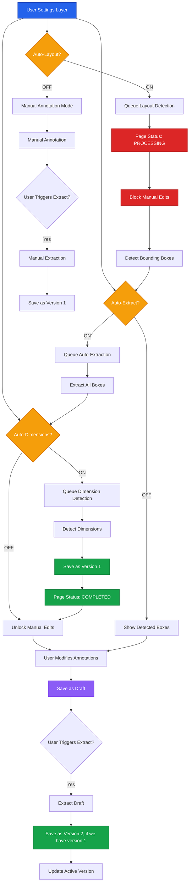
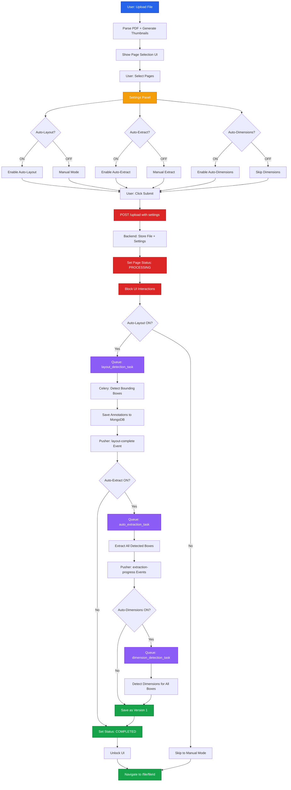
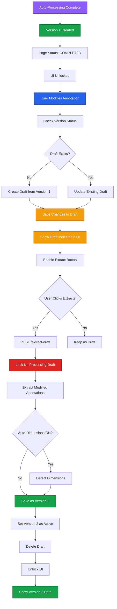
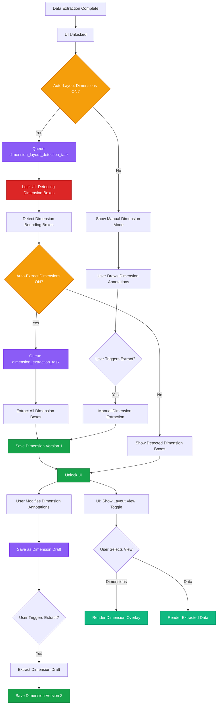
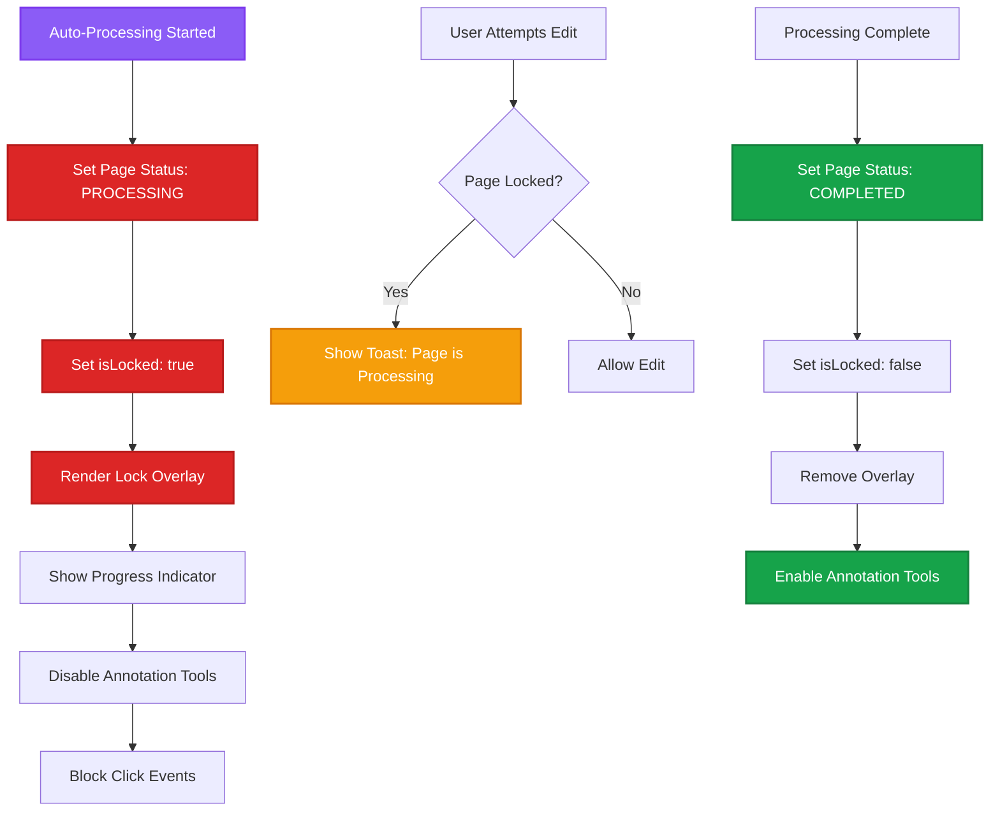

# User Control Flow

Advanced user control system for managing auto-layout detection, auto-extraction, auto-dimension detection, versioning, and draft management with blocking during processing.

## Architecture Overview



## Core Principles

### 1. Blocking During Processing

- Manual annotations are **blocked** while page is in `processing` state
- User cannot draw, edit, or delete annotations during auto-layout/extraction
- UI shows loading overlay with progress indicator
- Unlocks only when page reaches `completed` state

### 2. Version Management

- **Version 1**: Created when auto-layout + auto-extraction completes (or manual extraction)
- **Draft**: User modifications saved as draft (no new version yet)
- **Version 2+**: Created only when user triggers extraction on draft
- No version selection modal - active version is always the latest
- User can only edit if page is not currently processing

### 3. Dimension Detection (Independent Flow)

- **Completely separate** from data extraction with its own toggles:
  - **Auto-Layout Dimensions**: Detect dimension bounding boxes
  - **Auto-Extract Dimensions**: Extract dimension data from boxes
- If auto-layout is OFF, user can manually draw dimension annotations
- If auto-extract dimensions is OFF, user can edit detected boxes and manually trigger dimension extraction
- Follows same versioning/draft logic as data extraction (independent versions)
- User can switch between layout views: **Dimensions** / **Data**

## User Settings Management

### Settings Store Structure

```tsx
// store/settingsStore.ts
import { create } from "zustand";
import { persist } from "zustand/middleware";

interface FileSettings {
  fileId: string;

  // Data extraction settings
  autoLayoutData: boolean;
  autoExtractData: boolean;

  // Dimension detection settings (independent)
  autoLayoutDimensions: boolean;
  autoExtractDimensions: boolean;

  selectedPages: number[];
  processingState:
    | "idle"
    | "layout-detection-data"
    | "extracting-data"
    | "layout-detection-dimensions"
    | "extracting-dimensions"
    | "completed";
  layoutView: "dimensions" | "data"; // Toggle between dimension and data views
}

interface SettingsState {
  files: Record<string, FileSettings>;

  // Global defaults
  defaultAutoLayoutData: boolean;
  defaultAutoExtractData: boolean;
  defaultAutoLayoutDimensions: boolean;
  defaultAutoExtractDimensions: boolean;

  // Actions
  setFileSettings: (fileId: string, settings: Partial<FileSettings>) => void;
  toggleAutoLayoutData: (fileId: string) => void;
  toggleAutoExtractData: (fileId: string) => void;
  toggleAutoLayoutDimensions: (fileId: string) => void;
  toggleAutoExtractDimensions: (fileId: string) => void;
  toggleLayoutView: (fileId: string) => void;
  getFileSettings: (fileId: string) => FileSettings;
  resetFileSettings: (fileId: string) => void;
}

export const useSettingsStore = create<SettingsState>()(
  persist(
    (set, get) => ({
      files: {},
      defaultAutoLayoutData: true,
      defaultAutoExtractData: false,
      defaultAutoLayoutDimensions: false,
      defaultAutoExtractDimensions: false,

      setFileSettings: (fileId, settings) =>
        set((state) => ({
          files: {
            ...state.files,
            [fileId]: {
              ...state.files[fileId],
              fileId,
              ...settings,
            },
          },
        })),

      toggleAutoLayoutData: (fileId) =>
        set((state) => {
          const current =
            state.files[fileId]?.autoLayoutData ?? state.defaultAutoLayoutData;
          return {
            files: {
              ...state.files,
              [fileId]: {
                ...state.files[fileId],
                fileId,
                autoLayoutData: !current,
              },
            },
          };
        }),

      toggleAutoExtractData: (fileId) =>
        set((state) => {
          const current =
            state.files[fileId]?.autoExtractData ??
            state.defaultAutoExtractData;
          return {
            files: {
              ...state.files,
              [fileId]: {
                ...state.files[fileId],
                fileId,
                autoExtractData: !current,
              },
            },
          };
        }),

      toggleAutoLayoutDimensions: (fileId) =>
        set((state) => {
          const current =
            state.files[fileId]?.autoLayoutDimensions ??
            state.defaultAutoLayoutDimensions;
          return {
            files: {
              ...state.files,
              [fileId]: {
                ...state.files[fileId],
                fileId,
                autoLayoutDimensions: !current,
              },
            },
          };
        }),

      toggleAutoExtractDimensions: (fileId) =>
        set((state) => {
          const current =
            state.files[fileId]?.autoExtractDimensions ??
            state.defaultAutoExtractDimensions;
          return {
            files: {
              ...state.files,
              [fileId]: {
                ...state.files[fileId],
                fileId,
                autoExtractDimensions: !current,
              },
            },
          };
        }),

      toggleLayoutView: (fileId) =>
        set((state) => {
          const current = state.files[fileId]?.layoutView ?? "data";
          return {
            files: {
              ...state.files,
              [fileId]: {
                ...state.files[fileId],
                fileId,
                layoutView: current === "data" ? "dimensions" : "data",
              },
            },
          };
        }),

      getFileSettings: (fileId) => {
        const state = get();
        return (
          state.files[fileId] || {
            fileId,
            autoLayoutData: state.defaultAutoLayoutData,
            autoExtractData: state.defaultAutoExtractData,
            autoLayoutDimensions: state.defaultAutoLayoutDimensions,
            autoExtractDimensions: state.defaultAutoExtractDimensions,
            selectedPages: [],
            processingState: "idle",
            layoutView: "data",
          }
        );
      },

      resetFileSettings: (fileId) =>
        set((state) => {
          const { [fileId]: _, ...rest } = state.files;
          return { files: rest };
        }),
    }),
    { name: "user-settings" }
  )
);
```

## Complete Flow: Upload with Settings



## Scenario 1: Manual Edits After Auto-Processing

### Problem

User wants to modify annotations after auto-layout and auto-extraction completes.

### Solution: Draft + Versioning System



### Implementation: Draft Management Hook

```tsx
// hooks/useDraftManager.ts
import { useFileStore } from "@/store/fileStore";
import { useVersionStore } from "@/store/versionStore";
import { useSettingsStore } from "@/store/settingsStore";
import _ from "lodash";

export function useDraftManager(fileId: string, pageNumber: number) {
  const { files, updateAnnotation, deleteAnnotation } = useFileStore();
  const { versions, drafts, createDraft, updateDraft, deleteDraft } =
    useVersionStore();
  const { getFileSettings } = useSettingsStore();

  const pageKey = `${fileId}_${pageNumber}`;
  const activeVersion = _.find(versions[fileId], { isActive: true });
  const existingDraft = drafts[pageKey];
  const settings = getFileSettings(fileId);

  // Check if page is locked (processing)
  const isPageLocked = () => {
    const page = _.find(files[fileId]?.pages, { pageNumber });
    return (
      page?.processingState !== "completed" && page?.processingState !== "idle"
    );
  };

  // Create or update draft when user modifies annotation
  const saveAnnotationToDraft = async (
    annId: string,
    changes: Partial<Annotation>
  ) => {
    if (isPageLocked()) {
      toast.error("Page is processing. Manual edits are blocked.");
      return;
    }

    if (!existingDraft) {
      // Create new draft from active version
      await createDraft({
        fileId,
        pageNumber,
        baseVersionId: activeVersion?.versionId,
        annotations: [{ annId, ...changes }],
      });
    } else {
      // Update existing draft
      await updateDraft(pageKey, {
        annotations: [
          ...existingDraft.annotations.filter((a) => a.annId !== annId),
          { annId, ...changes },
        ],
        updatedAt: new Date().toISOString(),
      });
    }

    toast.info("Changes saved to draft");
  };

  // Extract draft and create new version
  const extractDraft = async () => {
    if (!existingDraft) {
      toast.error("No draft to extract");
      return;
    }

    // Lock page
    updatePageStatus(fileId, pageNumber, "extracting");

    const response = await fetch("/api/extract-draft", {
      method: "POST",
      headers: { "Content-Type": "application/json" },
      body: JSON.stringify({
        fileId,
        pageNumber,
        draftId: existingDraft.draftId,
        annotations: existingDraft.annotations,
        autoDimensions: settings.autoDimensions, // Pass dimension setting
      }),
    });

    const { versionId, batchId } = await response.json();

    toast.success(`Extracting draft... (Batch: ${batchId})`);

    // Pusher will handle unlocking when extraction completes
  };

  // Discard draft
  const discardDraft = async () => {
    if (!existingDraft) return;

    await deleteDraft(pageKey);
    toast.info("Draft discarded");

    // Reload annotations from active version
    reloadActiveVersion(fileId, pageNumber);
  };

  return {
    hasDraft: !!existingDraft,
    isLocked: isPageLocked(),
    saveAnnotationToDraft,
    extractDraft,
    discardDraft,
  };
}
```

## Scenario 2: Independent Dimension Detection Flow

### Problem

User wants dimension detection (separate from data extraction) with its own layout detection and extraction controls.

### Solution: Independent Dimension Pipeline



### Implementation: Dimension Detection Hook

```tsx
// hooks/useDimensionDetection.ts
import { useSettingsStore } from "@/store/settingsStore";
import { useVersionStore } from "@/store/versionStore";
import { useFileStore } from "@/store/fileStore";

export function useDimensionDetection(fileId: string, pageNumber: number) {
  const {
    getFileSettings,
    toggleAutoLayoutDimensions,
    toggleAutoExtractDimensions,
    toggleLayoutView,
  } = useSettingsStore();
  const { dimensionVersions } = useVersionStore();
  const { files } = useFileStore();

  const settings = getFileSettings(fileId);
  const activeDimensionVersion = _.find(dimensionVersions[fileId], {
    pageNumber,
    isActive: true,
  });

  // Check if dimension processing is active
  const isDimensionLocked = () => {
    const page = _.find(files[fileId]?.pages, { pageNumber });
    return (
      page?.processingState === "layout-detection-dimensions" ||
      page?.processingState === "extracting-dimensions"
    );
  };

  // Toggle auto-layout for dimensions
  const toggleDimensionLayout = async () => {
    if (isDimensionLocked()) {
      toast.error("Dimension processing is active");
      return;
    }

    toggleAutoLayoutDimensions(fileId);

    // If turning ON and no dimension version exists, trigger detection
    if (!settings.autoLayoutDimensions && !activeDimensionVersion) {
      const response = await fetch("/api/detect-dimension-layout", {
        method: "POST",
        headers: { "Content-Type": "application/json" },
        body: JSON.stringify({
          fileId,
          pageNumber,
          autoExtract: settings.autoExtractDimensions,
        }),
      });

      const { batchId } = await response.json();
      toast.success("Detecting dimension layout...");
    }
  };

  // Toggle auto-extract for dimensions
  const toggleDimensionExtract = () => {
    if (isDimensionLocked()) {
      toast.error("Dimension processing is active");
      return;
    }

    toggleAutoExtractDimensions(fileId);
  };

  // Manual trigger dimension extraction
  const extractDimensions = async () => {
    if (!activeDimensionVersion) {
      toast.error("No dimension layout detected");
      return;
    }

    const response = await fetch("/api/extract-dimensions", {
      method: "POST",
      headers: { "Content-Type": "application/json" },
      body: JSON.stringify({
        fileId,
        pageNumber,
        versionId: activeDimensionVersion.versionId,
      }),
    });

    const { batchId } = await response.json();
    toast.success("Extracting dimensions...");
  };

  const switchLayoutView = () => {
    if (!activeDimensionVersion) {
      toast.error("No dimension data available");
      return;
    }

    toggleLayoutView(fileId);
  };

  return {
    autoLayoutDimensions: settings.autoLayoutDimensions,
    autoExtractDimensions: settings.autoExtractDimensions,
    layoutView: settings.layoutView,
    hasDimensions: !!activeDimensionVersion,
    isLocked: isDimensionLocked(),
    toggleDimensionLayout,
    toggleDimensionExtract,
    extractDimensions,
    switchLayoutView,
  };
}
```

## Scenario 3: Blocking UI During Processing

### Problem

User tries to edit annotations while auto-processing is active.

### Solution: Lock Page with Overlay



### Implementation: Page Lock Component

```tsx
// components/PageLockOverlay.tsx
"use client";

import { useFileStore } from "@/store/fileStore";
import { Loader2, Lock } from "lucide-react";
import { Progress } from "@/components/ui/progress";

export function PageLockOverlay({
  fileId,
  pageNumber,
}: {
  fileId: string;
  pageNumber: number;
}) {
  const { files } = useFileStore();
  const page = _.find(files[fileId]?.pages, { pageNumber });

  if (!page?.isLocked) return null;

  const getStatusMessage = () => {
    switch (page.processingState) {
      case "layout-detection":
        return "Detecting bounding boxes...";
      case "extracting":
        return "Extracting data...";
      case "dimension-detection":
        return "Detecting dimensions...";
      default:
        return "Processing...";
    }
  };

  return (
    <div className="absolute inset-0 bg-background/80 backdrop-blur-sm z-50 flex items-center justify-center">
      <div className="bg-card p-6 rounded-lg shadow-lg max-w-md w-full">
        <div className="flex items-center gap-3 mb-4">
          <Lock className="w-6 h-6 text-orange-500" />
          <h3 className="text-lg font-semibold">Page Locked</h3>
        </div>

        <p className="text-sm text-muted-foreground mb-4">
          {getStatusMessage()}
        </p>

        {page.progress !== undefined && (
          <Progress value={page.progress} className="mb-2" />
        )}

        <div className="flex items-center gap-2 text-sm text-muted-foreground">
          <Loader2 className="w-4 h-4 animate-spin" />
          <span>Manual edits are temporarily blocked</span>
        </div>
      </div>
    </div>
  );
}
```

## Database Schema Updates

### data_versions_collection (Data Extraction Versions)

```javascript
{
  _id: "data_ver_001",
  versionId: "data_ver_001",
  type: "data",  // Identifies as data version
  fileId: "file_abc123",
  pageNumber: 3,
  versionNumber: 1,
  isActive: true,
  isDraft: false,
  baseVersionId: null,  // For version 2+, this points to version 1

  annotations: [
    {
      annId: "ann_001",
      type: "text",
      bbox: [100, 200, 400, 250],
      extractedData: {
        text: "Drawing Title",
        confidence: 0.95
      }
    }
  ],

  createdAt: ISODate("2025-10-09T10:00:00Z"),
  updatedAt: ISODate("2025-10-09T10:15:00Z")
}
```

### dimension_versions_collection (Dimension Extraction Versions)

```javascript
{
  _id: "dim_ver_001",
  versionId: "dim_ver_001",
  type: "dimension",  // Identifies as dimension version
  fileId: "file_abc123",
  pageNumber: 3,
  versionNumber: 1,
  isActive: true,
  isDraft: false,
  baseVersionId: null,

  annotations: [
    {
      annId: "dim_ann_001",
      type: "dimension",
      bbox: [50, 180, 200, 220],
      extractedData: {
        width: "150mm",
        height: "40mm",
        unit: "mm",
        confidence: 0.92
      }
    }
  ],

  createdAt: ISODate("2025-10-09T10:20:00Z"),
  updatedAt: ISODate("2025-10-09T10:22:00Z")
}
```

### data_drafts_collection (Data Drafts)

```javascript
{
  _id: "data_draft_001",
  draftId: "data_draft_001",
  type: "data",
  fileId: "file_abc123",
  pageNumber: 3,
  baseVersionId: "data_ver_001",

  annotations: [
    {
      annId: "ann_001",
      type: "text",
      bbox: [105, 205, 405, 255],  // Modified coordinates
      changes: ["bbox"],
      modifiedAt: ISODate("2025-10-09T10:20:00Z")
    }
  ],

  createdAt: ISODate("2025-10-09T10:20:00Z"),
  updatedAt: ISODate("2025-10-09T10:22:00Z")
}
```

### dimension_drafts_collection (Dimension Drafts)

```javascript
{
  _id: "dim_draft_001",
  draftId: "dim_draft_001",
  type: "dimension",
  fileId: "file_abc123",
  pageNumber: 3,
  baseVersionId: "dim_ver_001",

  annotations: [
    {
      annId: "dim_ann_001",
      type: "dimension",
      bbox: [52, 182, 202, 222],  // Modified coordinates
      changes: ["bbox"],
      modifiedAt: ISODate("2025-10-09T10:30:00Z")
    }
  ],

  createdAt: ISODate("2025-10-09T10:30:00Z"),
  updatedAt: ISODate("2025-10-09T10:32:00Z")
}
```

### pages_collection (Updated)

```javascript
{
  _id: "page_001",
  fileId: "file_abc123",
  pageNumber: 3,

  // Processing states (can be independent)
  dataProcessingState: "completed",  // idle | layout-detection-data | extracting-data | completed
  dimensionProcessingState: "extracting-dimensions",  // idle | layout-detection-dimensions | extracting-dimensions | completed

  isLocked: false,  // UI lock status (true if ANY processing is active)
  progress: 85,  // 0-100 percentage (combined progress)

  // Active versions (independent)
  activeDataVersionId: "data_ver_001",
  activeDimensionVersionId: "dim_ver_001",

  // Draft flags (independent)
  hasDataDraft: false,
  hasDimensionDraft: true,

  createdAt: ISODate("2025-10-09T10:00:00Z"),
  updatedAt: ISODate("2025-10-09T10:25:00Z")
}
```

## API Endpoint: Extract Draft

### POST /extract-draft

```python
# backend/routes/versions.py
from fastapi import APIRouter, HTTPException, Depends
from typing import List
import uuid
from datetime import datetime

router = APIRouter()

@router.post("/extract-draft")
async def extract_draft(
    payload: dict,
    user_id: str = Depends(get_current_user)
):
    file_id = payload["fileId"]
    page_number = payload["pageNumber"]
    draft_id = payload["draftId"]
    annotations = payload["annotations"]
    auto_dimensions = payload.get("autoDimensions", False)

    # Validate ownership
    file_doc = await mongo_db.files.find_one({"_id": file_id, "userId": user_id})
    if not file_doc:
        raise HTTPException(404, "File not found")

    # Get draft
    draft_doc = await mongo_db.drafts.find_one({"_id": draft_id})
    if not draft_doc:
        raise HTTPException(404, "Draft not found")

    # Lock page
    await mongo_db.pages.update_one(
        {"fileId": file_id, "pageNumber": page_number},
        {"$set": {
            "processingState": "extracting",
            "isLocked": True,
            "progress": 0
        }}
    )

    # Get active version
    active_version = await mongo_db.versions.find_one({
        "fileId": file_id,
        "pageNumber": page_number,
        "isActive": True
    })

    # Create new version
    new_version_number = (active_version["versionNumber"] if active_version else 0) + 1
    version_id = str(uuid.uuid4())

    # Queue extraction task
    batch_id = str(uuid.uuid4())
    extraction_task.apply_async(
        args=[file_id, page_number, annotations, version_id, auto_dimensions],
        task_id=batch_id
    )

    # Store batch
    await mongo_db.batches.insert_one({
        "_id": batch_id,
        "batchId": batch_id,
        "fileId": file_id,
        "pageNumber": page_number,
        "type": "draft-extraction",
        "status": "processing",
        "versionId": version_id,
        "autoDimensions": auto_dimensions,
        "createdAt": datetime.utcnow()
    })

    # Emit Pusher event
    pusher_client.trigger(
        channel=f"user-{user_id}",
        event="draft-extraction-started",
        data={
            "fileId": file_id,
            "pageNumber": page_number,
            "batchId": batch_id,
            "versionNumber": new_version_number
        }
    )

    return {
        "success": True,
        "versionId": version_id,
        "batchId": batch_id,
        "versionNumber": new_version_number
    }
```

## Settings UI Component

```tsx
// components/FileSettings.tsx
"use client";

import { useSettingsStore } from "@/store/settingsStore";
import { useDimensionDetection } from "@/hooks/useDimensionDetection";
import { Switch } from "@/components/ui/switch";
import { Label } from "@/components/ui/label";
import { Button } from "@/components/ui/button";
import { Badge } from "@/components/ui/badge";

export function FileSettings({
  fileId,
  pageNumber,
}: {
  fileId: string;
  pageNumber: number;
}) {
  const settings = useSettingsStore((state) => state.getFileSettings(fileId));
  const { toggleAutoLayoutData, toggleAutoExtractData } = useSettingsStore();
  const {
    autoLayoutDimensions,
    autoExtractDimensions,
    layoutView,
    hasDimensions,
    isLocked,
    toggleDimensionLayout,
    toggleDimensionExtract,
    extractDimensions,
    switchLayoutView,
  } = useDimensionDetection(fileId, pageNumber);

  return (
    <div className="space-y-6 p-4 border rounded-lg">
      {/* Header */}
      <div className="flex items-center justify-between">
        <h3 className="font-semibold text-lg">Processing Settings</h3>
        {settings.processingState !== "idle" &&
          settings.processingState !== "completed" && (
            <Badge variant="outline" className="bg-orange-500/10">
              {settings.processingState.replace("-", " ")}
            </Badge>
          )}
      </div>

      {/* Data Extraction Settings */}
      <div className="space-y-4">
        <h4 className="font-medium text-sm text-muted-foreground">
          Data Extraction
        </h4>

        <div className="flex items-center justify-between">
          <div className="space-y-0.5">
            <Label htmlFor="auto-layout-data">Auto-Layout Detection</Label>
            <p className="text-sm text-muted-foreground">
              Automatically detect data bounding boxes
            </p>
          </div>
          <Switch
            id="auto-layout-data"
            checked={settings.autoLayoutData}
            onCheckedChange={() => toggleAutoLayoutData(fileId)}
          />
        </div>

        <div className="flex items-center justify-between">
          <div className="space-y-0.5">
            <Label htmlFor="auto-extract-data">Auto-Extract Data</Label>
            <p className="text-sm text-muted-foreground">
              Automatically extract data from detected boxes
            </p>
          </div>
          <Switch
            id="auto-extract-data"
            checked={settings.autoExtractData}
            onCheckedChange={() => toggleAutoExtractData(fileId)}
            disabled={!settings.autoLayoutData}
          />
        </div>
      </div>

      {/* Dimension Detection Settings */}
      <div className="space-y-4 pt-4 border-t">
        <h4 className="font-medium text-sm text-muted-foreground">
          Dimension Detection
        </h4>

        <div className="flex items-center justify-between">
          <div className="space-y-0.5">
            <Label htmlFor="auto-layout-dimensions">
              Auto-Layout Dimensions
            </Label>
            <p className="text-sm text-muted-foreground">
              Automatically detect dimension bounding boxes
            </p>
          </div>
          <Switch
            id="auto-layout-dimensions"
            checked={autoLayoutDimensions}
            onCheckedChange={toggleDimensionLayout}
            disabled={isLocked}
          />
        </div>

        <div className="flex items-center justify-between">
          <div className="space-y-0.5">
            <Label htmlFor="auto-extract-dimensions">
              Auto-Extract Dimensions
            </Label>
            <p className="text-sm text-muted-foreground">
              Automatically extract dimension data from boxes
            </p>
          </div>
          <Switch
            id="auto-extract-dimensions"
            checked={autoExtractDimensions}
            onCheckedChange={toggleDimensionExtract}
            disabled={!autoLayoutDimensions || isLocked}
          />
        </div>

        {/* Manual Extract Button (when auto-extract is OFF) */}
        {autoLayoutDimensions && !autoExtractDimensions && (
          <Button
            onClick={extractDimensions}
            variant="outline"
            size="sm"
            disabled={isLocked || !hasDimensions}
            className="w-full"
          >
            Extract Dimensions Manually
          </Button>
        )}
      </div>

      {/* Layout View Toggle */}
      {hasDimensions && (
        <div className="pt-4 border-t">
          <Label className="mb-2 block">Layout View</Label>
          <div className="flex gap-2">
            <Button
              variant={layoutView === "data" ? "default" : "outline"}
              onClick={switchLayoutView}
              size="sm"
              className="flex-1"
            >
              Data
            </Button>
            <Button
              variant={layoutView === "dimensions" ? "default" : "outline"}
              onClick={switchLayoutView}
              size="sm"
              className="flex-1"
            >
              Dimensions
            </Button>
          </div>
        </div>
      )}
    </div>
  );
}
```

## Draft Indicator UI

```tsx
// components/DraftIndicator.tsx
"use client";

import { useDraftManager } from "@/hooks/useDraftManager";
import { Button } from "@/components/ui/button";
import { Badge } from "@/components/ui/badge";
import { AlertCircle } from "lucide-react";

export function DraftIndicator({
  fileId,
  pageNumber,
}: {
  fileId: string;
  pageNumber: number;
}) {
  const { hasDraft, isLocked, extractDraft, discardDraft } = useDraftManager(
    fileId,
    pageNumber
  );

  if (!hasDraft) return null;

  return (
    <div className="fixed bottom-4 right-4 bg-card p-4 rounded-lg shadow-lg border border-orange-500 z-40">
      <div className="flex items-center gap-2 mb-3">
        <AlertCircle className="w-5 h-5 text-orange-500" />
        <div>
          <Badge variant="outline" className="bg-orange-500/10">
            Draft
          </Badge>
          <p className="text-sm text-muted-foreground mt-1">
            You have unsaved changes
          </p>
        </div>
      </div>

      <div className="flex gap-2">
        <Button
          onClick={discardDraft}
          variant="outline"
          size="sm"
          disabled={isLocked}
        >
          Discard
        </Button>
        <Button onClick={extractDraft} size="sm" disabled={isLocked}>
          {isLocked ? "Processing..." : "Extract & Save"}
        </Button>
      </div>
    </div>
  );
}
```

## Pusher Events

### extraction-complete Event

```json
{
  "event": "extraction-complete",
  "channel": "user-{userId}",
  "data": {
    "fileId": "file_abc123",
    "pageNumber": 3,
    "versionId": "ver_002",
    "versionNumber": 2,
    "draftId": "draft_001",
    "completedAt": "2025-10-09T10:25:00Z"
  }
}
```

### dimension-complete Event

```json
{
  "event": "dimension-complete",
  "channel": "user-{userId}",
  "data": {
    "fileId": "file_abc123",
    "pageNumber": 3,
    "versionId": "ver_001",
    "annotations": [
      {
        "annId": "ann_001",
        "dimensions": {
          "width": 300,
          "height": 50,
          "unit": "px"
        }
      }
    ],
    "completedAt": "2025-10-09T10:15:00Z"
  }
}
```

### page-unlocked Event

```json
{
  "event": "page-unlocked",
  "channel": "user-{userId}",
  "data": {
    "fileId": "file_abc123",
    "pageNumber": 3,
    "processingState": "completed",
    "activeVersionId": "ver_001",
    "unlockedAt": "2025-10-09T10:15:00Z"
  }
}
```

## Performance Considerations

### 1. Lock/Unlock Mechanism

- Use optimistic UI updates with server reconciliation
- Show spinner overlay during processing
- Disable all edit tools (draw, edit, delete)
- Show progress indicator for long-running tasks

### 2. Draft Auto-Save

```tsx
const debouncedSave = _.debounce(saveAnnotationToDraft, 1000);
```

### 3. Version History

- Only store active version + draft in memory
- Load older versions on-demand
- Paginate version list if user has many iterations

### 4. Dimension Rendering

- Use canvas for dimension overlays
- Cache dimension calculations
- Toggle view without re-fetching data
- Lazy load dimension data when view is switched

### 5. Blocking UI

- Prevent click events with `pointer-events: none`
- Show visual feedback (overlay + spinner)
- Disable toolbar buttons
- Queue user actions and retry after unlock

## Related Documentation

- **[File Upload Flow →](/v3-iteration/file-upload-flow)** - Initial settings during upload
- **[File Page Flow →](/v3-iteration/file-page-flow)** - Real-time updates during processing
- **[State Management →](/v3-iteration/state-management)** - Settings and version stores
- **[API Architecture →](/v3-iteration/api-architecture)** - Backend processing logic
