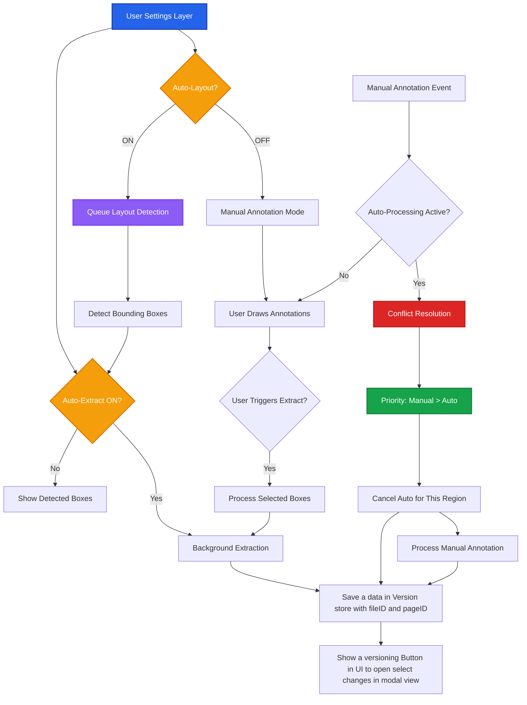
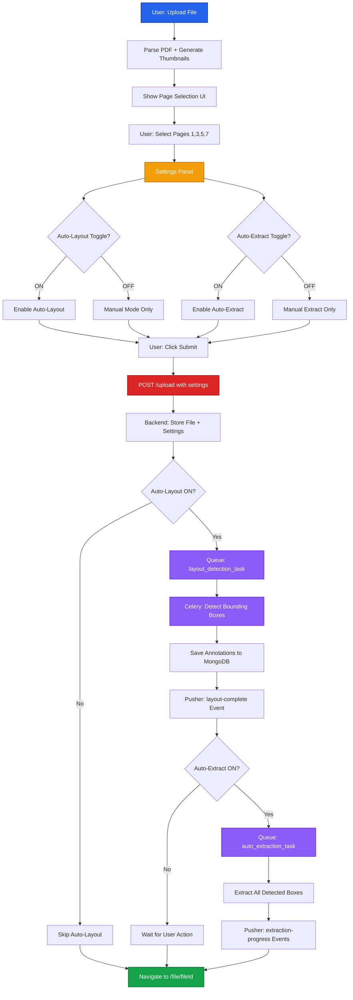
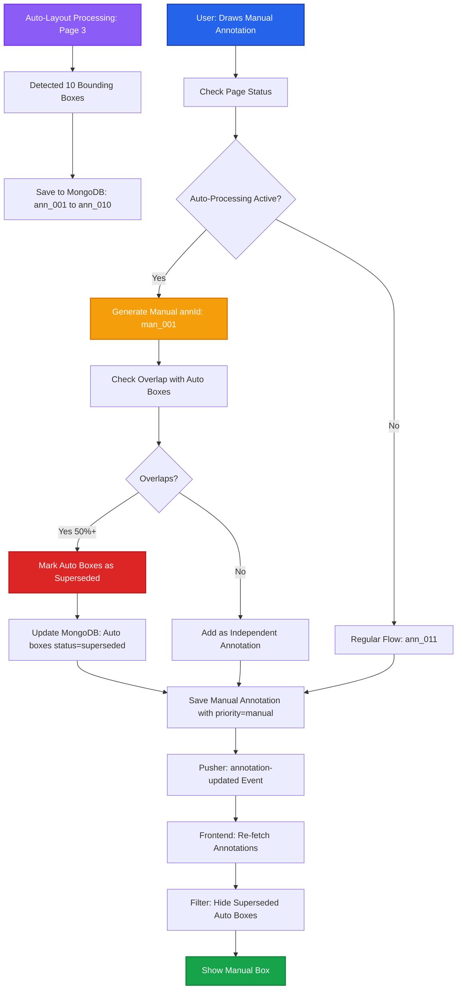
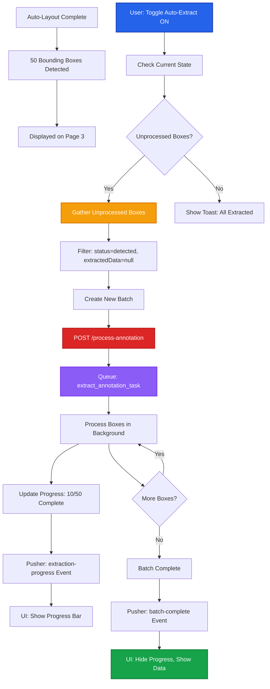
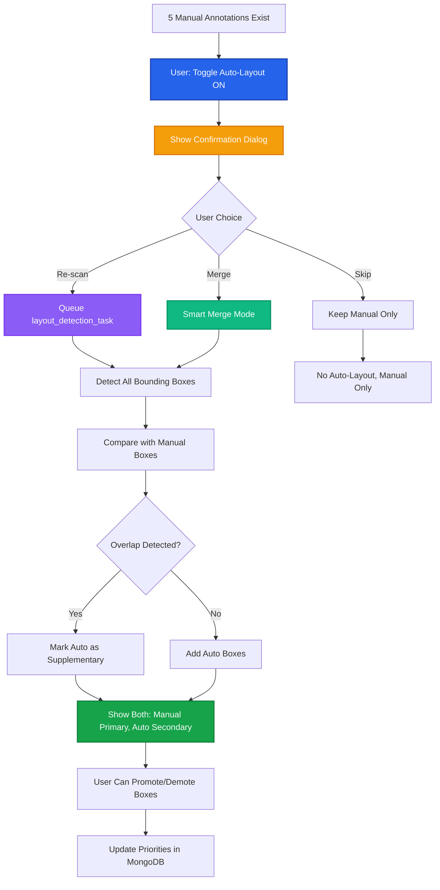

# User Control Flow

Advanced user control system for managing auto-layout detection, auto-extraction, and handling concurrent manual operations during automated processing.

## Architecture Overview



## User Settings Management

### Settings Store Structure

```tsx
// store/settingsStore.ts
import { create } from "zustand";
import { persist } from "zustand/middleware";

interface FileSettings {
  fileId: string;
  autoLayout: boolean;
  autoExtraction: boolean;
  selectedPages: number[];
  processingState: "idle" | "layout-detection" | "extracting" | "completed";
}

interface SettingsState {
  files: Record<string, FileSettings>;

  // Global defaults
  defaultAutoLayout: boolean;
  defaultAutoExtraction: boolean;

  // Actions
  setFileSettings: (fileId: string, settings: Partial<FileSettings>) => void;
  toggleAutoLayout: (fileId: string) => void;
  toggleAutoExtraction: (fileId: string) => void;
  getFileSettings: (fileId: string) => FileSettings;
  resetFileSettings: (fileId: string) => void;
}

export const useSettingsStore = create<SettingsState>()(
  persist(
    (set, get) => ({
      files: {},
      defaultAutoLayout: true,
      defaultAutoExtraction: false,

      setFileSettings: (fileId, settings) =>
        set((state) => ({
          files: {
            ...state.files,
            [fileId]: {
              ...state.files[fileId],
              fileId,
              ...settings,
            },
          },
        })),

      toggleAutoLayout: (fileId) =>
        set((state) => {
          const current =
            state.files[fileId]?.autoLayout ?? state.defaultAutoLayout;
          return {
            files: {
              ...state.files,
              [fileId]: {
                ...state.files[fileId],
                fileId,
                autoLayout: !current,
              },
            },
          };
        }),

      toggleAutoExtraction: (fileId) =>
        set((state) => {
          const current =
            state.files[fileId]?.autoExtraction ?? state.defaultAutoExtraction;
          return {
            files: {
              ...state.files,
              [fileId]: {
                ...state.files[fileId],
                fileId,
                autoExtraction: !current,
              },
            },
          };
        }),

      getFileSettings: (fileId) => {
        const state = get();
        return (
          state.files[fileId] || {
            fileId,
            autoLayout: state.defaultAutoLayout,
            autoExtraction: state.defaultAutoExtraction,
            selectedPages: [],
            processingState: "idle",
          }
        );
      },

      resetFileSettings: (fileId) =>
        set((state) => {
          const { [fileId]: _, ...rest } = state.files;
          return { files: rest };
        }),
    }),
    { name: "user-settings" }
  )
);
```

## Complete Flow: Upload with Settings



## Scenario 1: Manual Annotation During Auto-Processing

### Problem

User toggles auto-layout ON, pages start processing, but user begins drawing manual annotations before auto-processing completes.

### Solution: Priority-Based Conflict Resolution



### Implementation: Conflict Detection Hook

```tsx
// hooks/useAnnotationConflict.ts
import { useFileStore } from "@/store/fileStore";
import { useBatchStore } from "@/store/batchStore";
import _ from "lodash";

interface BBox {
  x: number;
  y: number;
  width: number;
  height: number;
}

export function useAnnotationConflict(fileId: string) {
  const { files } = useFileStore();
  const { batches } = useBatchStore();

  // Calculate overlap percentage
  const calculateOverlap = (bbox1: BBox, bbox2: BBox): number => {
    const x_overlap = Math.max(
      0,
      Math.min(bbox1.x + bbox1.width, bbox2.x + bbox2.width) -
        Math.max(bbox1.x, bbox2.x)
    );
    const y_overlap = Math.max(
      0,
      Math.min(bbox1.y + bbox1.height, bbox2.y + bbox2.height) -
        Math.max(bbox1.y, bbox2.y)
    );

    const overlapArea = x_overlap * y_overlap;
    const bbox1Area = bbox1.width * bbox1.height;

    return (overlapArea / bbox1Area) * 100;
  };

  // Check if auto-processing is active for this file
  const isAutoProcessing = () => {
    const activeBatches = _.filter(batches, {
      fileId,
      status: "processing",
      type: "auto-layout",
    });
    return activeBatches.length > 0;
  };

  // Handle manual annotation creation
  const createManualAnnotation = async (
    pageNumber: number,
    bbox: BBox,
    type: string
  ) => {
    const isAutoActive = isAutoProcessing();

    // Generate annotation ID with priority flag
    const annId = isAutoActive
      ? `man_${Date.now()}_${Math.random().toString(36).substr(2, 9)}`
      : `ann_${Date.now()}_${Math.random().toString(36).substr(2, 9)}`;

    // Get existing annotations on this page
    const page = _.find(files[fileId]?.pages, { pageNumber });
    const existingAnnotations = page?.annotations || [];

    // Check for overlaps with auto-generated annotations
    const conflicts = _.filter(existingAnnotations, (ann) => {
      if (!ann.source || ann.source !== "auto-layout") return false;
      if (ann.status === "superseded") return false;

      const overlap = calculateOverlap(bbox, ann.bbox);
      return overlap >= 50; // 50% overlap threshold
    });

    // API call to create annotation
    const response = await fetch("/api/create-annotation", {
      method: "POST",
      headers: { "Content-Type": "application/json" },
      body: JSON.stringify({
        fileId,
        pageNumber,
        annId,
        bbox,
        type,
        source: "manual",
        priority: isAutoActive ? "manual" : "normal",
        supersedes: conflicts.map((c) => c.annId),
      }),
    });

    return response.json();
  };

  return {
    isAutoProcessing,
    createManualAnnotation,
    calculateOverlap,
  };
}
```

## Scenario 2: Toggle Auto-Extract During Processing

### Problem

User has auto-layout ON but auto-extract OFF. Layout detection completes, showing 50 detected boxes. User now toggles auto-extract ON. What happens?

### Solution: Progressive Activation



### Implementation: Progressive Extraction Hook

```tsx
// hooks/useProgressiveExtraction.ts
import { useSettingsStore } from "@/store/settingsStore";
import { useFileStore } from "@/store/fileStore";
import { useBatchStore } from "@/store/batchStore";
import _ from "lodash";

export function useProgressiveExtraction(fileId: string) {
  const { getFileSettings, setFileSettings } = useSettingsStore();
  const { files } = useFileStore();
  const { batches } = useBatchStore();

  const toggleAutoExtraction = async () => {
    const settings = getFileSettings(fileId);
    const newState = !settings.autoExtraction;

    // Update settings
    setFileSettings(fileId, { autoExtraction: newState });

    if (newState) {
      // User turned ON auto-extraction
      // Check for unprocessed annotations
      const pages = files[fileId]?.pages || [];
      const unprocessedAnnotations = _.chain(pages)
        .flatMap("annotations")
        .filter({
          source: "auto-layout",
          status: "detected",
        })
        .filter((ann) => !ann.extractedData)
        .value();

      if (unprocessedAnnotations.length === 0) {
        toast.info("All detected annotations already processed");
        return;
      }

      // Create extraction batch
      const items = unprocessedAnnotations.map((ann) => ({
        annId: ann.annId,
        type: ann.type,
        bbox: ann.bbox,
        pageNumber: ann.pageNumber,
        fileId,
      }));

      const response = await fetch("/api/process-annotation", {
        method: "POST",
        headers: { "Content-Type": "application/json" },
        body: JSON.stringify({ items, trigger: "auto-extract-toggle" }),
      });

      const { batchId } = await response.json();

      toast.success(`Processing ${items.length} annotations...`);
    } else {
      // User turned OFF auto-extraction
      // Check if there's an active extraction batch
      const activeExtractionBatch = _.find(batches, {
        fileId,
        status: "processing",
        type: "extraction",
      });

      if (activeExtractionBatch) {
        // Cancel ongoing extraction
        await fetch("/api/cancel-batch", {
          method: "POST",
          headers: { "Content-Type": "application/json" },
          body: JSON.stringify({ batchId: activeExtractionBatch.batchId }),
        });

        toast.info("Stopped auto-extraction. Completed items will be saved.");
      }
    }
  };

  return { toggleAutoExtraction };
}
```

## Scenario 3: Toggle Auto-Layout During Manual Annotation

### Problem

User starts with auto-layout OFF, creates 5 manual annotations, then toggles auto-layout ON. Should it re-scan the page?

### Solution: Non-Destructive Auto-Layout



### Implementation: Smart Toggle Dialog

```tsx
// components/AutoLayoutToggleDialog.tsx
"use client";

import { useState } from "react";
import { useFileStore } from "@/store/fileStore";
import _ from "lodash";

interface Props {
  fileId: string;
  onConfirm: (mode: "replace" | "merge" | "skip") => void;
  onCancel: () => void;
}

export function AutoLayoutToggleDialog({ fileId, onConfirm, onCancel }: Props) {
  const { files } = useFileStore();
  const [mode, setMode] = useState<"replace" | "merge" | "skip">("merge");

  // Count existing manual annotations
  const manualCount = _.chain(files[fileId]?.pages)
    .flatMap("annotations")
    .filter({ source: "manual" })
    .size()
    .value();

  return (
    <Dialog open>
      <DialogContent>
        <DialogHeader>
          <DialogTitle>Enable Auto-Layout Detection?</DialogTitle>
          <DialogDescription>
            You have {manualCount} existing manual annotations. How should
            auto-layout handle them?
          </DialogDescription>
        </DialogHeader>

        <RadioGroup value={mode} onValueChange={setMode}>
          <div className="flex items-start space-x-2">
            <RadioGroupItem value="merge" id="merge" />
            <Label htmlFor="merge" className="cursor-pointer">
              <div className="font-medium">Smart Merge (Recommended)</div>
              <p className="text-sm text-muted-foreground">
                Keep manual annotations as primary. Add auto-detected boxes that
                don't overlap with manual ones.
              </p>
            </Label>
          </div>

          <div className="flex items-start space-x-2">
            <RadioGroupItem value="replace" id="replace" />
            <Label htmlFor="replace" className="cursor-pointer">
              <div className="font-medium">Replace All</div>
              <p className="text-sm text-muted-foreground">
                Remove manual annotations and run fresh auto-layout detection.
                <span className="text-destructive font-semibold">
                  {" "}
                  (Cannot be undone)
                </span>
              </p>
            </Label>
          </div>

          <div className="flex items-start space-x-2">
            <RadioGroupItem value="skip" id="skip" />
            <Label htmlFor="skip" className="cursor-pointer">
              <div className="font-medium">Skip Auto-Layout</div>
              <p className="text-sm text-muted-foreground">
                Keep setting OFF. Only use manual annotations.
              </p>
            </Label>
          </div>
        </RadioGroup>

        <DialogFooter>
          <Button variant="outline" onClick={onCancel}>
            Cancel
          </Button>
          <Button onClick={() => onConfirm(mode)}>
            {mode === "skip" ? "Keep OFF" : "Continue"}
          </Button>
        </DialogFooter>
      </DialogContent>
    </Dialog>
  );
}
```

## API Endpoint: Create Annotation with Conflict Resolution

### POST /create-annotation

```python
# backend/routes/annotations.py
from fastapi import APIRouter, HTTPException, Depends
from typing import List, Optional
import uuid
from datetime import datetime

router = APIRouter()

@router.post("/create-annotation")
async def create_annotation(
    payload: dict,
    user_id: str = Depends(get_current_user)
):
    file_id = payload["fileId"]
    page_number = payload["pageNumber"]
    bbox = payload["bbox"]
    ann_type = payload["type"]
    source = payload.get("source", "manual")  # manual | auto-layout
    priority = payload.get("priority", "normal")  # manual | normal
    supersedes = payload.get("supersedes", [])  # List of annIds to mark as superseded

    # Validate ownership
    file_doc = await mongo_db.files.find_one({"_id": file_id, "userId": user_id})
    if not file_doc:
        raise HTTPException(404, "File not found")

    # Generate annotation ID
    ann_id = payload.get("annId") or str(uuid.uuid4())

    # Check for active auto-processing
    active_layout_batch = await mongo_db.batches.find_one({
        "fileId": file_id,
        "type": "auto-layout",
        "status": {"$in": ["pending", "processing"]}
    })

    # If superseding other annotations, mark them
    if supersedes:
        await mongo_db.annotations.update_many(
            {"annId": {"$in": supersedes}},
            {"$set": {
                "status": "superseded",
                "supersededBy": ann_id,
                "supersededAt": datetime.utcnow()
            }}
        )

    # Create annotation document
    annotation = {
        "_id": ann_id,
        "annId": ann_id,
        "fileId": file_id,
        "pageNumber": page_number,
        "type": ann_type,
        "bbox": bbox,
        "source": source,
        "priority": priority,
        "status": "detected",
        "extractedData": None,
        "createdAt": datetime.utcnow(),
        "updatedAt": datetime.utcnow(),
        "createdDuringAutoProcess": bool(active_layout_batch),
    }

    await mongo_db.annotations.insert_one(annotation)

    # Emit Pusher event
    pusher_client.trigger(
        channel=f"user-{user_id}",
        event="annotation-created",
        data={
            "fileId": file_id,
            "pageNumber": page_number,
            "annotation": annotation,
            "superseded": supersedes,
        }
    )

    return {
        "success": True,
        "annId": ann_id,
        "superseded": supersedes,
    }
```

## Database Schema Updates

### annotations_collection

```javascript
{
  _id: "ann_001",
  annId: "ann_001",
  fileId: "file_abc123",
  pageNumber: 3,
  type: "text",
  bbox: [100, 200, 400, 250],

  // Source tracking
  source: "manual",  // manual | auto-layout
  priority: "normal",  // manual | normal

  // Status tracking
  status: "detected",  // detected | processing | completed | superseded | failed

  // Conflict resolution
  supersededBy: null,  // annId that replaced this
  supersededAt: null,  // ISODate when superseded
  createdDuringAutoProcess: false,  // Was auto-processing active when created?

  // Extraction data
  extractedData: null,

  createdAt: ISODate("2025-10-09T10:00:00Z"),
  updatedAt: ISODate("2025-10-09T10:05:00Z")
}
```

### files_collection (Add Settings)

```javascript
{
  _id: "file_abc123",
  userId: "user_123",
  fileName: "drawing.pdf",
  blobUrl: "https://...",

  // User settings
  settings: {
    autoLayout: true,
    autoExtraction: false,
    processingState: "layout-detection"  // idle | layout-detection | extracting | completed
  },

  createdAt: ISODate("2025-10-09T10:00:00Z")
}
```

### batches_collection (Add Type)

```javascript
{
  _id: "batch_xyz789",
  batchId: "batch_xyz789",
  userId: "user_123",
  fileId: "file_abc123",

  type: "auto-layout",  // auto-layout | extraction | manual-extraction
  trigger: "upload",  // upload | auto-extract-toggle | user-action

  status: "processing",
  progress: 45,
  totalItems: 10,
  completedItems: 4,

  // Cancellation support
  cancellable: true,
  cancelledAt: null,

  createdAt: ISODate("2025-10-09T10:00:00Z")
}
```

## Settings UI Component

```tsx
// components/FileSettings.tsx
"use client";

import { useSettingsStore } from "@/store/settingsStore";
import { useFileStore } from "@/store/fileStore";
import { useProgressiveExtraction } from "@/hooks/useProgressiveExtraction";
import { Switch } from "@/components/ui/switch";
import { Label } from "@/components/ui/label";
import _ from "lodash";

export function FileSettings({ fileId }: { fileId: string }) {
  const settings = useSettingsStore((state) => state.getFileSettings(fileId));
  const { toggleAutoLayout, toggleAutoExtraction } = useSettingsStore();
  const { toggleAutoExtraction: handleExtractionToggle } =
    useProgressiveExtraction(fileId);
  const { files } = useFileStore();

  const [showLayoutDialog, setShowLayoutDialog] = useState(false);

  const manualAnnotations = _.chain(files[fileId]?.pages)
    .flatMap("annotations")
    .filter({ source: "manual" })
    .value();

  const handleLayoutToggle = () => {
    if (!settings.autoLayout && manualAnnotations.length > 0) {
      // Show dialog if turning ON with existing manual annotations
      setShowLayoutDialog(true);
    } else {
      toggleAutoLayout(fileId);
    }
  };

  const handleLayoutConfirm = async (mode: "replace" | "merge" | "skip") => {
    setShowLayoutDialog(false);

    if (mode === "skip") return;

    toggleAutoLayout(fileId);

    // Trigger layout detection with mode
    await fetch("/api/trigger-layout-detection", {
      method: "POST",
      headers: { "Content-Type": "application/json" },
      body: JSON.stringify({ fileId, mode }),
    });
  };

  return (
    <div className="space-y-4 p-4 border rounded-lg">
      <h3 className="font-semibold text-lg">Processing Settings</h3>

      <div className="flex items-center justify-between">
        <div className="space-y-0.5">
          <Label htmlFor="auto-layout">Auto-Layout Detection</Label>
          <p className="text-sm text-muted-foreground">
            Automatically detect bounding boxes on upload
          </p>
        </div>
        <Switch
          id="auto-layout"
          checked={settings.autoLayout}
          onCheckedChange={handleLayoutToggle}
        />
      </div>

      <div className="flex items-center justify-between">
        <div className="space-y-0.5">
          <Label htmlFor="auto-extract">Auto-Extraction</Label>
          <p className="text-sm text-muted-foreground">
            Automatically extract data from detected boxes
          </p>
        </div>
        <Switch
          id="auto-extract"
          checked={settings.autoExtraction}
          onCheckedChange={handleExtractionToggle}
          disabled={!settings.autoLayout}
        />
      </div>

      {settings.processingState !== "idle" && (
        <div className="text-sm text-muted-foreground">
          Status:{" "}
          <span className="font-medium capitalize">
            {settings.processingState.replace("-", " ")}
          </span>
        </div>
      )}

      {showLayoutDialog && (
        <AutoLayoutToggleDialog
          fileId={fileId}
          onConfirm={handleLayoutConfirm}
          onCancel={() => setShowLayoutDialog(false)}
        />
      )}
    </div>
  );
}
```

## Pusher Events for User Control

### annotation-created Event

```json
{
  "event": "annotation-created",
  "channel": "user-{userId}",
  "data": {
    "fileId": "file_abc123",
    "pageNumber": 3,
    "annotation": {
      "annId": "man_001",
      "type": "text",
      "bbox": [100, 200, 400, 250],
      "source": "manual",
      "priority": "manual",
      "createdDuringAutoProcess": true
    },
    "superseded": ["ann_002", "ann_003"]
  }
}
```

### batch-cancelled Event

```json
{
  "event": "batch-cancelled",
  "channel": "user-{userId}",
  "data": {
    "batchId": "batch_xyz789",
    "fileId": "file_abc123",
    "type": "extraction",
    "reason": "user-toggle-off",
    "completedItems": 7,
    "cancelledItems": 3,
    "cancelledAt": "2025-10-09T10:30:00Z"
  }
}
```

## Performance Considerations

### 1. Debounce Settings Changes

```tsx
const debouncedToggle = _.debounce(toggleAutoExtraction, 500);
```

### 2. Batch Conflict Checks

- Check overlaps in single MongoDB aggregation query
- Use spatial indexes for bbox queries

### 3. Progressive UI Updates

- Don't re-render entire page on single annotation update
- Use React.memo and selector patterns

### 4. Cancel Gracefully

- Allow ongoing extraction tasks to complete
- Don't abort mid-extraction
- Save partial results

## Related Documentation

- **[File Upload Flow →](/v3-iteration/file-upload-flow)** - Initial settings during upload
- **[File Page Flow →](/v3-iteration/file-page-flow)** - Real-time updates during processing
- **[State Management →](/v3-iteration/state-management)** - Settings store integration
- **[API Architecture →](/v3-iteration/api-architecture)** - Backend processing logic
